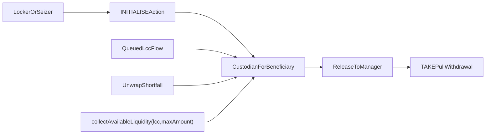

# Beneficiary-Scoped Custodian Plan

## Goal
Replace the current mixed model of owner-keyed custodian lookup plus beneficiary-scoped slices with a cleaner long-term architecture:
- one `MMQueueCustodian` per interacting beneficiary domain,
- explicit `INITIALISE` provisioning,
- beneficiary/custodian-scoped `COLLECT_AVAILABLE_LIQUIDITY`,
- no four-word collect form,
- seizure and other queued-LCC flows route to the acting party's custodian,
- queued MM custody becomes beneficiary-owned receivable state once forwarded to the custodian,
- commitment NFTs no longer gate queued-custody drainage.

## Current surfaces to unwind
The interim beneficiary-param collect path is currently wired through:
- [`contracts/evm/src/MMPositionManager.sol`](contracts/evm/src/MMPositionManager.sol): `_handleUtilityAction`, `_collectAvailableLiquidity`, `_collectSettleHubQueueForCustodian`, `_releasePreSettledCustodianUnderlying`
- [`contracts/evm/src/libraries/MMCalldataDecoder.sol`](contracts/evm/src/libraries/MMCalldataDecoder.sol): `decodeCollectLiquidityParams` supports `0x60` and `0x80`
- [`contracts/evm/src/interfaces/IMMQueueCustodian.sol`](contracts/evm/src/interfaces/IMMQueueCustodian.sol): beneficiary-scoped interface/docs
- [`contracts/evm/src/MMQueueCustodian.sol`](contracts/evm/src/MMQueueCustodian.sol): `_queuedLcc[tokenId][lcc][beneficiary]`, `totalQueuedLcc`, `collectUnderlyingToBeneficiary`
- [`contracts/evm/src/MMPositionActionsImpl.sol`](contracts/evm/src/MMPositionActionsImpl.sol) and [`contracts/evm/src/modules/PositionManagerImpl.sol`](contracts/evm/src/modules/PositionManagerImpl.sol): queued-LCC forwarding still records by `beneficiary`
- [`contracts/evm/src/libraries/Errors.sol`](contracts/evm/src/libraries/Errors.sol): `CollectForBeneficiaryRequiresCommitToken`
- [`contracts/evm/INVARIANTS.md`](contracts/evm/INVARIANTS.md): documents four-word collect and beneficiary-scoped custody

## Target architecture

Core rules:
- `custodianFor[beneficiary]` becomes the only queue-custody lookup key.
- `MMQueueCustodian` is scoped to a single immutable beneficiary; internal beneficiary maps disappear.
- Queued custody is beneficiary-global: once queued principal reaches the custodian, it is no longer commitment-scoped property.
- Bucket scoping and commitment-custody drainage gates are removed; queued custody does not follow NFT transfer or decommit lifecycle.
- `COLLECT_AVAILABLE_LIQUIDITY` becomes beneficiary/custodian-scoped and manager-mediated; the explicit fourth beneficiary parameter is removed.
- Any path that can create queued LCC principal for a party must require that party to have deployed a custodian first.

## Implementation slices

### 1. Revert the interim four-word collect path
- Remove both the four-word beneficiary form and the legacy tokenId-scoped collect encoding; retarget [`contracts/evm/src/libraries/MMCalldataDecoder.sol`](contracts/evm/src/libraries/MMCalldataDecoder.sol) directly to the final `(lcc, maxAmount)` collect shape.
- Recast `MMActions.COLLECT_AVAILABLE_LIQUIDITY` handling in [`contracts/evm/src/MMPositionManager.sol`](contracts/evm/src/MMPositionManager.sol) directly to beneficiary/custodian-scoped collect, with no intermediate commitment-bucket collect mode retained.
- Remove `CollectForBeneficiaryRequiresCommitToken` and all helper/test adapters introduced solely for the explicit-beneficiary form.

### 2. Redesign `MMQueueCustodian` around one immutable beneficiary-global receivable state
- Add immutable beneficiary identity to [`contracts/evm/src/MMQueueCustodian.sol`](contracts/evm/src/MMQueueCustodian.sol).
- Replace `_queuedLcc[tokenId][lcc][beneficiary]` with beneficiary-global custody accounting per `lcc` on the custodian.
- Remove bucket-based `isBucketEmpty` semantics and any beneficiary parameter from custodian payout/release methods.
- Replace `collectUnderlyingToBeneficiary(...)` with a release-to-manager method so external withdrawal happens through manager pull flows, not custodian push payout.
- Reassess whether `totalQueuedLcc(lcc)` becomes the primary durable custody metric for pre-settled release and aggregate collect limits.

### 3. Introduce explicit custodian deployment as a first-class action
- Add an `INITIALISE` utility action and calldata helper in the action/decoder stack for queue custodian provisioning.
- Update [`contracts/evm/src/MMPositionManager.sol`](contracts/evm/src/MMPositionManager.sol) / helper libraries so every path that requires queue custody fail-closes unless the acting beneficiary has deployed its custodian.
- Keep seize flows aligned with this rule: the seizing party must have its own custodian before queued seizure proceeds.

### 4. Re-route all queued-LCC producers to the acting beneficiary's custodian
- Review queued custody entrypoints in [`contracts/evm/src/MMPositionActionsImpl.sol`](contracts/evm/src/MMPositionActionsImpl.sol), [`contracts/evm/src/modules/PositionManagerImpl.sol`](contracts/evm/src/modules/PositionManagerImpl.sol), and [`contracts/evm/src/MMPositionManager.sol`](contracts/evm/src/MMPositionManager.sol).
- Ensure owner-originated commit proceeds, utility residue, and seizure-created queued principal all resolve `custodianFor[actingBeneficiary]`, not owner-domain + internal beneficiary slices.
- Treat all such queued proceeds as beneficiary-global receivable state once forwarded to the custodian.

### 5. Remove commitment-custody drainage gates
- Remove `CommitCustodyNotDrained`-based transfer/decommit gating in [`contracts/evm/src/MMPositionManager.sol`](contracts/evm/src/MMPositionManager.sol).
- Re-document NFT semantics so queued custody is no longer treated as part of commitment lifecycle after forwarding to the beneficiary custodian.
- Re-audit any ownership-transition logic that currently assumes queued commitment residue must clear before `transferFrom` or `decommit`.

### 6. Convert collect to a manager-mediated pull model
- Redesign `COLLECT_AVAILABLE_LIQUIDITY` as `collectAvailableLiquidity(lcc, maxAmount)` around the caller's beneficiary/custodian scope rather than `tokenId` bucket drainage.
- Have the custodian release settled underlying back to [`contracts/evm/src/MMPositionManager.sol`](contracts/evm/src/MMPositionManager.sol), which then credits the locker through existing delta/native-credit mechanics.
- Require final outward withdrawal through `TAKE(...)`, eliminating direct beneficiary/native callback payout from [`contracts/evm/src/MMQueueCustodian.sol`](contracts/evm/src/MMQueueCustodian.sol).
- Do not preserve a tokenId-scoped intermediate collect ABI: finding `31_9` is considered fully closed only once collect is bucket-free and beneficiary-global.

### 7. Update invariants and tests together
- Rewrite the MM queue custody invariants in [`contracts/evm/INVARIANTS.md`](contracts/evm/INVARIANTS.md) to reflect beneficiary-global custody, explicit deployment, collect-via-manager pull semantics, and the removal of commitment custody gates.
- Update unit/integration coverage in:
  - [`contracts/evm/test/MMPositionManager.t.sol`](contracts/evm/test/MMPositionManager.t.sol)
  - [`contracts/evm/test/libraries/MMCalldataDecoder.t.sol`](contracts/evm/test/libraries/MMCalldataDecoder.t.sol)
  - [`contracts/evm/test/marketmaker/MMPositionActionsImpl.t.sol`](contracts/evm/test/marketmaker/MMPositionActionsImpl.t.sol)
  - any helper adapters under `contracts/evm/test/utils/`
- Add focused regressions for:
  - explicit deploy required before unwrap/seize/collect queue paths,
  - queued seizure routed to seizer custodian,
  - collect works with pre-settled underlying on a single-beneficiary beneficiary-global custodian,
  - queued proceeds remain collectible after NFT transfer or decommit,
  - direct beneficiary payout callbacks are gone and final withdrawal happens only through manager pull/`TAKE`.

## Sequencing
1. Remove the explicit-beneficiary collect action plumbing.
2. Refactor `MMQueueCustodian` data model and interface.
3. Add explicit deployment action and manager plumbing.
4. Re-route queue producers and seize paths to beneficiary custodians.
5. Remove commitment-custody transfer/decommit gates.
6. Convert collect to manager-mediated pull withdrawal.
7. Update invariants and tests last, once the new custody model settles.

## Key risk to validate during implementation
The biggest architectural risk is semantic drift between commitment lifecycle and beneficiary-global custody: once queued principal is held on the beneficiary custodian and no longer blocked by NFT transfer/decommit, every flow that previously assumed queued residue followed `tokenId` ownership must be re-audited so value is intentionally detached from the commitment lifecycle rather than accidentally orphaned or double-claimable.