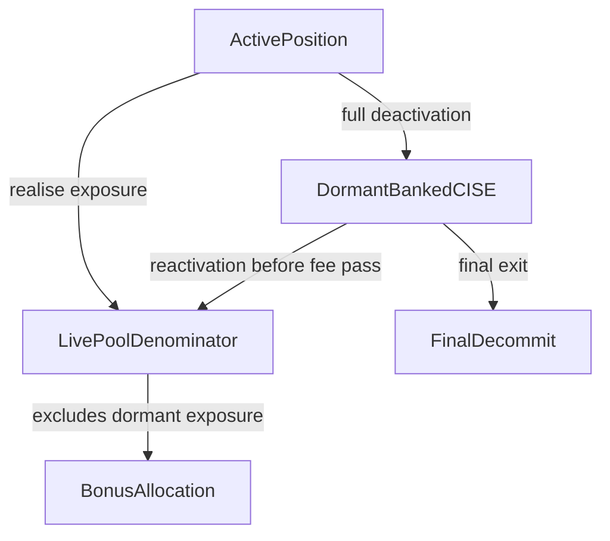

# Dormant CISE Banking Plan

## Goal
Shift CISE handling closer to “model 1” without full abandonment on inactivity:

- inactive positions should **not** remain inside the live pool bonus denominator;
- their already-earned `ciseExposureSinceLastMod` should stay preserved on the position while inactive;
- reactivation should **re-admit** that dormant exposure into the live denominator before fee processing;
- final decommit should abandon only the position’s dormant bank, not leave stale denominator weight behind.

This keeps best-effort exit semantics for `pendingFeeAdj`, while preventing inactive MM positions from diluting live claimants through stale `totalCISEExposureSinceLastMod`.

## Current Mechanics To Change
The current denominator is eagerly increased at coverage time and only reduced on actual allocation:

- [`contracts/evm/src/libraries/VTSCommitLib.sol`](/Users/ryansoury/dev/fiet/protocol/contracts/evm/src/libraries/VTSCommitLib.sol): `incrementCoverage(...)` adds `coveredAmount` into `paPool.totalCISEExposureSinceLastMod` whenever `totalSettled > 0`.
- [`contracts/evm/src/libraries/VTSFeeLib.sol`](/Users/ryansoury/dev/fiet/protocol/contracts/evm/src/libraries/VTSFeeLib.sol): `_queueBonusForToken(...)` allocates `bonus = potAvail * ciseExposure / totalExposure`, and `_cleanupAfterAllocationForToken(...)` decrements the pool total only if allocation actually happened.
- [`contracts/evm/src/libraries/VTSPositionLib.sol`](/Users/ryansoury/dev/fiet/protocol/contracts/evm/src/libraries/VTSPositionLib.sol): `_applyLiquidityMirrorTransition(...)` already performs position-state cleanup on full deactivation, and `touchPosition(...)` already has a clean reactivation branch before `_afterTouchPositionFees(...)`.
- [`contracts/evm/src/MMPositionManager.sol`](/Users/ryansoury/dev/fiet/protocol/contracts/evm/src/MMPositionManager.sol): `_decommitSignal(...)` only checks `activePositionCount` and `inactiveRemnantCount`, so any dormant CISE must already have been removed from the live denominator before this point.

## Proposed State Model
Add a per-position notion of whether banked CISE exposure is currently counted inside the live pool denominator.

Recommended shape:

- keep existing per-position bank: `ciseExposureSinceLastMod`
- keep existing live pool denominator: `totalCISEExposureSinceLastMod`
- add a compact per-position lane flag, e.g. `ciseExposureInPoolMask`
  - bit 0 => token0 exposure currently counted in the pool denominator
  - bit 1 => token1 exposure currently counted in the pool denominator

This avoids a second pool denominator and keeps one clean invariant:

- `totalCISEExposureSinceLastMod` should mean **currently allocatable active denominator only**.

## Transition Rules
### 1. Coverage accrual while active
No change to coverage accrual semantics:

- `incrementCoverage(...)` still advances pool CISE index + denominator when `totalSettled > 0`.
- touched positions still realise exposure into `ciseExposureSinceLastMod`.
- when a position first realises non-zero exposure on a lane while active, mark that lane as “in pool”.

### 2. Active -> inactive
When a position fully deactivates (`initialLiquidity > 0 && nextLiquidity == 0`):

- for each token lane:
  - if `ciseExposureSinceLastMod[lane] > 0` and that lane is marked “in pool”, subtract it from `paPool.totalCISEExposureSinceLastMod[lane]`;
  - clear the lane bit in `ciseExposureInPoolMask`;
  - keep `ciseExposureSinceLastMod[lane]` unchanged on the position.

Effect:

- the position keeps its dormant claimable bonus weight;
- live claimants are no longer diluted while the position is inactive.

### 3. Inactive -> active
In the reactivation path inside `touchPosition(...)`, before `_afterTouchPositionFees(...)`:

- for each lane where `ciseExposureSinceLastMod[lane] > 0` and the lane is currently not marked “in pool”:
  - add that exposure back into `paPool.totalCISEExposureSinceLastMod[lane]`;
  - set the lane bit in `ciseExposureInPoolMask`.

This should happen after the zero-principal snapshot rebases but before fee processing, so the same reopen touch can allocate against the restored denominator.

### 4. Allocation cleanup
Update `_cleanupAfterAllocationForToken(...)` in [`contracts/evm/src/libraries/VTSFeeLib.sol`](/Users/ryansoury/dev/fiet/protocol/contracts/evm/src/libraries/VTSFeeLib.sol) so that:

- it only decrements `paPool.totalCISEExposureSinceLastMod` if the lane is marked “in pool”;
- it always zeroes `pa.ciseExposureSinceLastMod[lane]`;
- it clears the corresponding lane bit afterward.

This keeps cleanup correct for both active and dormant exposure.

### 5. Final decommit
No denominator action should be needed in `_decommitSignal(...)` if inactive exposure was already removed from the pool total on deactivation.

Effect:

- full decommit can still abandon dormant banked CISE as part of best-effort fee-sharing policy;
- there is no stale denominator left behind.

## Suggested File Changes
### Core accounting
- [`contracts/evm/src/types/VTS.sol`](/Users/ryansoury/dev/fiet/protocol/contracts/evm/src/types/VTS.sol)
  - add `ciseExposureInPoolMask` (preferred compact representation) to `PositionAccounting`
  - document that `totalCISEExposureSinceLastMod` is active-only allocatable denominator

- [`contracts/evm/src/libraries/VTSFeeLib.sol`](/Users/ryansoury/dev/fiet/protocol/contracts/evm/src/libraries/VTSFeeLib.sol)
  - add tiny helpers for:
    - checking whether a lane’s CISE is currently counted in the pool denominator
    - moving a lane out of / back into the pool denominator
  - update `_cleanupAfterAllocationForToken(...)`
  - keep `_queueBonusForToken(...)` unchanged except to rely on the corrected denominator

- [`contracts/evm/src/libraries/VTSPositionLib.sol`](/Users/ryansoury/dev/fiet/protocol/contracts/evm/src/libraries/VTSPositionLib.sol)
  - hook deactivation-time removal into `_applyLiquidityMirrorTransition(...)`
  - hook reactivation-time re-admission into the inactive->active branch in `touchPosition(...)`
  - preserve current `ciseIndexLastX128` rebasing logic for zero-principal lanes

### Optional supporting surface
- [`contracts/evm/src/MMPositionManager.sol`](/Users/ryansoury/dev/fiet/protocol/contracts/evm/src/MMPositionManager.sol)
  - likely no logic change required if denominator cleanup is guaranteed on deactivation
  - only touch if you want an assertion/comment documenting that decommit assumes no inactive CISE remains in the live pool denominator

## Test Plan
### Unit / mutation tests
Extend existing fee-accounting harnesses around the dormant-inactive scenarios:

- [`contracts/evm/test/libraries/VTSFeeLib.t.sol`](/Users/ryansoury/dev/fiet/protocol/contracts/evm/test/libraries/VTSFeeLib.t.sol)
  - add focused tests for deactivation/removal and reactivation/re-admission of banked CISE
  - assert denominator changes, lane-bit changes, and cleanup semantics

- [`contracts/evm/test/libraries/VTSPositionLib.mutation.unit.t.sol`](/Users/ryansoury/dev/fiet/protocol/contracts/evm/test/libraries/VTSPositionLib.mutation.unit.t.sol)
  - add state-machine style tests for:
    - active -> inactive removes live denominator but preserves banked position exposure
    - inactive -> active restores denominator before fee processing
    - inactive allocation cleanup is a no-op on the pool total unless re-admitted first

### Scenario tests
Update the inactive-claim scenarios to assert denominator behaviour explicitly:

- [`contracts/evm/test/libraries/VTSFeeLib.scenario.t.sol`](/Users/ryansoury/dev/fiet/protocol/contracts/evm/test/libraries/VTSFeeLib.scenario.t.sol)
  - existing inactive MM / DirectLP claim scenarios are the right regression anchors
  - add checks that:
    - after close, the inactive position’s banked `ciseExposureSinceLastMod` remains
    - `totalCISEExposureSinceLastMod` no longer includes that dormant bank
    - reopen re-adds it before bonus allocation

### Behavioural invariant to preserve
The implementation should preserve this behaviour:

- an inactive position can still reopen briefly and claim previously-earned banked CISE once `slashedPot` is funded;
- but while it stays inactive, it does not dilute live claimants.

## Documentation Updates
Update the policy docs so the economic intent is explicit.

- [`contracts/evm/INVARIANTS.md`](/Users/ryansoury/dev/fiet/protocol/contracts/evm/INVARIANTS.md)
  - extend `FEE-01` with an inactive-CISE clarification
  - state that inactive positions’ banked CISE is preserved off-denominator and re-admitted on reactivation

- [`agents/spec/Fee-Pot-Materialisation-And-DirectLP-Policy.md`](/Users/ryansoury/dev/fiet/protocol/agents/spec/Fee-Pot-Materialisation-And-DirectLP-Policy.md)
  - add an amendment clarifying that best-effort exit abandonment applies to unresolved opportunity, but inactive dormant CISE does not remain inside live pool denominator

- [`agents/spec/CISE-Zero-Settled-Coverage-Policy.md`](/Users/ryansoury/dev/fiet/protocol/agents/spec/CISE-Zero-Settled-Coverage-Policy.md)
  - add a note distinguishing:
    - zero-settled historical non-claimability
    - inactive-position dormant banking / reactivation

## Design Rationale
This is preferable to two weaker alternatives:

- **Full cleanup on inactivity**: removes dilution, but wrongly destroys genuinely-earned bonus weight even when the position later reactivates.
- **Separate inactive pool denominator used in allocation**: preserves too much shared complexity and leaves `totalCISEExposureSinceLastMod` less meaningful.

The proposed model keeps allocation simple and local:

## Acceptance Criteria
- Inactive positions’ banked CISE is not counted in `totalCISEExposureSinceLastMod`.
- Reactivation restores dormant banked CISE into the live denominator before fee processing.
- Final decommit leaves no stale CISE denominator behind.
- Existing inactive-reopen bonus-claim flows still work.
- Best-effort exit semantics for `pendingFeeAdj` remain unchanged.