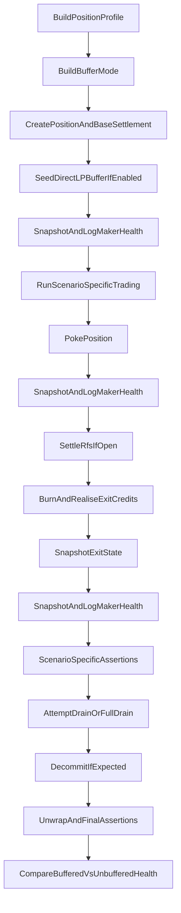

# MM E2E Expansion Plan

## Goal
Turn the current single MM e2e path into a reusable matrix that varies:
- scenario behaviour,
- position geometry/liquidity,
- initial settled amounts derived per profile,
- and whether the market is additionally buffered by a full-range DirectLP position.

The core refactor point is the existing one-path script in [`contracts/evm-scripts/script/e2e/MarketMaker.s.sol`](contracts/evm-scripts/script/e2e/MarketMaker.s.sol) and the bundled exit helpers in [`contracts/evm-scripts/script/e2e/base/MME2EBase.sol`](contracts/evm-scripts/script/e2e/base/MME2EBase.sol).

## Proposed Matrix
Implement a full cross-product of:

### Scenario kinds
- `ExtremeUnserviceableRemnant`
  - Current large-sweep behaviour.
  - Assert stalled inactive drain, non-zero remnant, and blocked decommit.
- `ServiceableRoundTrip`
  - Adaptive return-to-start trading path.
  - Assert full drain, zero overflow, successful decommit.
- `ServiceableReserveShaped`
  - Explicitly serviceable exit path without requiring price round-trip.
  - Assert full drain, zero overflow, successful decommit.
- `ModestNonExtreme`
  - Small swaps such as `10e18`.
  - Assert no boundary pinning and classify exit outcome explicitly.
- `WideOrDeepStress`
  - Reuse larger-swap path on non-pathological MM profiles.
  - Assert materially improved serviceability relative to `tightTiny`.

### Position profiles
Introduce reusable `PositionProfile` definitions in [`contracts/evm-scripts/script/e2e/base/MME2EBase.sol`](contracts/evm-scripts/script/e2e/base/MME2EBase.sol):
- `tightTiny`: current `[-60, 60], 1e10`
- `tightMaterial`: same range, larger liquidity
- `wideMaterial`: wider ticks, medium liquidity
- `wideDeep`: wider ticks, deeper liquidity

Each profile should recompute initial settled amounts through the existing path:

```646:657:contracts/evm-scripts/script/e2e/base/MME2EBase.sol
function _baseSettlementAmounts(
    address vtsOrchestratorAddr,
    PoolKey memory key,
    int24 tickLower,
    int24 tickUpper,
    uint128 liq
) internal view returns (uint256 settle0, uint256 settle1) {
    ...
    (uint256 c0, uint256 c1) = LiquidityUtils.calculateCommitmentMaxima(tickLower, tickUpper, liq);
    (settle0, settle1) =
        LiquidityUtils.getBaseSettlementAmounts(c0, c1, vtsCfg.token0.baseVTSRate, vtsCfg.token1.baseVTSRate);
}
```

That keeps initial funding aligned with the new range/liquidity parameters instead of reusing the current baseline implicitly.

### Liquidity buffer modes
Introduce a second reusable matrix axis:
- `NoDirectLPBuffer`
- `FullRangeDirectLPBuffer`

The buffered variant should seed additional core liquidity with the existing helper in [`contracts/evm-scripts/script/e2e/base/E2EBase.sol`](contracts/evm-scripts/script/e2e/base/E2EBase.sol):

```341:383:contracts/evm-scripts/script/e2e/base/E2EBase.sol
function _addCoreLiquidityFullRange(
    StandaloneMarket memory m,
    uint256 lpPk,
    uint256 wrapAmountPerAsset,
    uint256 amountMaxPerAsset
) internal returns (uint256 tokenId) {
    ...
}
```

This lets the suite compare the same MM scenario/profile in under-buffered versus externally buffered market conditions.

## Refactor Shape
Split the monolithic exit path in [`contracts/evm-scripts/script/e2e/base/MME2EBase.sol`](contracts/evm-scripts/script/e2e/base/MME2EBase.sol):
- `_settleRfsIfOpen(...)`
- `_burnAndRealiseExitCredits(...)`
- `_snapshotExitState(...)`
- `_attemptInactiveDrainOnce(...)`
- `_drainInactivePositionSurplus(...)`
- `_decommitAndTakeAllLccs(...)`
- `_unwrapAllLccsAndAssert(...)`

Add reusable config structs:
- `PositionProfile { name, tickLower, tickUpper, liquidity }`
- `ScenarioProfile { name, wrapAmount, swapAmount, scenarioKind }`
- `BufferMode { name, seedDirectLP, wrapAmountPerAsset, amountMaxPerAsset }`
- `ExitSnapshot { positionId, effective0, effective1, overflow0, overflow1, inactiveRemnantCount }`
- `MakerHealthSnapshot { positionId, tickCurrent, commitment0, commitment1, effectiveSettled0, effectiveSettled1, overflow0, overflow1, poolTotalSettled0, poolTotalSettled1, poolTotalDeficitPrincipal0, poolTotalDeficitPrincipal1, inactiveRemnantCount }`

This lets each scenario choose whether to stop after burn, attempt one drain, fully drain, decommit, or unwrap.

Add reusable health/telemetry helpers:
- `_snapshotMakerHealth(...)`
- `_logMakerHealth(...)`
- `_assertMakerHealthImproved(...)`
- `_assertMakerHealthNotWorseWithBuffer(...)`

The implementation should log health at fixed checkpoints:
- after initial settle
- after trading
- after poke
- after RFS close
- after burn
- after first drain attempt
- after final drain/decommit/unwrap

## Assertion Model
Use per-scenario expectation helpers in [`contracts/evm-scripts/script/e2e/base/MME2EBase.sol`](contracts/evm-scripts/script/e2e/base/MME2EBase.sol):
- `assertUnserviceableRemnant(...)`
- `assertDrainableAndFullyDrained(...)`
- `assertNonExtremeTicks(...)`
- `assertImprovedServiceabilityVsBaseline(...)`
- `assertMakerHealthImprovedOrStable(...)`
- `assertBufferedRunNotWorseThanUnbuffered(...)`

Back them with the existing VTS lenses/getters:
- [`contracts/evm/src/interfaces/IVTSOrchestrator.sol`](contracts/evm/src/interfaces/IVTSOrchestrator.sol)
- [`contracts/evm/src/VTSOrchestrator.sol`](contracts/evm/src/VTSOrchestrator.sol)

Key values to snapshot and compare:
- `getPositionSettledAmounts(positionId)`
- `getPositionSettledOverflowAmounts(positionId)`
- `getCommitmentMaxima(positionId)`
- `getPoolTotalSettled(poolId)`
- `getPoolTotalDeficitPrincipal(poolId)`
- `getCommit(commitId).inactiveRemnantCount`
- current pool tick via `getSlot0`
- optional reserve/queue lenses where needed for serviceability diagnostics

Be explicit that these values are not just diagnostic logs: each scenario/profile/buffer run should assert whether the MM is in a better, worse, or unchanged economic state relative to:
- its own prior checkpoint,
- the baseline `tightTiny` profile where relevant,
- and the corresponding unbuffered run.

## Script Layout
Prefer separate top-level scripts over one large branching script:
- [`contracts/evm-scripts/script/e2e/MarketMaker.s.sol`](contracts/evm-scripts/script/e2e/MarketMaker.s.sol) can become the baseline entrypoint or a thin wrapper.
- Add dedicated scenario runners, for example:
  - `MarketMakerExtremeUnserviceable.s.sol`
  - `MarketMakerServiceableRoundTrip.s.sol`
  - `MarketMakerServiceableReserveShaped.s.sol`
  - `MarketMakerModestSwap.s.sol`
  - `MarketMakerWideOrDeepStress.s.sol`

Each runner iterates every `PositionProfile` and every `BufferMode` because you chose full cross-product.

## Trading-Phase Strategy
Keep the current exact-input helper for extreme paths, but add two more trading helpers in [`contracts/evm-scripts/script/e2e/base/MME2EBase.sol`](contracts/evm-scripts/script/e2e/base/MME2EBase.sol):
- `_runExtremeTradingPhase(...)`
- `_runAdaptiveRoundTripTradingPhase(...)`
- `_runModestTradingPhase(..., swapAmount)`
- `_runReserveShapedTradingAndExitSetup(...)`
- `_seedDirectLPBufferIfEnabled(...)`

The current helper is still valid for the extreme baseline:

```47:55:contracts/evm-scripts/script/e2e/MarketMaker.s.sol
function _runTradingPhase(StandaloneMarket memory m, uint256 mmPk, uint256 commitId) internal {
    uint256 takerPk = _getDeployerPrivateKey();
    _swapBothDirections(m, takerPk, WRAP_FOR_SWAPS, BIG_SWAP_AMOUNT_IN);
    _pokePosition(m, mmPk, commitId);
}
```

But it should no longer be the only trading mode.

## Sketch of Execution Flow


## Expected Outcome by Scenario
- `ExtremeUnserviceableRemnant`
  - remnant persists, drain stalls, decommit blocked.
  - buffered rerun should be at least as serviceable as unbuffered, with explicit comparison logs.
- `ServiceableRoundTrip`
  - full drain to zero, decommit succeeds.
  - buffered rerun should not regress Maker health or drainability.
- `ServiceableReserveShaped`
  - full drain to zero, decommit succeeds without requiring price restoration.
  - buffered rerun should preserve or improve final health metrics.
- `ModestNonExtreme`
  - non-boundary tick movement; exit expectation depends on the profile but must be asserted explicitly.
  - health logs should show whether smaller swaps materially reduce stranded overflow versus the extreme path.
- `WideOrDeepStress`
  - better serviceability than `tightTiny`; deepest profile should decommit successfully.
  - buffered repeats should quantify whether exogenous full-range liquidity closes the remaining serviceability gap.

## Risks to Address in Implementation
- Full cross-product will increase runtime; keep common deploy/setup shared where possible within each script.
- Modest and wide/deep scenarios should not rely on brittle exact tick values; prefer bounded assertions like “not min/max tick” or “closer to start than extreme path”.
- Initial settled amounts must always be recalculated per profile; do not hardcode a shared baseline across profile variants.
- Maker-health comparisons should use bounded relational assertions rather than brittle exact values, especially when buffered liquidity changes execution shape.
- If existing public getters are insufficient for meaningful health verdicts, add a read-only lens rather than relying on ad hoc logs alone.
