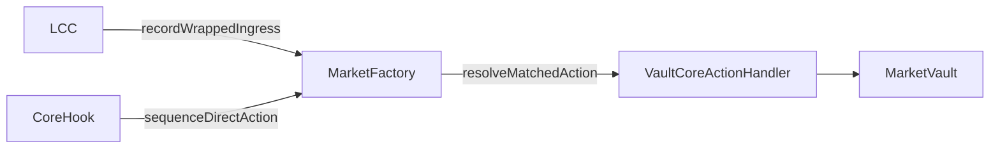

# Market Action Sequencer Plan

## Goal

Replace the fragile hook-timing provenance approach with a `MarketFactory`-owned sequencer that matches:

- wrapped ingress facts emitted by `LCC`
- direct core actions emitted by `CoreHook`

The sequencer must support cumulative many-to-many matching within a single `unlockCallback`, then dispatch resolved actions to a vault-scoped handler implemented by the canonical proxy hook.

## Architecture

Core rules:

- `LCC` remains a dumb producer of transfer-side facts.
- `CoreHook` remains a dumb producer of direct-action facts.
- `[/Users/ryansoury/dev/fiet/protocol/contracts/evm/src/MarketFactory.sol](/Users/ryansoury/dev/fiet/protocol/contracts/evm/src/MarketFactory.sol)` becomes the sole sequencing/orchestration boundary.
- Resolved vault reactions are invoked through a broad but contract-scoped interface, not concrete hook callbacks.

## Planned Changes

### 1. Thread immutable factory into `LCC`

Update deployment so `LCC` receives the factory explicitly at construction time, alongside the explicit hub dependency.

Files:

- `[/Users/ryansoury/dev/fiet/protocol/contracts/evm/src/LCC.sol](/Users/ryansoury/dev/fiet/protocol/contracts/evm/src/LCC.sol)`
- `[/Users/ryansoury/dev/fiet/protocol/contracts/evm/src/libraries/LCCFactoryLib.sol](/Users/ryansoury/dev/fiet/protocol/contracts/evm/src/libraries/LCCFactoryLib.sol)`
- `[/Users/ryansoury/dev/fiet/protocol/contracts/evm/src/LiquidityHub.sol](/Users/ryansoury/dev/fiet/protocol/contracts/evm/src/LiquidityHub.sol)`
- `[/Users/ryansoury/dev/fiet/protocol/contracts/evm/src/interfaces/ILCC.sol](/Users/ryansoury/dev/fiet/protocol/contracts/evm/src/interfaces/ILCC.sol)`

Implementation notes:

- In `LiquidityHub.createLCCPair(...)`, capture `msg.sender` as the calling factory and thread it through `LCCFactoryLib.createLCC(...)`.
- In `LCC`, store immutable `factory` and `hub` instead of relying on deployer identity alone.
- Replace `boundLevelOfLcc(...)` / `boundLevelsOfLcc(...)` lookups in `LCC` with factory-scoped bound lookups where appropriate.
- Add concise comments above the constructor and any helper that now relies on factory namespace rather than inferred market metadata.

### 2. Introduce factory-owned action sequencing library

Create a linked library that owns transient reconciliation for transfer provenance and direct core actions.

Files:

- `[/Users/ryansoury/dev/fiet/protocol/contracts/evm/src/MarketFactory.sol](/Users/ryansoury/dev/fiet/protocol/contracts/evm/src/MarketFactory.sol)`
- `[/Users/ryansoury/dev/fiet/protocol/contracts/evm/src/libraries/MarketActionSequencer.sol](/Users/ryansoury/dev/fiet/protocol/contracts/evm/src/libraries/MarketActionSequencer.sol)`
- `[/Users/ryansoury/dev/fiet/protocol/contracts/evm/src/libraries/TransientSlots.sol](/Users/ryansoury/dev/fiet/protocol/contracts/evm/src/libraries/TransientSlots.sol)`
- `[/Users/ryansoury/dev/fiet/protocol/contracts/evm/src/interfaces/IMarketFactory.sol](/Users/ryansoury/dev/fiet/protocol/contracts/evm/src/interfaces/IMarketFactory.sol)`

Implementation notes:

- Add `MarketFactory` entrypoints for the two raw fact types:
  - transfer-side wrapped ingress from `LCC`
  - direct core action notifications from `CoreHook`
- Back them with a transient FIFO-style queue plus cumulative lane credit accounting.
- Model transfer-side amounts as cumulative per market/lane credit.
- Model core-side events as ordered pending actions that retain their own remaining unmatched demand.
- Resolve from the queue head whenever new credit arrives or a new action is enqueued.
- Require all direct actions to be fully resolved by unlock completion; do not allow unresolved direct core actions to leak across transactions.
- Use method comments to explain why the sequencer tracks cumulative lane credit while preserving per-action ordering.

### 3. Refactor vault action handling out of `ProxyHook`

Move direct core settlement reactions into an abstract vault module with broad but contract-scoped names.

Files:

- `[/Users/ryansoury/dev/fiet/protocol/contracts/evm/src/ProxyHook.sol](/Users/ryansoury/dev/fiet/protocol/contracts/evm/src/ProxyHook.sol)`
- `[/Users/ryansoury/dev/fiet/protocol/contracts/evm/src/modules/MarketVault.sol](/Users/ryansoury/dev/fiet/protocol/contracts/evm/src/modules/MarketVault.sol)`
- `[/Users/ryansoury/dev/fiet/protocol/contracts/evm/src/modules/VaultCoreActionHandler.sol](/Users/ryansoury/dev/fiet/protocol/contracts/evm/src/modules/VaultCoreActionHandler.sol)`
- `[/Users/ryansoury/dev/fiet/protocol/contracts/evm/src/interfaces/IVaultCoreActionHandler.sol](/Users/ryansoury/dev/fiet/protocol/contracts/evm/src/interfaces/IVaultCoreActionHandler.sol)`

Implementation notes:

- Move `ProxyHook.onDirectLP(...)` and `ProxyHook.onCorePoolDirectSwap(...)` logic into:
  - `handleLiquidity(...)`
  - `handleSwap(...)`
- Gate these handlers with `onlyFactory`, not `onlyCoreHook`.
- Keep settlement internals in `MarketVault`, but document that `VaultCoreActionHandler` is the contract-scoped reaction surface for sequenced direct core actions.
- Add top-of-contract comments describing inheritance boundaries:
  - `MarketVault`: generic vault accounting and settlement primitives
  - `VaultCoreActionHandler`: direct-core reaction layer
  - `ProxyHook`: Uniswap hook and proxy-pool behaviour

### 4. Rewire `CoreHook` to emit raw action facts only

Remove direct coupling from `CoreHook` to concrete `ProxyHook` callbacks and send direct action facts into the factory sequencer instead.

Files:

- `[/Users/ryansoury/dev/fiet/protocol/contracts/evm/src/CoreHook.sol](/Users/ryansoury/dev/fiet/protocol/contracts/evm/src/CoreHook.sol)`
- `[/Users/ryansoury/dev/fiet/protocol/contracts/evm/src/interfaces/IMarketFactory.sol](/Users/ryansoury/dev/fiet/protocol/contracts/evm/src/interfaces/IMarketFactory.sol)`

Implementation notes:

- In `_afterSwap(...)`, keep existing snapshot clear and VTS sequencing, but replace `ProxyHook(...).onCorePoolDirectSwap(...)` with a factory sequencing call.
- In `_afterAddLiquidity(...)`, preserve `effective = delta - feeAdj` and replace `ProxyHook(...).onDirectLP(...)` with a factory sequencing call.
- Keep direct-LP remove behaviour unchanged.
- Add comments explaining that `CoreHook` now reports raw facts only, leaving ordering reconciliation to the factory.

### 5. Rewire `LCC` transfer-side provenance to report into the factory sequencer

Replace the current local/transient provenance approach with factory-owned sequencing input.

Files:

- `[/Users/ryansoury/dev/fiet/protocol/contracts/evm/src/LCC.sol](/Users/ryansoury/dev/fiet/protocol/contracts/evm/src/LCC.sol)`
- `[/Users/ryansoury/dev/fiet/protocol/contracts/evm/src/libraries/TransientSlots.sol](/Users/ryansoury/dev/fiet/protocol/contracts/evm/src/libraries/TransientSlots.sol)`
- `[/Users/ryansoury/dev/fiet/protocol/contracts/evm/src/interfaces/IMarketFactory.sol](/Users/ryansoury/dev/fiet/protocol/contracts/evm/src/interfaces/IMarketFactory.sol)`

Implementation notes:

- In the protocol transfer paths that currently identify wrapped ingress towards exempt sinks, emit the raw wrapped amount into `MarketFactory` instead of leaving it resident on `LCC` for exttload reads.
- Ensure the transfer-side API is additive/cumulative so multiple settles in one unlock can satisfy one action, or many actions can draw from one transfer stream.
- Add comments above transfer helpers clarifying that `LCC` is reporting factual lane credit only, not attempting to infer or execute action semantics.

### 6. Add sequencing invariants, comments, and tests

Update tests and docs around the new sequencing model and inheritance split.

Files:

- `[/Users/ryansoury/dev/fiet/protocol/contracts/evm/test/CoreHook.t.sol](/Users/ryansoury/dev/fiet/protocol/contracts/evm/test/CoreHook.t.sol)`
- `[/Users/ryansoury/dev/fiet/protocol/contracts/evm/test/LCC.t.sol](/Users/ryansoury/dev/fiet/protocol/contracts/evm/test/LCC.t.sol)`
- `[/Users/ryansoury/dev/fiet/protocol/contracts/evm/test/LiquidityHub.t.sol](/Users/ryansoury/dev/fiet/protocol/contracts/evm/test/LiquidityHub.t.sol)`
- Any `MarketFactory` / `ProxyHook` tests covering direct swaps and direct LP flows

Test focus:

- many transfer-side credits satisfy one direct action
- one transfer-side credit satisfies many direct actions
- exact-input and exact-output direct swap ordering
- direct LP add path uses effective delta and only wrapped portion settles from hub
- unresolved direct actions revert before unlock completion
- proxy-pool initiated swaps still bypass direct-action handling

Documentation focus:

- add method comments above all new sequencing entrypoints
- add contract-level comments above `VaultCoreActionHandler` and updated `ProxyHook`
- use broad names such as `handleLiquidity` / `handleSwap`, but make the NatSpec explicitly contract-scoped so readers do not mistake them for generic public protocol routers

## Risks To Watch

- preserving `delta - feeAdj` semantics for direct LP adds
- avoiding recursion or double-processing on proxy-initiated swaps
- ensuring transient queue state cannot leak or remain partially matched after unlock
- maintaining current best-effort obligation settlement semantics after direct actions resolve
- preventing accidental dependence on market metadata that is only available after later `LiquidityHub.initialize(...)`
