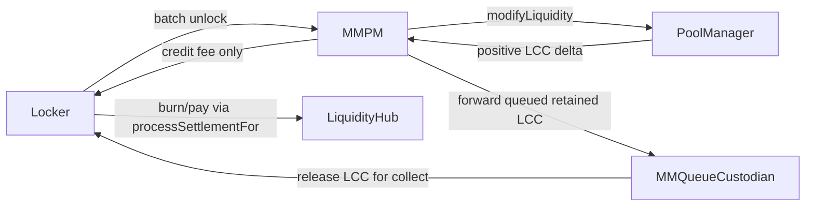

# MMQueueCustodian Action Plan

## Goal

Move claim-bearing queued LCC out of `[/Users/ryansoury/dev/fiet/protocol/contracts/evm/src/MMPositionManager.sol](`/Users/ryansoury/dev/fiet/protocol/contracts/evm/src/MMPositionManager.sol`)` and into a dedicated per-commit `MMQueueCustodian`, while preserving the current router-style fee batching and `SYNC` behaviour for genuine transfer-in flows.

## Agreed Invariants

- For MM flows, `locker` is always the `queueRecipient`.
- `locker` and `custodian` are distinct roles: `locker` backs positions and owns delta semantics; `custodian` physically holds queued MM-backed LCC.
- `MMPM` must not retain queued LCC beyond the current interaction. Any non-fee retained LCC from a positive-delta modify path must be forwarded to the mapped custodian in the same flow.
- Per-commit custody follows Model A: one deployed `MMQueueCustodian` per commitment NFT / commit id.
- Hook data for MM operations must carry enough information to resolve both `locker` and `custodian`; no fallback to router `owner` for queued-custody semantics.
- After `_handleLccBalanceIncrease`, only the fee portion may remain credited to the locker on `MMPM`; queued retained LCC must no longer sit on `MMPM`.

## Implementation Shape

## Planned Changes

- Add new custody contract `[/Users/ryansoury/dev/fiet/protocol/contracts/evm/src/MMQueueCustodian.sol](`/Users/ryansoury/dev/fiet/protocol/contracts/evm/src/MMQueueCustodian.sol`)`.
  - Minimal surface area: receive queued LCC from `MMPM`, release LCC only for approved settlement collection, reject arbitrary sweeping/third-party transfer patterns.
  - Store immutable references needed to validate `MMPM`-driven releases.
- Extend MM hook data in `[/Users/ryansoury/dev/fiet/protocol/contracts/evm/src/types/Position.sol](`/Users/ryansoury/dev/fiet/protocol/contracts/evm/src/types/Position.sol`)`.
  - Add explicit `custodian` field alongside existing `locker`.
  - Update `PositionModificationHookDataLib.encode(...)` and `encodeSeizure(...)` to populate it for all MM entrypoints.
  - Keep `locker` as the effective `queueRecipient` by invariant rather than deriving queue ownership from router `owner`.
- Thread custodian selection through MM action builders in `[/Users/ryansoury/dev/fiet/protocol/contracts/evm/src/MMPositionActionsImpl.sol](`/Users/ryansoury/dev/fiet/protocol/contracts/evm/src/MMPositionActionsImpl.sol`)`.
  - When constructing hook data for mint/increase/decrease/burn/seize, resolve the commit’s mapped custodian and include it.
  - Ensure all position-modification paths use the same hook-data contract so decrease/burn/seize behave consistently.
- Add per-commit custodian deployment + lookup in `[/Users/ryansoury/dev/fiet/protocol/contracts/evm/src/MMPositionManager.sol](`/Users/ryansoury/dev/fiet/protocol/contracts/evm/src/MMPositionManager.sol`)`.
  - On `COMMIT_SIGNAL`, deploy `MMQueueCustodian` for the newly minted commit id and persist `commitId => custodian`.
  - Expose a getter for downstream paths/tests.
  - Update collection logic so `_collectAvailableLiquidity(...)` sources LCC from the mapped custodian before calling `liquidityHub.processSettlementFor(...)`.
- Update queued-cancellation planning in `[/Users/ryansoury/dev/fiet/protocol/contracts/evm/src/libraries/VTSPositionLib.sol](`/Users/ryansoury/dev/fiet/protocol/contracts/evm/src/libraries/VTSPositionLib.sol`)`.
  - Replace the current `planCancelWithQueue(..., owner, ..., queueRecipient)` recipient assumption with `planCancelWithQueue(..., custodian, ..., locker)`.
  - Preserve the invariant that the LiquidityHub queue remains owned by `locker`, while the retained LCC holder becomes the custodian.
- Update LCC post-withdraw handling in `[/Users/ryansoury/dev/fiet/protocol/contracts/evm/src/modules/PositionManagerImpl.sol](`/Users/ryansoury/dev/fiet/protocol/contracts/evm/src/modules/PositionManagerImpl.sol`)`.
  - Keep the delta-diff approach so only the fee portion becomes locker credit.
  - Compute the non-fee retained increment from the current modify call and immediately transfer that queued residue to the custodian.
  - Maintain compatibility with `SYNC` for native/WETH transfer-in patterns by restoring the invariant that `MMPM` is not long-lived custody for queued LCC.
- Add MM-path validation in `[/Users/ryansoury/dev/fiet/protocol/contracts/evm/src/VTSOrchestrator.sol](`/Users/ryansoury/dev/fiet/protocol/contracts/evm/src/VTSOrchestrator.sol`)` if needed.
  - Assert MM hook data carries non-zero/authorised `locker` and `custodian` for MM operations.
  - Keep existing advancer checks intact.

## Test Coverage

- Extend `[/Users/ryansoury/dev/fiet/protocol/contracts/evm/test/marketmaker/MMPositionActionsImpl.t.sol](`/Users/ryansoury/dev/fiet/protocol/contracts/evm/test/marketmaker/MMPositionActionsImpl.t.sol`)` to prove queued retained LCC is forwarded to custodian, not left on `MMPM`.
- Extend `[/Users/ryansoury/dev/fiet/protocol/contracts/evm/test/MMPositionManager.t.sol](`/Users/ryansoury/dev/fiet/protocol/contracts/evm/test/MMPositionManager.t.sol`)` to cover:
  - custodian deployment and commit-to-custodian mapping
  - `collectAvailableLiquidity` releasing custodian-held LCC to the locker before settlement burn
  - later lockers being unable to `SYNC`/`TAKE` previously queued LCC because `MMPM` no longer holds it
  - fee-only LCC still behaving as intended inside the router batch model

## Key Risks To Watch

- Per-commit custodian deployment must not break deterministic commit mint/renew flows.
- Seizure and decrease paths must resolve the same custodian semantics as normal decreases.
- Collection must not introduce a new avenue for arbitrary release of custodian-held LCC.
- Existing assumptions around `payerIsUser`, `_unwrapLccFromDeltas`, and fee dust should be regression-tested because they still interact with router balances.

