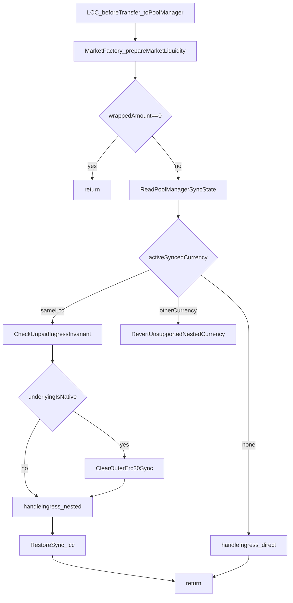

# Nested Settle Restore Plan

## Goal

Make `[contracts/evm/src/MarketFactory.sol](/Users/ryansoury/dev/fiet/protocol/contracts/evm/src/MarketFactory.sol)` the sole coordinator for nested ingress settlement so that:

- `LCC` continues to report wrapped ingress facts without learning about `PoolManager` transient state.
- `prepareMarketLiquidity(...)` preserves an outer canonical `sync(lcc) -> transfer -> settle()` window when nested underlying settlement occurs.
- the protocol enforces `at most one unpaid LCC -> PoolManager transfer per active sync(lcc) window`.
- native-underlying markets are explicitly supported rather than rejected.

## Implementation shape

### 1. Add transient-sync inspection helpers in `MarketFactory`

Update `[contracts/evm/src/MarketFactory.sol](/Users/ryansoury/dev/fiet/protocol/contracts/evm/src/MarketFactory.sol)` to read the active `PoolManager` sync context via `IExttload.exttload(...)`.

Add small internal helpers to:

- read the current synced currency slot from v4 core (`CurrencyReserves.CURRENCY_SLOT`)
- read the current synced reserves snapshot (`CurrencyReserves.RESERVES_OF_SLOT`)
- compare the active synced currency against `lcc`
- inspect the current `LCC` balance held by `PoolManager`

Keep the slot knowledge centralised in `MarketFactory` or a tiny adjacent helper so `LCC` remains boundary-clean.

### 2. Split `prepareMarketLiquidity(...)` into explicit nested-settlement branches

Refactor `[contracts/evm/src/MarketFactory.sol](/Users/ryansoury/dev/fiet/protocol/contracts/evm/src/MarketFactory.sol)` `prepareMarketLiquidity(address lcc, uint256 wrappedAmount)` so it no longer unconditionally forwards to `handleIngress(...)`.

The branch matrix should be:

- `wrappedAmount == 0`: return early.
- no active sync context: call `IVaultCoreActionHandler(handler).handleIngress(lcc, wrappedAmount)` directly.
- active sync for this exact `lcc`: enforce the unpaid-ingress invariant, execute nested ingress settlement, then restore the outer LCC sync context.
- active sync for some other ERC20 currency: revert as unsupported nested settlement.

This keeps the current caller boundary unchanged while making the restore behaviour explicit and auditable.

### 3. Enforce the unpaid-ingress invariant before restore

Inside the same-`lcc` branch in `[contracts/evm/src/MarketFactory.sol](/Users/ryansoury/dev/fiet/protocol/contracts/evm/src/MarketFactory.sol)`, enforce:

`at most one unpaid LCC -> PoolManager transfer per active sync(lcc) window`

Mechanism:

- read `syncedReserves` from `PoolManager` transient state
- read `IERC20(lcc).balanceOf(address(poolManager))`
- allow only when `poolManagerLccBalance == syncedReserves`
- revert when `poolManagerLccBalance > syncedReserves` because an earlier unpaid ingress already exists in the current sync window
- revert when `poolManagerLccBalance < syncedReserves` as invariant corruption / unsupported state

Prefer a dedicated error in `[contracts/evm/src/libraries/Errors.sol](/Users/ryansoury/dev/fiet/protocol/contracts/evm/src/libraries/Errors.sol)` rather than a generic string-based invariant error so tests and audits can assert the exact failure mode.

### 4. Support native-underlying nested settlement with explicit clear-and-restore flow

The native case needs its own branch because `PoolManager.settle{value: ...}()` will hit `NonzeroNativeValue()` if an ERC20 sync is still active.

Plan the same-`lcc` nested path as:

1. snapshot outer synced currency/reserves
2. if the target underlying is native, temporarily clear the active ERC20 sync context by calling `poolManager.sync(Currency.wrap(address(0)))` or the equivalent native-reset path
3. call `handleIngress(...)` so the underlying reserve mobilisation can complete
4. restore the outer LCC context with `poolManager.sync(Currency.wrap(lcc))`

For ERC20 underlyings, the nested path remains:

1. snapshot outer synced state
2. call `handleIngress(...)`
3. restore with `poolManager.sync(Currency.wrap(lcc))`

Make the native/erc20 distinction in `MarketFactory` using the `lcc` market metadata rather than moving v4 settlement knowledge into `[contracts/evm/src/LCC.sol](/Users/ryansoury/dev/fiet/protocol/contracts/evm/src/LCC.sol)`.

### 5. Keep `LCC` as a pure ingress reporter

`[contracts/evm/src/LCC.sol](/Users/ryansoury/dev/fiet/protocol/contracts/evm/src/LCC.sol)` should continue to do only what it does now:

- detect wrapped ingress to `BOUND_DEX`
- forward `(lcc, wrappedAmount)` to `prepareMarketLiquidity(...)`

Do not add `PoolManager` reads or transient-slot logic to `LCC`.

### 6. Add regression and edge-case coverage

Update the relevant unit/integration tests to cover the nested-settlement matrix.

Required coverage:

- canonical active `sync(lcc)` + first unpaid ingress succeeds and outer `settle()` still succeeds
- second unpaid ingress in the same sync window reverts with the new invariant error
- nested ingress while another ERC20 currency is the active synced currency reverts with the unsupported-context error
- no active sync context still allows direct ingress settlement
- native-underlying nested ingress succeeds via clear-and-restore
- direct-core `handleSwap` / `handleAddLiquidity` obligation paths still work unchanged
- the prior regressions that surfaced `CurrencyNotSettled()` / `NonzeroNativeValue()` now pass for canonical flows

Prefer to add focussed tests near existing `MarketFactory` / `LCC` / vault handler coverage rather than spreading the matrix across unrelated suites.

### 7. Document the invariant in `INVARIANTS.md`

Add a new invariant section to `[contracts/evm/INVARIANTS.md](/Users/ryansoury/dev/fiet/protocol/contracts/evm/INVARIANTS.md)` under the LCC / settlement / market sections.

Document:

- the statement of the invariant
- the enforcement point: `MarketFactory.prepareMarketLiquidity(...)`
- the canonical supported payment shape: `sync(lcc) -> one transfer -> settle()`
- the reason the protocol restores outer `sync(lcc)` after nested ingress settlement
- the explicit non-goal: non-canonical multi-transfer `LCC -> PoolManager` payment windows are unsupported and revert by design
- the native-underlying support rule, including that the active ERC20 sync context is temporarily cleared then restored only inside the controlled same-`lcc` branch

## Control-flow sketch

## Key files

- `[contracts/evm/src/MarketFactory.sol](/Users/ryansoury/dev/fiet/protocol/contracts/evm/src/MarketFactory.sol)`: implement sync-state inspection, invariant enforcement, restore path, and native handling.
- `[contracts/evm/src/libraries/Errors.sol](/Users/ryansoury/dev/fiet/protocol/contracts/evm/src/libraries/Errors.sol)`: add explicit custom errors for the new unsupported nested-settlement states.
- `[contracts/evm/src/LCC.sol](/Users/ryansoury/dev/fiet/protocol/contracts/evm/src/LCC.sol)`: keep ingress reporting intact; only minimal changes if needed for comments/tests.
- `[contracts/evm/src/modules/VaultCoreActionHandler.sol](/Users/ryansoury/dev/fiet/protocol/contracts/evm/src/modules/VaultCoreActionHandler.sol)`: no semantic change expected, but regression coverage should confirm `handleIngress(...)` still serves as the only factory-called settlement entrypoint.
- `[contracts/evm/INVARIANTS.md](/Users/ryansoury/dev/fiet/protocol/contracts/evm/INVARIANTS.md)`: document the new invariant and supported/non-supported flow shapes.
