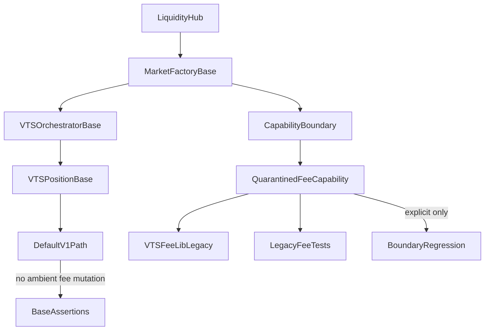

# Phase 1: Boundary And Quarantine

## Objective

Create a Phase 1 refactor for [`contracts/evm`](contracts/evm) that **does not delete fee-era code yet**. Instead, it should establish a clean **base market boundary** and quarantine fee-adjustment behaviour behind explicit seams.

This phase is successful when:

- the default v1 runtime path no longer performs ambient fee-era mutation;
- the fee-era implementation still exists and can be exercised explicitly for validation;
- the existing fee-oriented test suite remains available as executable regression scaffolding;
- the codebase is in a safer state for a later deletion / migration phase.

## Scope

- In scope:
  - boundary formation;
  - runtime quarantine;
  - config/interface normalisation;
  - invariant taxonomy;
  - regression-suite preservation;
  - explicit Phase 1 exit criteria.
- Out of scope:
  - deleting legacy fee files;
  - removing fee-era storage solely for tidiness;
  - physically moving code into `contracts/evm-v2`;
  - rewriting the fee model itself.

## Implementation Constraint

- Minimise file renaming during Phase 1.
- Prefer preserving existing file names and locations unless a rename is strictly necessary to establish the boundary safely.
- Preserve implementation attention and review tokens for the more important work: isolating runtime seams, proving quarantine, and stabilising the base path.
- If a clearer conceptual boundary is needed before Phase 2, prefer documenting the intended future ownership in invariants/specs rather than renaming files early.

## Phase Boundary



## Why This Phase Exists

The current fee system is still ambient in the v1 hot path. The main live couplings are:

```solidity
// contracts/evm/src/MarketFactory.sol
vtsOrchestrator.incrementCoverage(pId, ...);
```

```solidity
// contracts/evm/src/libraries/VTSPositionLib.sol
VTSFeeLinkedLib.settleSettledIndexedCoverageUsage(s, positionId);
VTSFeeLinkedLib.settleDeficitIndexedCoverageUsage(s, poolManager, positionId);
```

```solidity
// contracts/evm/src/libraries/VTSPositionLib.sol
result.feeAdj = _afterTouchPositionFees(s, result.id, p.feesAccrued, p.params.liquidityDelta < 0);
```

Those seams mean Phase 1 must isolate the base path first, before any safe deletion or migration can happen.

## Architectural Intent

### Base-v1 line

[`contracts/evm/src`](contracts/evm/src) should remain the conservative product line for:

- market creation;
- liquidity routing;
- commitment lifecycle;
- RFS and seizure logic;
- generic settlement and growth accounting.

### Quarantined fee capability

Legacy fee-era behaviour should remain present, but only through explicit capability seams:

- controlled entrypoints or branches;
- harness-accessible testing surfaces;
- clear documentation that this is not part of the default v1 path.

## Workstreams

### 1. Map and isolate the runtime boundary

Identify and quarantine every place where fee-era logic is currently ambient in the default path.

Primary files:

- [contracts/evm/src/MarketFactory.sol](contracts/evm/src/MarketFactory.sol)
- [contracts/evm/src/VTSOrchestrator.sol](contracts/evm/src/VTSOrchestrator.sol)
- [contracts/evm/src/libraries/VTSPositionLib.sol](contracts/evm/src/libraries/VTSPositionLib.sol)
- [contracts/evm/src/libraries/VTSFeeLib.sol](contracts/evm/src/libraries/VTSFeeLib.sol)

Initial targets:

- `useMarketLiquidity()` -> `incrementCoverage()`
- `settlePositionGrowths()` coverage reconciliation
- `_afterTouchPositionFees()` / `feeAdj` production
- residual fee-backing capture on decreases

Goal:

- the default v1 path should no longer reach these behaviours implicitly;
- any retained fee behaviour should be reached only through an explicit capability path.

### 2. Normalise the base-v1 surface

Separate the **base market surface** from the **legacy fee surface** at the config and interface level.

Primary files:

- [contracts/evm/src/types/VTS.sol](contracts/evm/src/types/VTS.sol)
- [contracts/evm/src/interfaces/IVTSOrchestrator.sol](contracts/evm/src/interfaces/IVTSOrchestrator.sol)
- [contracts/evm/src/libraries/VTSConfigs.sol](contracts/evm/src/libraries/VTSConfigs.sol)

Questions to resolve in Phase 1:

- Which fields remain on the base config surface but become inert?
- Which surfaces should become capability-only, even if not deleted yet?
- Whether `incrementCoverage(...)` remains part of the base orchestrator ABI during quarantine, or becomes an explicitly capability-scoped path.

Special attention:

- `MarketVTSConfiguration.coverageFeeShare`
- `TouchPositionParams.feesAccrued`
- `TouchPositionResult.feeAdj`
- `getSlashedPot(...)`
- `getPositionFeeAccounting(...)`
- `incrementCoverage(...)`

Data-structure expectation for Phase 1:

- be explicit about which fields in [contracts/evm/src/types/VTS.sol](contracts/evm/src/types/VTS.sol) are base-critical versus fee-era/quarantined;
- where fields become inert on the default path, prepare them for later extraction into dedicated legacy structs rather than leaving them conceptually mixed into the core accounting model;
- if full structural extraction is too risky for Phase 1, add code comments around the relevant field blocks showing the intended future split so Phase 2 can isolate or remove them safely.

### 3. Introduce a capability taxonomy for invariants

Split the current invariant set into three classes:

- **Base invariants**: always true for the conservative base market line
- **Capability annex invariants**: true only when a named capability is enabled
- **Historical notes**: useful research context, not active runtime guarantees

Primary file:

- [contracts/evm/INVARIANTS.md](contracts/evm/INVARIANTS.md)
- [contracts/evm/ANNEXED-INVARIANTS.md](contracts/evm/ANNEXED-INVARIANTS.md)

Recommended taxonomy:

- `BASE-*`
- `CAP-COVERAGE-*`
- `CAP-FEEADJ-*`
- `CAP-CUSTODY-*` if later needed
- `HIST-*`

Initial likely candidates:

- keep only the core/base guarantees in [contracts/evm/INVARIANTS.md](contracts/evm/INVARIANTS.md);
- move non-core capability-specific material into [contracts/evm/ANNEXED-INVARIANTS.md](contracts/evm/ANNEXED-INVARIANTS.md);
- keep `VTS-01` and generic settlement rules as base;
- reclassify `COV-*` and `FEE-*` as annexed capability invariants unless they remain truly structural after quarantine;
- move older narrative assumptions into historical notes where they no longer describe default behaviour.

Target file roles:

- [contracts/evm/INVARIANTS.md](contracts/evm/INVARIANTS.md): only core/base invariants for the conservative default line
- [contracts/evm/ANNEXED-INVARIANTS.md](contracts/evm/ANNEXED-INVARIANTS.md): non-core, capability-specific, and quarantined-runtime invariants that still matter for explicit fee/coverage paths

### 4. Preserve the existing fee-oriented suite as boundary scaffolding

Do not delete the fee suite in Phase 1. Use it to validate the correctness of the new boundary.

Preserve and repurpose:

- [contracts/evm/test/libraries/VTSFeeLib.t.sol](contracts/evm/test/libraries/VTSFeeLib.t.sol)
- [contracts/evm/test/libraries/VTSFeeLib.scenario.t.sol](contracts/evm/test/libraries/VTSFeeLib.scenario.t.sol)
- [contracts/evm/test/libraries/VTSFeeLib.index.t.sol](contracts/evm/test/libraries/VTSFeeLib.index.t.sol)
- [contracts/evm/test/libraries/harnesses/VTSFeeLibHarness.sol](contracts/evm/test/libraries/harnesses/VTSFeeLibHarness.sol)
- [contracts/evm/test/libraries/VTSPositionLib.t.sol](contracts/evm/test/libraries/VTSPositionLib.t.sol)
- [contracts/evm/test/libraries/VTSPositionLib.mutation.unit.t.sol](contracts/evm/test/libraries/VTSPositionLib.mutation.unit.t.sol)
- [contracts/evm/test/VTSOrchestrator.t.sol](contracts/evm/test/VTSOrchestrator.t.sol)
- fuzz/invariant coverage for `COV-*` and `FEE-*`

Purpose in Phase 1:

- prove the quarantined fee implementation still behaves correctly when reached explicitly;
- prove the default path no longer reaches it accidentally;
- avoid losing the best executable specification before deletion/migration decisions are stable.

### 5. Add a minimal quarantine regression layer

Add a small set of focused regressions specifically for Phase 1 success criteria.

Recommended assertions:

- default v1 path does not mutate fee-era state;
- `incrementCoverage` and growth settlement no longer imply fee outcomes on the default path;
- explicit quarantined entrypoints still drive the old fee behaviour in a controlled environment;
- ordering-sensitive base invariants such as growth-before-modify remain intact.

Examples of the kind of state to watch:

- `slashedPot`
- `pendingFeeAdj`
- DICE / CISE indices
- CSI epoch/factor state

### 6. Establish a state quarantine checkpoint

Before any deletion or migration, explicitly prove which fee-era fields are:

- still live on the default path;
- present but inert;
- explicit-only through the quarantined capability;
- candidates for later deletion.

Primary file:

- [contracts/evm/src/types/VTS.sol](contracts/evm/src/types/VTS.sol)

This checkpoint is required before any later Phase 2 file movement or storage simplification.

Data-structure deliverables in Phase 1:

- classify the field groups inside `PositionAccounting` and `PoolAccounting`;
- identify the fee-era/quarantined blocks that should eventually move into dedicated legacy structs;
- either isolate those blocks into their own structs in a low-risk way, or annotate the existing field groups with explicit removal/migration comments that make the future extraction straightforward;
- create a dedicated markdown note describing the intended struct split, migration order, and removal mechanics.

Initial likely quarantined field groups in [contracts/evm/src/types/VTS.sol](contracts/evm/src/types/VTS.sol):

- `PositionAccounting`: `feesShared`, `pendingFeeAdj`, DICE coverage checkpoints, residual-burn banking, CISE/CSI fields, `feeBurnGrowthRemainder`
- `PoolAccounting`: `slashedPot`, `coveragePerDeficitIndexX128`, `coveragePerResidualDeficitIndexX128`, `coverageResidualDICE`, `totalSettled`, `coveragePerSettledIndexX128`, `totalCISEExposureSinceLastMod`, `feesSharedRemainingFactorX128`, `feesSharedEpoch`

## Documentation Strategy

### Active Phase 1 docs

- [contracts/evm/INVARIANTS.md](contracts/evm/INVARIANTS.md) should describe only the core/base line.
- [contracts/evm/ANNEXED-INVARIANTS.md](contracts/evm/ANNEXED-INVARIANTS.md) should hold non-core capability-specific invariants.
- [contracts/evm/VTS-INERT-STATE-ISOLATION.md](contracts/evm/VTS-INERT-STATE-ISOLATION.md) should describe how inert/quarantined `VTS.sol` fields are grouped, annotated, and later extracted or removed.

### Capability-spec references

- [agents/spec/Fee-Pot-Materialisation-And-DirectLP-Policy.md](agents/spec/Fee-Pot-Materialisation-And-DirectLP-Policy.md)
- related DICE / CISE / fee-adjustment specs under [agents/spec](agents/spec)

These should remain available during Phase 1 as design references for the quarantined capability, but should no longer be phrased as the default v1 product story.

## File Focus

- [contracts/evm/src/MarketFactory.sol](contracts/evm/src/MarketFactory.sol): isolate coverage-triggered fee coupling from the default base line
- [contracts/evm/src/VTSOrchestrator.sol](contracts/evm/src/VTSOrchestrator.sol): preserve generic orchestration while separating capability-specific surfaces
- [contracts/evm/src/libraries/VTSPositionLib.sol](contracts/evm/src/libraries/VTSPositionLib.sol): quarantine fee settlement and `feeAdj` production from the default touch/growth path
- [contracts/evm/src/libraries/VTSFeeLib.sol](contracts/evm/src/libraries/VTSFeeLib.sol): keep present, but remove from ambient v1 execution
- [contracts/evm/src/types/VTS.sol](contracts/evm/src/types/VTS.sol): classify base vs quarantined state
- [contracts/evm/src/interfaces/IVTSOrchestrator.sol](contracts/evm/src/interfaces/IVTSOrchestrator.sol): classify base vs capability-only interface surface
- [contracts/evm/INVARIANTS.md](contracts/evm/INVARIANTS.md): reduce to core/base guarantees only
- [contracts/evm/ANNEXED-INVARIANTS.md](contracts/evm/ANNEXED-INVARIANTS.md): hold non-core capability-specific and quarantined-path invariants
- [contracts/evm/VTS-INERT-STATE-ISOLATION.md](contracts/evm/VTS-INERT-STATE-ISOLATION.md): document the future struct split and removal path for inert fee-era fields

## Phase 1 Exit Criteria

Phase 1 is complete when all of the following are true:

1. The default v1 runtime path no longer performs ambient fee-era mutation.
2. Legacy fee behaviour is still reachable only through explicit, quarantined seams.
3. The existing fee-oriented tests still run as regression scaffolding for the quarantined capability.
4. A small set of new quarantine regressions proves that default-path operations do not change fee-era state.
5. The invariant set is clearly split between [contracts/evm/INVARIANTS.md](contracts/evm/INVARIANTS.md) for core guarantees and [contracts/evm/ANNEXED-INVARIANTS.md](contracts/evm/ANNEXED-INVARIANTS.md) for non-core capability-specific guarantees, with historical notes separated appropriately.
6. [contracts/evm/src/types/VTS.sol](contracts/evm/src/types/VTS.sol) clearly identifies which field groups are inert/quarantined and how they should later move into dedicated legacy structs or be removed.
7. [contracts/evm/VTS-INERT-STATE-ISOLATION.md](contracts/evm/VTS-INERT-STATE-ISOLATION.md) exists as the explicit hand-off note for the later storage simplification phase.
8. The codebase is ready for a later deletion / migration phase without ambiguity about what is still live.

## Non-Goals

- Do not delete `VTSFeeLib` in Phase 1.
- Do not rename files merely to reflect future architecture if the same boundary can be expressed through runtime isolation and documentation.
- Do not move code into `contracts/evm-v2` in Phase 1.
- Do not collapse the existing fee suite prematurely.
- Do not simplify storage just because it appears unused before quarantine is proven.

## Hand-off To Phase 2

Only once Phase 1 exit criteria are met should a later plan decide:

- what can be deleted;
- what should move to `contracts/evm-v2`;
- which tests become obsolete;
- and whether the future capability should be implemented as a dedicated engine, a new factory/corehook family, or both.
