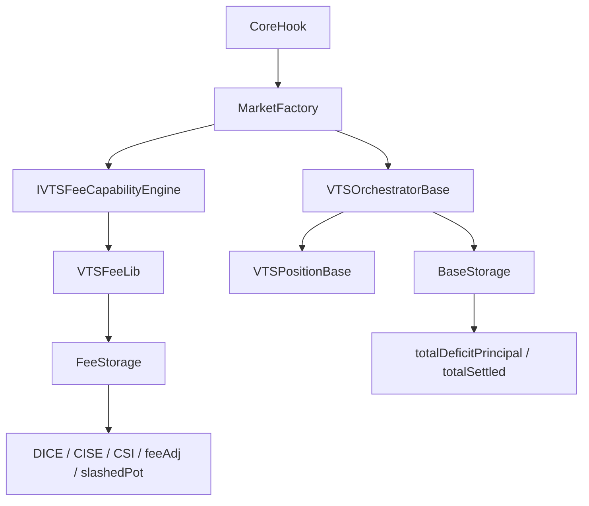

# VTS Fee Carve-Out Plan

## Goal
Refactor [`contracts/evm/src/VTSOrchestrator.sol`](/Users/ryansoury/dev/fiet/protocol/contracts/evm/src/VTSOrchestrator.sol) and [`contracts/evm/src/libraries/VTSPositionLib.sol`](/Users/ryansoury/dev/fiet/protocol/contracts/evm/src/libraries/VTSPositionLib.sol) so fee-related logic lives behind [`contracts/evm/src/libraries/VTSFeeLib.sol`](/Users/ryansoury/dev/fiet/protocol/contracts/evm/src/libraries/VTSFeeLib.sol) plus a new fee storage/types file (target `VTSFee.sol`), with a lean [`contracts/evm/src/interfaces/IVTSFeeCapabilityEngine.sol`](/Users/ryansoury/dev/fiet/protocol/contracts/evm/src/interfaces/IVTSFeeCapabilityEngine.sol) routed through `CoreHook -> MarketFactory -> IVTSFeeCapabilityEngine`, while keeping test expectations/parity intact.

## Target Boundary

## Keep In Base Engine
These stay in the original VTS engine and remain the source of truth:
- In [`contracts/evm/src/types/VTS.sol`](/Users/ryansoury/dev/fiet/protocol/contracts/evm/src/types/VTS.sol):
  - `PositionAccounting.commitmentMax`
  - `PositionAccounting.settled`
  - `PositionAccounting.cumulativeDeficit`
  - `PositionAccounting.deficitGrowthInsideLast`
  - `PositionAccounting.inflowGrowthInsideLast`
  - `PositionAccounting.cumulativeOutflows`
  - `PositionAccounting.commitmentDeficit`
  - `PositionAccounting.commitmentDeficitBps`
  - `PositionAccounting.commitmentDeficitSince`
  - `PoolAccounting.deficitGrowthGlobal`
  - `PoolAccounting.inflowGrowthGlobal`
  - `PoolAccounting.totalDeficitPrincipal`
  - `PoolAccounting.totalSettled`
- In [`contracts/evm/src/libraries/VTSPositionLib.sol`](/Users/ryansoury/dev/fiet/protocol/contracts/evm/src/libraries/VTSPositionLib.sol):
  - position registration/linking
  - commitment tracking
  - base settlement update paths (`_sUpdateSettlement`, `_updatePoolAccounting`, deficit/inflow growth)
  - liquidity mirror / active-status management
  - RFS / checkpoint / non-fee touch control flow
- In [`contracts/evm/src/VTSOrchestrator.sol`](/Users/ryansoury/dev/fiet/protocol/contracts/evm/src/VTSOrchestrator.sol):
  - auth / pause policy
  - base `processPosition` routing
  - base `settlePositionGrowths` routing
  - base denominator readers
  - ownership of the configured fee hook target and outer capability routing

## Move To `VTSFee.sol` + `VTSFeeLib`
Create a new fee types/storage file (target [`contracts/evm/src/types/VTSFee.sol`](/Users/ryansoury/dev/fiet/protocol/contracts/evm/src/types/VTSFee.sol)) containing:
- Pool fee state:
  - `slashedPot`
  - `coveragePerDeficitIndexX128`
  - `coveragePerResidualDeficitIndexX128`
  - `coverageResidualDICE`
  - `coveragePerSettledIndexX128`
  - `totalCISEExposureSinceLastMod`
  - `feesSharedRemainingFactorX128`
  - `feesSharedEpoch`
- Position fee state:
  - `feesShared`
  - `pendingFeeAdj`
  - `coverageIndexLastX128`
  - `residualCoverageIndexLastX128`
  - `pendingResidualBurnBase`
  - `pendingResidualFeeBacking`
  - `pendingResidualBurnOutflowsFloor`
  - `diceOrdinaryRealisationCarry`
  - `diceResidualRealisationCarry`
  - `diceOrdinaryCovAgg`
  - `diceResidualCovAgg`
  - `ciseIndexLastX128`
  - `ciseExposureSinceLastMod`
  - `feesSharedRemainingFactorLastX128`
  - `feesSharedEpoch`
  - `feeBurnGrowthRemainder`
  - `feeGrowthInsideLast`
  - `outflowsAtFeeSnap`
- Fee config gate:
  - move or alias `coverageFeeShare` handling into the fee storage/config layer while preserving the current enable/disable semantics.

## Staged Refactor
### 1. Introduce fee storage/types without changing behaviour
- Add `VTSFee.sol` types and fee storage mappings/slices.
- Add internal accessors inside [`contracts/evm/src/libraries/VTSFeeLib.sol`](/Users/ryansoury/dev/fiet/protocol/contracts/evm/src/libraries/VTSFeeLib.sol) so callers stop reaching directly into `s.positionAccounting` / `s.poolAccounting` for fee fields.
- Keep existing getter signatures in [`contracts/evm/src/VTSOrchestrator.sol`](/Users/ryansoury/dev/fiet/protocol/contracts/evm/src/VTSOrchestrator.sol) and [`contracts/evm/src/interfaces/IVTSOrchestrator.sol`](/Users/ryansoury/dev/fiet/protocol/contracts/evm/src/interfaces/IVTSOrchestrator.sol), but rewire them to read from the new fee storage.

### 2. Define the lean hook owner and wiring
- Add [`contracts/evm/src/interfaces/IVTSFeeCapabilityEngine.sol`](/Users/ryansoury/dev/fiet/protocol/contracts/evm/src/interfaces/IVTSFeeCapabilityEngine.sol).
- Keep the hook surface lean and outer-layer owned. Minimum hook set:
  - `incrementCoverage(PoolId poolId, uint256 amount0, uint256 amount1)`
  - `beforeSettleGrowths(PositionId positionId)`
  - `afterSettleGrowths(PositionId positionId, uint256 totalDeficitPrincipal0Before, uint256 totalDeficitPrincipal1Before, uint256 totalDeficitPrincipal0After, uint256 totalDeficitPrincipal1After)`
  - `onInitPosition(...)`
  - `onTouchPosition(...) returns (BalanceDelta feeAdj)`
- Route fee hooks through `CoreHook -> MarketFactory -> IVTSFeeCapabilityEngine`.
- `VTSFeeLib` remains the calculation library behind the interface implementation; no standalone fee engine contract is required.

### 3. Move pool coverage accounting first
- Carve `incrementCoverage` implementation out of [`contracts/evm/src/libraries/VTSCommitLib.sol`](/Users/ryansoury/dev/fiet/protocol/contracts/evm/src/libraries/VTSCommitLib.sol) into [`contracts/evm/src/libraries/VTSFeeLib.sol`](/Users/ryansoury/dev/fiet/protocol/contracts/evm/src/libraries/VTSFeeLib.sol).
- Route [`contracts/evm/src/MarketFactory.sol`](/Users/ryansoury/dev/fiet/protocol/contracts/evm/src/MarketFactory.sol) through `IVTSFeeCapabilityEngine.incrementCoverage(...)`.
- The fee-side implementation should continue to read base denominators from the original engine (`totalDeficitPrincipal`, `totalSettled`) and write only fee-owned pool state.

### 4. Move growth-settlement fee phases out of `VTSPositionLib`
Refactor [`contracts/evm/src/libraries/VTSPositionLib.sol`](/Users/ryansoury/dev/fiet/protocol/contracts/evm/src/libraries/VTSPositionLib.sol) so it no longer directly calls fee internals or writes fee fields. Replace direct fee interaction with the outer hook phases:
- `beforeSettleGrowths(...)`
  - mirror reconcile
  - fee-burn remainder hygiene
  - CISE settlement that must happen before deficit growth
- base deficit growth executes in `VTSPositionLib`
- `afterSettleGrowths(...)`
  - compares total deficit principal before/after
  - flushes residual coverage if new principal appeared
  - settles DICE after deficit growth and before inflow netting
- fee snapshot initialisation / zero-principal checkpoint helpers are no longer called from `VTSPositionLib`; they are driven from outer-layer init/touch hooks

Preserve current ordering:
1. CISE settle
2. deficit growth
3. DICE settle
4. inflow growth

### 5. Embed fee-owned init and touch entrypoints behind the outer hook path
Add fee-owned `onInitPosition(...)` and `onTouchPosition(...)` implementations to [`contracts/evm/src/libraries/VTSFeeLib.sol`](/Users/ryansoury/dev/fiet/protocol/contracts/evm/src/libraries/VTSFeeLib.sol).

The base [`contracts/evm/src/libraries/VTSPositionLib.sol`](/Users/ryansoury/dev/fiet/protocol/contracts/evm/src/libraries/VTSPositionLib.sol) touch flow should remain the owner of base lifecycle decisions, but fee-specific work should be driven only by the outer call graph:
- `CoreHook -> MarketFactory -> IVTSFeeCapabilityEngine.onInitPosition(...)` for new position fee snapshot initialisation
- `CoreHook -> MarketFactory -> IVTSFeeCapabilityEngine.onTouchPosition(...)` for:
  - residual fee backing capture on decrease
  - residual fee growth rebase on increase
  - fee snapshot / reactivation checkpoint pieces
  - final `feeAdj` materialisation

### 6. Remove direct fee-field mutation from base code
After the new fee storage and fee touch/settle entrypoints are wired:
- delete direct writes to moved fee fields from [`contracts/evm/src/libraries/VTSPositionLib.sol`](/Users/ryansoury/dev/fiet/protocol/contracts/evm/src/libraries/VTSPositionLib.sol)
- delete fee-only logic from [`contracts/evm/src/VTSOrchestrator.sol`](/Users/ryansoury/dev/fiet/protocol/contracts/evm/src/VTSOrchestrator.sol) beyond auth/routing/read helpers
- ensure no `VTSFeeLib` / `VTSFeeLinkedLib` calls remain in [`contracts/evm/src/libraries/VTSPositionLib.sol`](/Users/ryansoury/dev/fiet/protocol/contracts/evm/src/libraries/VTSPositionLib.sol)
- keep only reads of the base denominators and base position state as fee inputs

## Minimal Test-Churn Strategy
Preserve test outcomes by keeping public/harness surfaces stable wherever possible.
- Update only storage paths / contract-library references in:
  - [`contracts/evm/test/base/VTSOrchestratorTestable.sol`](/Users/ryansoury/dev/fiet/protocol/contracts/evm/test/base/VTSOrchestratorTestable.sol)
  - [`contracts/evm/test/libraries/harnesses/VTSFeeLibHarness.sol`](/Users/ryansoury/dev/fiet/protocol/contracts/evm/test/libraries/harnesses/VTSFeeLibHarness.sol)
  - [`contracts/evm/test/libraries/harnesses/VTSPositionLibHarness.sol`](/Users/ryansoury/dev/fiet/protocol/contracts/evm/test/libraries/harnesses/VTSPositionLibHarness.sol)
- Aim to keep behavioural assertions unchanged in:
  - [`contracts/evm/test/libraries/VTSFeeLib.t.sol`](/Users/ryansoury/dev/fiet/protocol/contracts/evm/test/libraries/VTSFeeLib.t.sol)
  - [`contracts/evm/test/libraries/VTSFeeLib.index.t.sol`](/Users/ryansoury/dev/fiet/protocol/contracts/evm/test/libraries/VTSFeeLib.index.t.sol)
  - [`contracts/evm/test/libraries/VTSFeeLib.scenario.t.sol`](/Users/ryansoury/dev/fiet/protocol/contracts/evm/test/libraries/VTSFeeLib.scenario.t.sol)
  - [`contracts/evm/test/libraries/VTSPositionLib.t.sol`](/Users/ryansoury/dev/fiet/protocol/contracts/evm/test/libraries/VTSPositionLib.t.sol)
  - [`contracts/evm/test/libraries/VTSPositionLib.mutation.unit.t.sol`](/Users/ryansoury/dev/fiet/protocol/contracts/evm/test/libraries/VTSPositionLib.mutation.unit.t.sol)
  - [`contracts/evm/test/Phase1Quarantine.t.sol`](/Users/ryansoury/dev/fiet/protocol/contracts/evm/test/Phase1Quarantine.t.sol)

## Verification Gates
After each stage:
- compile the full `contracts/evm` suite
- run the focused fee tests first (`VTSFeeLib*`, `VTSPositionLib*`, `VTSOrchestrator.t.sol`)
- then run the full Foundry suite
- keep the Phase 1 quarantine tests green to prove base-config markets still avoid fee-state mutation

## Risks To Watch
- `feeGrowthInsideLast` and `outflowsAtFeeSnap` are logically fee-owned but currently interleaved with core fields; moving them must not desynchronise reads against `cumulativeOutflows`, `settled`, or PoolManager fee growth.
- `incrementCoverage` parity depends on reading the base denominators exactly as before.
- `afterSettleGrowths(...)` must be placed after base deficit growth but before base inflow netting; if it runs at the wrong time, the current CISE-before-deficit-before-DICE ordering is lost.
- The current test suite uses harnesses and debug getters that open storage directly; these should be adapted before broad behavioural debugging begins.