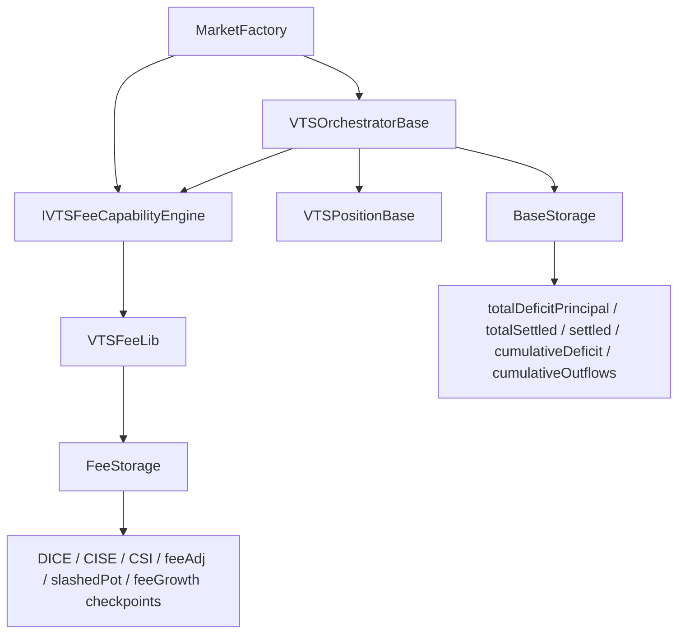

# VTS Fee Hook Carve-Out Plan

## Goal

Refactor [`contracts/evm/src/VTSOrchestrator.sol`](/Users/ryansoury/dev/fiet/protocol/contracts/evm/src/VTSOrchestrator.sol) and [`contracts/evm/src/libraries/VTSPositionLib.sol`](/Users/ryansoury/dev/fiet/protocol/contracts/evm/src/libraries/VTSPositionLib.sol) so fee-related logic is owned by [`contracts/evm/src/libraries/VTSFeeLib.sol`](/Users/ryansoury/dev/fiet/protocol/contracts/evm/src/libraries/VTSFeeLib.sol) plus a new [`contracts/evm/src/types/VTSFee.sol`](/Users/ryansoury/dev/fiet/protocol/contracts/evm/src/types/VTSFee.sol), with a new [`contracts/evm/src/interfaces/IVTSFeeCapabilityEngine.sol`](/Users/ryansoury/dev/fiet/protocol/contracts/evm/src/interfaces/IVTSFeeCapabilityEngine.sol) hook surface that `MarketFactory` can use and `VTSPositionLib` can target indirectly through its owner contract.

## Boundary Intent

## Keep In Base Engine

These remain the source of truth in the original VTS engine:

- In [`contracts/evm/src/types/VTS.sol`](/Users/ryansoury/dev/fiet/protocol/contracts/evm/src/types/VTS.sol):
  - `PositionAccounting.commitmentMax`
  - `PositionAccounting.settled`
  - `PositionAccounting.cumulativeDeficit`
  - `PositionAccounting.deficitGrowthInsideLast`
  - `PositionAccounting.inflowGrowthInsideLast`
  - `PositionAccounting.cumulativeOutflows`
  - `PositionAccounting.commitmentDeficit`
  - `PositionAccounting.commitmentDeficitBps`
  - `PositionAccounting.commitmentDeficitSince`
  - `PoolAccounting.deficitGrowthGlobal`
  - `PoolAccounting.inflowGrowthGlobal`
  - `PoolAccounting.totalDeficitPrincipal`
  - `PoolAccounting.totalSettled`
- In [`contracts/evm/src/libraries/VTSPositionLib.sol`](/Users/ryansoury/dev/fiet/protocol/contracts/evm/src/libraries/VTSPositionLib.sol):
  - position registration / linking
  - commitment tracking
  - base settlement updates (`_sUpdateSettlement`, `_updatePoolAccounting`, deficit/inflow growth)
  - liquidity mirror / active-status management
  - RFS / checkpoint / non-fee touch control flow
- In [`contracts/evm/src/VTSOrchestrator.sol`](/Users/ryansoury/dev/fiet/protocol/contracts/evm/src/VTSOrchestrator.sol):
  - auth / pause policy
  - base `processPosition` routing
  - base `settlePositionGrowths` routing
  - base denominator readers
  - ownership of the fee hook target / capability routing

## Move To `VTSFee.sol` + `VTSFeeLib`

Create [`contracts/evm/src/types/VTSFee.sol`](/Users/ryansoury/dev/fiet/protocol/contracts/evm/src/types/VTSFee.sol) for fee-owned storage:

- Pool fee state:
  - `slashedPot`
  - `coveragePerDeficitIndexX128`
  - `coveragePerResidualDeficitIndexX128`
  - `coverageResidualDICE`
  - `coveragePerSettledIndexX128`
  - `totalCISEExposureSinceLastMod`
  - `feesSharedRemainingFactorX128`
  - `feesSharedEpoch`
- Position fee state:
  - `feesShared`
  - `pendingFeeAdj`
  - `coverageIndexLastX128`
  - `residualCoverageIndexLastX128`
  - `pendingResidualBurnBase`
  - `pendingResidualFeeBacking`
  - `pendingResidualBurnOutflowsFloor`
  - `diceOrdinaryRealisationCarry`
  - `diceResidualRealisationCarry`
  - `diceOrdinaryCovAgg`
  - `diceResidualCovAgg`
  - `ciseIndexLastX128`
  - `ciseExposureSinceLastMod`
  - `feesSharedRemainingFactorLastX128`
  - `feesSharedEpoch`
  - `feeBurnGrowthRemainder`
  - `feeGrowthInsideLast`
  - `outflowsAtFeeSnap`
- Fee config gate:
  - keep `coverageFeeShare` semantics, but ensure fee enablement is evaluated only at the explicit capability boundary

## `IVTSFeeCapabilityEngine` Hook Surface

Add [`contracts/evm/src/interfaces/IVTSFeeCapabilityEngine.sol`](/Users/ryansoury/dev/fiet/protocol/contracts/evm/src/interfaces/IVTSFeeCapabilityEngine.sol) with hooks sufficient to remove all direct `VTSFeeLib` calls from [`contracts/evm/src/libraries/VTSPositionLib.sol`](/Users/ryansoury/dev/fiet/protocol/contracts/evm/src/libraries/VTSPositionLib.sol).

Minimum hook set:

- `incrementCoverage(PoolId poolId, uint256 amount0, uint256 amount1)`
- `onSettleGrowthsPreDeficit(PositionId positionId)`
  - for mirror reconcile, fee-burn remainder hygiene, and CISE settlement that must happen before base deficit growth
- `onPrincipalIncrease(PositionId positionId, uint8 tokenIndex)` or a pool/position-level equivalent
  - for `flushCoverageResidualIfNeeded` after base creates new deficit principal
- `onSettleGrowthsPostDeficit(PositionId positionId)`
  - for DICE settlement that must happen after deficit growth and before inflow netting
- `onTouchPosition(...) returns (BalanceDelta feeAdj)`
  - for residual capture on decrease, residual rebase on increase, fee snapshot/reactivation work, and final feeAdj materialisation
- optional narrow helpers if needed to keep ordering explicit:
  - `onInitPositionSnapshots(...)`
  - `onCheckpointZeroPrincipalSnapshots(...)`

This interface should be implemented by the owning contract/context, not by a new standalone engine contract. `VTSFeeLib` remains the calculation library behind that implementation.

## Staged Refactor

### 1. Introduce fee storage/types without changing behaviour

- Add `VTSFee.sol` types and fee storage mappings/slices.
- Add internal accessors inside [`contracts/evm/src/libraries/VTSFeeLib.sol`](/Users/ryansoury/dev/fiet/protocol/contracts/evm/src/libraries/VTSFeeLib.sol) so callers stop reaching directly into `s.positionAccounting` / `s.poolAccounting` for fee fields.
- Keep existing getter signatures in [`contracts/evm/src/VTSOrchestrator.sol`](/Users/ryansoury/dev/fiet/protocol/contracts/evm/src/VTSOrchestrator.sol) and [`contracts/evm/src/interfaces/IVTSOrchestrator.sol`](/Users/ryansoury/dev/fiet/protocol/contracts/evm/src/interfaces/IVTSOrchestrator.sol), but rewire them to read from the new fee storage.

### 2. Define the hook owner and wiring

- Add [`contracts/evm/src/interfaces/IVTSFeeCapabilityEngine.sol`](/Users/ryansoury/dev/fiet/protocol/contracts/evm/src/interfaces/IVTSFeeCapabilityEngine.sol).
- Update [`contracts/evm/src/MarketFactory.sol`](/Users/ryansoury/dev/fiet/protocol/contracts/evm/src/MarketFactory.sol) to depend on the interface for `incrementCoverage(...)`.
- Update [`contracts/evm/src/VTSOrchestrator.sol`](/Users/ryansoury/dev/fiet/protocol/contracts/evm/src/VTSOrchestrator.sol) to own the configured fee hook target and route hook calls to `VTSFeeLib`-backed implementations.
- Keep hook logic synchronous; no event-feed pattern.

### 3. Move pool coverage accounting first

- Carve `incrementCoverage` implementation out of [`contracts/evm/src/libraries/VTSCommitLib.sol`](/Users/ryansoury/dev/fiet/protocol/contracts/evm/src/libraries/VTSCommitLib.sol) into [`contracts/evm/src/libraries/VTSFeeLib.sol`](/Users/ryansoury/dev/fiet/protocol/contracts/evm/src/libraries/VTSFeeLib.sol).
- Route [`contracts/evm/src/MarketFactory.sol`](/Users/ryansoury/dev/fiet/protocol/contracts/evm/src/MarketFactory.sol) through `IVTSFeeCapabilityEngine.incrementCoverage(...)`.
- Continue reading base denominators from the original engine (`totalDeficitPrincipal`, `totalSettled`) while writing only fee-owned pool state.

### 4. Move growth-settlement fee phases out of `VTSPositionLib`

Refactor [`contracts/evm/src/libraries/VTSPositionLib.sol`](/Users/ryansoury/dev/fiet/protocol/contracts/evm/src/libraries/VTSPositionLib.sol) so it no longer directly calls fee internals or writes fee fields. Replace those direct calls with contract-level hook invocations through `IVTSFeeCapabilityEngine`, with implementations delegated to [`contracts/evm/src/libraries/VTSFeeLib.sol`](/Users/ryansoury/dev/fiet/protocol/contracts/evm/src/libraries/VTSFeeLib.sol):

- `onSettleGrowthsPreDeficit(...)`
- `onPrincipalIncrease(...)`
- `onSettleGrowthsPostDeficit(...)`
- fee snapshot initialisation / zero-principal checkpoint helpers as required

Preserve current ordering:

1. CISE settle
2. deficit growth
3. DICE settle
4. inflow growth

### 5. Embed a fee-owned `touchPosition` path behind the hook interface

- Add a new fee-owned `touchPosition` implementation to [`contracts/evm/src/libraries/VTSFeeLib.sol`](/Users/ryansoury/dev/fiet/protocol/contracts/evm/src/libraries/VTSFeeLib.sol).
- The base [`contracts/evm/src/libraries/VTSPositionLib.sol`](/Users/ryansoury/dev/fiet/protocol/contracts/evm/src/libraries/VTSPositionLib.sol) touch flow should remain responsible for base lifecycle, but fee-specific work should be supplied exclusively through `IVTSFeeCapabilityEngine.onTouchPosition(...)`.
- The fee touch path should own:
  - residual fee backing capture on decrease
  - residual fee growth rebase on increase
  - fee snapshot / reactivation checkpoint pieces
  - final `feeAdj` materialisation

### 6. Remove direct fee-field mutation from base code

After the new fee storage and hook entrypoints are wired:

- delete direct writes to moved fee fields from [`contracts/evm/src/libraries/VTSPositionLib.sol`](/Users/ryansoury/dev/fiet/protocol/contracts/evm/src/libraries/VTSPositionLib.sol)
- delete fee-only logic from [`contracts/evm/src/VTSOrchestrator.sol`](/Users/ryansoury/dev/fiet/protocol/contracts/evm/src/VTSOrchestrator.sol) beyond auth/routing/read helpers
- ensure no `VTSFeeLib` / `VTSFeeLinkedLib` calls remain in [`contracts/evm/src/libraries/VTSPositionLib.sol`](/Users/ryansoury/dev/fiet/protocol/contracts/evm/src/libraries/VTSPositionLib.sol)
- keep only reads of base denominators and base position state as fee inputs

## Minimal Test-Churn Strategy

Preserve test outcomes by keeping public/harness surfaces stable wherever possible.

- Update storage paths / contract-library references in:
  - [`contracts/evm/test/base/VTSOrchestratorTestable.sol`](/Users/ryansoury/dev/fiet/protocol/contracts/evm/test/base/VTSOrchestratorTestable.sol)
  - [`contracts/evm/test/libraries/harnesses/VTSFeeLibHarness.sol`](/Users/ryansoury/dev/fiet/protocol/contracts/evm/test/libraries/harnesses/VTSFeeLibHarness.sol)
  - [`contracts/evm/test/libraries/harnesses/VTSPositionLibHarness.sol`](/Users/ryansoury/dev/fiet/protocol/contracts/evm/test/libraries/harnesses/VTSPositionLibHarness.sol)
- Aim to keep behavioural assertions unchanged in:
  - [`contracts/evm/test/libraries/VTSFeeLib.t.sol`](/Users/ryansoury/dev/fiet/protocol/contracts/evm/test/libraries/VTSFeeLib.t.sol)
  - [`contracts/evm/test/libraries/VTSFeeLib.index.t.sol`](/Users/ryansoury/dev/fiet/protocol/contracts/evm/test/libraries/VTSFeeLib.index.t.sol)
  - [`contracts/evm/test/libraries/VTSFeeLib.scenario.t.sol`](/Users/ryansoury/dev/fiet/protocol/contracts/evm/test/libraries/VTSFeeLib.scenario.t.sol)
  - [`contracts/evm/test/libraries/VTSPositionLib.t.sol`](/Users/ryansoury/dev/fiet/protocol/contracts/evm/test/libraries/VTSPositionLib.t.sol)
  - [`contracts/evm/test/libraries/VTSPositionLib.mutation.unit.t.sol`](/Users/ryansoury/dev/fiet/protocol/contracts/evm/test/libraries/VTSPositionLib.mutation.unit.t.sol)
  - [`contracts/evm/test/Phase1Quarantine.t.sol`](/Users/ryansoury/dev/fiet/protocol/contracts/evm/test/Phase1Quarantine.t.sol)

## Verification Gates

After each stage:

- compile the full `contracts/evm` suite
- run the focused fee tests first (`VTSFeeLib*`, `VTSPositionLib*`, `VTSOrchestrator.t.sol`)
- then run the full Foundry suite
- keep the Phase 1 quarantine tests green to prove base-config markets still avoid fee-state mutation

## Risks To Watch

- `feeGrowthInsideLast` and `outflowsAtFeeSnap` are logically fee-owned but currently interleaved with core fields; moving them must not desynchronise reads against `cumulativeOutflows`, `settled`, or PoolManager fee growth.
- `incrementCoverage` parity depends on reading the base denominators exactly as before.
- Hook granularity matters: `onSettleGrowths` may need pre-deficit and post-deficit phases rather than a single callback, otherwise the current CISE-before-deficit-before-DICE ordering can be lost.
- The current test suite uses harnesses and debug getters that open storage directly; these should be adapted before broad behavioural debugging begins.
