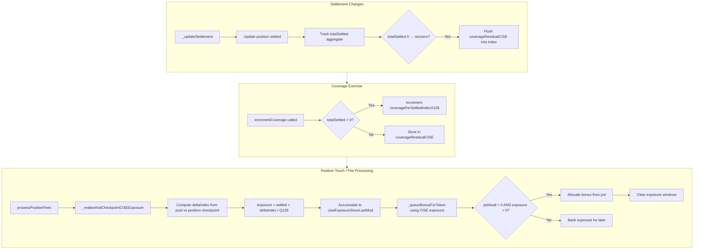

## Coverage‑Indexed Bonus Allocation Upgrade (Settled‑Exposure Indexed, Clamp‑Resilient)

> **Fee-pot redesign (supersedes `protocolFeeAccrued` in older text below)**  
> Bonus `potAvail` is derived from materialised **`slashedPot`**, not `protocolFeeAccrued`. See [`Fee-Pot-Materialisation-And-DirectLP-Policy.md`](./Fee-Pot-Materialisation-And-DirectLP-Policy.md).

This document complements the existing research notes in `agents/spec/`, in particular:

- `agents/spec/Tick-Indexed-Coverage-and-Fee-Sharing-in-VTSManager.md`
- `agents/spec/FeeAdj-Flow-Pot-Accrual-And-Delta-Settlement.md`
- `agents/spec/Deficit-Indexed-Coverage-Exercise.md` (DICE)
- `agents/spec/Fee-Accrual-Weighted-Bonus-Allocation-Upgrade.md`

It proposes a **second upgrade** to the fee‑sharing **bonus** mechanism:

- Replace **`selfNet` (net settlement since last modification)** as the primary bonus driver, because it fails under **`commitmentMax` clamping** and does not represent “how long settled liquidity was in use during protocol coverage”.
- Introduce a **coverage‑indexed settled exposure** accumulator, driven by **`incrementCoverage(...)`** events, so that a position can accrue bonus weight even when its settled balances are constant (e.g., already at `commitmentMax`).

This is a **research spec**: it defines the maths, state, objectives, and integration points. It is intended to map cleanly onto the existing `feeAdj` / `pendingFeeAdj` / `slashedPot` flow described in the architecture documents.

---

## 1. Context and motivation

### 1.1 The observed bug

The current bonus eligibility/weighting relies on **positive net settlement deltas** (commonly stored as `netSettlementSinceLastMod`), which is updated from:

- \( \Delta S = S_{\text{next}} - S_{\text{cur}} \)
- \( \text{selfNet} \leftarrow \text{selfNet} + \Delta S \)

However, settlement is clamped by per‑position maxima \(C\) (`commitmentMax`):

\[
S_{\text{next}} = \min(S_{\text{cur}} + \text{deposit},\; C)
\]

If \(S_{\text{cur}} = C\), then \(S_{\text{next}} = S_{\text{cur}}\) for any further deposit attempts, hence:

\[
\Delta S = 0 \Rightarrow \text{selfNet does not increase}
\]

This causes a false negative in bonus accrual:

- a fully settled position (exactly the position we intend to reward) cannot “prove” its contribution via \( \Delta S > 0 \),
- therefore it cannot allocate a bonus, even if its settled liquidity is actively used by the protocol via `incrementCoverage`.

### 1.2 The economic objective (first principles)

Bonuses are meant to reward **proactively settled liquidity** for **being available and used** during protocol coverage events.

That implies bonus weight should be driven by:

- **coverage exercise events** (`incrementCoverage(...)`), and
- **the amount of liquidity that was actually settled and therefore usable** during those events,

not by whether the position happened to increase settlement during the same window.

---

## 2. Design goals

We want:

1. **Clamp resilience**: A position already at `commitmentMax` must continue accruing bonus weight.
2. **Coverage linkage**: Bonus weight should be tied to `incrementCoverage` (coverage exercise), i.e. “settled liquidity in use during coverage”.
3. **No iteration**: Pool updates must be \(O(1)\), compatible with the existing index‑and‑checkpoint pattern (Uniswap‑style growth / DICE‑style indices).
4. **Safety unchanged**: The current pot/settlement safety properties remain:
   - allocation is accounting‑only (`protocolFeeAccrued` and `pendingFeeAdj`),
   - payout materialisation is bounded by `slashedPot`.
5. **Self‑exclusion preserved**: A position cannot reclaim its own slashes during allocation.

Non‑goals:

- Changing the slash formula or the `feeAdj` settlement mechanism (those remain as described in `FeeAdj-Flow-Pot-Accrual-And-Delta-Settlement.md`).

---

## 3. The proposed upgrade: coverage‑indexed settled exposure (CISE)

### 3.1 Key idea

Introduce a pool‑global index that advances whenever coverage is exercised:

- **Coverage‑per‑settled index** \(I^{\mathrm{sett}}_{p,k}\) (Q128), per pool \(p\) and token \(k\).

This is analogous to:

- Uniswap fee growth per liquidity unit, and
- DICE’s coverage‑per‑deficit index \(J_{p,k}\),

but with the denominator being **total settled** rather than total deficit principal.

Each position tracks a checkpoint \(i^{\mathrm{sett}}_{r,k}\). On touch/settle, the position realises:

- its **settled‑exposure contribution** since last checkpoint, proportional to its settled balance.

That realised contribution becomes the **bonus weight input**, replacing `selfNet` deltas.

### 3.2 Notation

For a given pool \(p\), position \(r\), and token \(k \in \{0,1\}\):

- \(S_{r,k}\): position’s settled amount (raw units).
- \(S^{\Sigma}_{p,k} = \sum_r S_{r,k}\): pool‑wide total settled (raw units).
- \(U_{p,k}\): coverage amount exercised by the protocol (raw units), observed at `incrementCoverage(p, amount0, amount1)`.
- \(Q128 = 2^{128}\).

Indexing:

- \(I^{\mathrm{sett}}_{p,k}\): pool‑wide coverage‑per‑settled index (Q128).
- \(i^{\mathrm{sett}}_{r,k}\): per‑position checkpoint of that index (Q128).

### 3.3 Index update (at `incrementCoverage`)

When coverage is exercised for token \(k\) by amount \(U_{p,k}\):

If \(S^{\Sigma}_{p,k} > 0\):

\[
\Delta I^{\mathrm{sett}}_{p,k} =
\left\lfloor \frac{U_{p,k} \cdot Q128}{S^{\Sigma}_{p,k}} \right\rfloor
\qquad
I^{\mathrm{sett}}_{p,k} \leftarrow I^{\mathrm{sett}}_{p,k} + \Delta I^{\mathrm{sett}}_{p,k}
\]

If \(S^{\Sigma}_{p,k} = 0\), the event cannot be distributed (no settled liquidity exists). We store a residual:

- \(R^{\mathrm{sett}}_{p,k} \leftarrow R^{\mathrm{sett}}_{p,k} + U_{p,k}\)

and later “flush” it when \(S^{\Sigma}_{p,k}\) becomes non‑zero.

### 3.4 Position realisation (at touch / settlement / fee processing)

When we reconcile a position \(r\) for token \(k\):

Let:

\[
\Delta i = I^{\mathrm{sett}}_{p,k} - i^{\mathrm{sett}}_{r,k}
\]

The position’s realised “coverage‑linked settled exposure” is:

\[
E_{r,k} =
\left\lfloor \frac{S_{r,k} \cdot \Delta i}{Q128} \right\rfloor
\]

Then checkpoint:

\[
i^{\mathrm{sett}}_{r,k} \leftarrow I^{\mathrm{sett}}_{p,k}
\]

Interpretation:

- \(E_{r,k}\) is the portion of the protocol’s exercised coverage \(U\) that is attributable to the position’s settled liquidity while it was available.
- It increases when coverage is exercised, even if \(S_{r,k}\) is constant and clamped at `commitmentMax`.

### 3.5 Residual flushing

If residual \(R^{\mathrm{sett}}_{p,k} > 0\) and later \(S^{\Sigma}_{p,k} > 0\), flush:

\[
\Delta I^{\mathrm{sett,res}}_{p,k} =
\left\lfloor \frac{R^{\mathrm{sett}}_{p,k} \cdot Q128}{S^{\Sigma}_{p,k}} \right\rfloor
\]

then:

- \(I^{\mathrm{sett}}_{p,k} \leftarrow I^{\mathrm{sett}}_{p,k} + \Delta I^{\mathrm{sett,res}}_{p,k}\)
- \(R^{\mathrm{sett}}_{p,k} \leftarrow 0\)

This mirrors DICE’s residual handling, but the “principal exists” condition is **total settled** instead of total deficit principal.

---

## 4. Bonus allocation using CISE

### 4.1 Pot availability and self‑exclusion (unchanged)

For token \(t\) (this refers to the **pot currency**, not necessarily the deficit/coverage token):

- `protocolFeeAccrued_t` is the accounting source for allocation,
- `feesShared_t` is used for self‑exclusion,

so:

\[
potAvail_t = \max(protocolFeeAccrued_t - selfContrib_t, 0)
\]

### 4.2 Replacing selfNet with coverage‑indexed settled exposure

Define the position’s bonus weight input \(W_{r,t}\) as some function of its realised settled exposure \(E\).

The simplest mapping is:

- \(W_{r,t} = E_{r,k}\) for some chosen exposure token \(k\).

However, note the system has two “token roles”:

- Coverage is exercised in the **deficit token** (the token the protocol had to source for an unwrap).
- Slashes accrue fees in the **fee token** (typically the opposite token in AMM fee accounting).

We therefore propose the following explicit mapping:

- When allocating bonuses for fee token \(t\), use exposure \(E\) measured on the **coverage token** \(k\) that generated that fee pot over the window.

In practice, this can be encoded as:

- For a token0 deficit (coverage exercised in token0), fees are slashed from token1, so token1 pot distribution uses token0 exposure.
- For a token1 deficit (coverage exercised in token1), fees are slashed from token0, so token0 pot distribution uses token1 exposure.

This keeps “who deserves” aligned with “what created the pot”.

### 4.3 Allocation formula

Per fee token \(t\), let:

- \(w_{r,t} = W_{r,t}\) (non‑negative integer)
- \(W^{\Sigma}_t = \sum_r w_{r,t}\) over eligible positions in the current window

Then:

\[
bonus_{r,t} = potAvail_t \cdot \frac{w_{r,t}}{W^{\Sigma}_t}
\]

Allocation occurs only if:

- \(potAvail_t > 0\),
- \(w_{r,t} > 0\),
- \(W^{\Sigma}_t > 0\),
- and optional dust guards (implementation‑level).

Allocation accounting is unchanged:

- Decrease pot accounting (keeping self‑exclusion invariant),
- Queue bonus as negative pending adjustment:
  - `pendingFeeAdj_t -= bonus_{r,t}`.

### 4.4 Windowing and banking

CISE naturally introduces “banked” exposure:

- exposure is realised and accumulated while the position remains settled and coverage is exercised,
- but allocation only occurs when the position is touched and \(potAvail > 0\).

To avoid losing contributions:

- Do **not** clear the position’s accumulated \(w_{r,t}\) unless a non‑zero bonus was actually queued for token \(t\).

This is the same “banked window” philosophy already described in `Fee-Accrual-Weighted-Bonus-Allocation-Upgrade.md`, but now the banked quantity is **coverage‑indexed exposure** rather than `selfNet`.

---

## 5. State variables (conceptual additions)

### 5.1 Pool‑level additions

Per pool \(p\), per token \(k\):

- \(S^{\Sigma}_{p,k}\): total settled aggregate.
- \(I^{\mathrm{sett}}_{p,k}\): coverage‑per‑settled index (Q128).
- \(R^{\mathrm{sett}}_{p,k}\): deferred residual when no settled exists.

### 5.2 Position‑level additions

Per position \(r\), per token \(k\):

- \(i^{\mathrm{sett}}_{r,k}\): checkpoint of pool index.
- \(E^{\mathrm{bank}}_{r,k}\): banked realised exposure since last allocation (optional but convenient).

Implementation note:

- You may store only \(i^{\mathrm{sett}}_{r,k}\) and compute \(E\) on each touch, but banking helps avoid recomputing and makes partial allocation easier.

---

## 6. Ordering constraints and correctness notes

### 6.1 Index checkpointing vs settlement changes

If a position’s settled amount \(S_{r,k}\) changes, and we also need to realise exposure based on the index, ordering matters.

To prevent retroactive capture:

- **Realise and checkpoint exposure using the old \(S_{r,k}\)** before applying a settlement change to \(S_{r,k}\).

This is exactly the same fairness principle as Uniswap’s fee checkpointing before liquidity changes.

### 6.2 Conservation and rounding

As with all integer index schemes:

- \(\sum_r E_{r,k}\) may be slightly less than \(U_{p,k}\) due to flooring.
- This is acceptable; residual can be handled either implicitly (rounding stays in the pot) or explicitly (carry a remainder accumulator).

### 6.3 Relationship to DICE

CISE is conceptually orthogonal to DICE:

- **DICE** allocates _coverage burns_ to deficit principals (who caused the liability at swap time).
- **CISE** allocates _bonus weight_ to settled balances (who provided usable settled liquidity at exercise time).

Both are index‑and‑checkpoint mechanisms with residual handling.

---

## 7. Security and gameability analysis

### 7.1 What this upgrade fixes

- **Commitment clamp bug**: eligibility no longer depends on \(\Delta S > 0\); a fully settled position accrues exposure whenever coverage is exercised.
- **False signals**: depositing right before a touch does not automatically create large weight unless coverage is actually exercised while the deposit is present.

### 7.2 What remains a design choice

CISE rewards being settled during coverage exercise, which is intended. However:

- If a participant can predict a large imminent `incrementCoverage` and momentarily settle just before it, they can capture weight for that event.

Mitigations (optional, depending on how adversarial you expect participants to be):

- **Minimum dwell time**: introduce epoch‑based gating or time‑weighted settlement, which increases complexity.
- **Settlement quality gates**: require some “proactive settlement margin” (e.g., maintain settlement above an RfS threshold) to accrue weight.
- **Fee‑accrual hybrid**: multiply CISE exposure by fee accrual weight (see next section) to favour positions that are also economically active in the AMM.

---

## 8. Optional hybrid: CISE × fee accrual weighting

If you still want the “time‑in‑range proxy” from `Fee-Accrual-Weighted-Bonus-Allocation-Upgrade.md`, you can define:

\[
w_{r,t} = E_{r,k} \cdot F_{r,t}
\]

Where:

- \(E_{r,k}\) is coverage‑indexed exposure (settled‑linked),
- \(F_{r,t}\) is fee weight (native Uniswap fees accrued for the fee token).

This hybrid:

- keeps clamp resilience and coverage linkage,
- further biases distribution towards positions that were actually in‑range and earning fees.

Trade‑off:

- it can under‑reward “coverage‑useful but low‑fee” positions in quiet markets (by design).

---

## 9. Integration with `feeAdj` flow (unchanged mechanics)

This upgrade does not change the `feeAdj` settlement story:

- **Slashes** still queue `pendingFeeAdj += feesBurn` and increment `protocolFeeAccrued`.
- **Bonuses** still queue `pendingFeeAdj -= bonus`.
- `_finaliseFeeAdjustment` still:
  - funds `slashedPot` for positive pending,
  - drains it (clamped) for negative pending.

See `agents/spec/FeeAdj-Flow-Pot-Accrual-And-Delta-Settlement.md`.

---

## 10. Summary

The current `selfNet`‑gated bonus mechanism can fail when settlement is clamped by `commitmentMax`, preventing positions that are already fully settled from accruing bonus weight even when they are actively providing coverage liquidity.

The Coverage‑Indexed Settled Exposure (CISE) upgrade fixes this by:

- advancing a pool‑global Q128 index on `incrementCoverage`,
- realising per‑position exposure proportional to settled balances via index checkpointing,
- allocating bonuses from the pot proportionally to this realised exposure (with self‑exclusion intact),
- preserving all existing pot materialisation and delta‑settlement safety properties.

## 11. Data Flow Diagram

