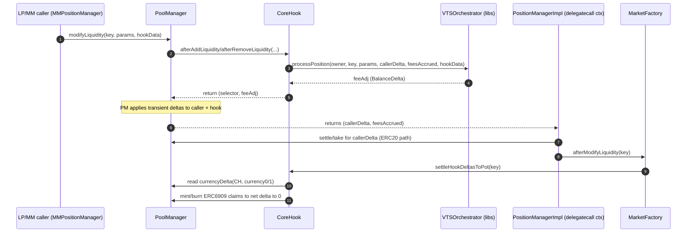

## FeeAdj Flow, Pot Accrual/Distribution, and Delta Settlement (No “Extra LCCs” Required)

This document expands on the research spec:

- `agents/spec/Tick-Indexed-Coverage-and-Fee-Sharing-in-VTSManager.md`

It focuses on the **runtime flow of `feeAdj`**, how **slashes accrue into claimables (ERC6909/LCC claims)**, how **bonuses are distributed**, and why **all PoolManager transient deltas are flushed** within the same `unlock` batch (so you do not need to pre-fund “extra LCCs” in `CoreHook` to make slashes/bonuses work).

---

## Key Actors / Concepts

- **LP / MM caller**: The account whose liquidity is being modified (in this repo that’s typically `MMPositionManager` via `MMPositionActionsImpl`).
- **Uniswap v4 `PoolManager`**: Maintains *transient* per-(address,currency) deltas during `unlock`.
- **`CoreHook`**: Returns `feeAdj` as hook delta; later clears its own transient deltas by minting/burning ERC6909 claims.
- **`VTSOrchestrator` + libs**: Computes slashes/bonuses, updates accounting (`pendingFeeAdj`, pool `slashedPot`, etc.), returns `feeAdj`.
- **Fee pot state**:
  - `slashedPot` (per fee token, pool-level): **materialised** accounting balance used for CSI bonus allocation (`potAvail` after self-exclusion) and for paying negative `pendingFeeAdj` in the same touch’s Phase 3 finalisation.
  - Positive `pendingFeeAdj` on positions queues slash-side obligations until materialised into `slashedPot` on touches (subject to decrease caps — SETTLE-03).
- **ERC6909 claims (LCC claims)**: minted/burned *inside PoolManager* to represent claimable balances without moving ERC20s.

---

## What `feeAdj` Means (Sign Conventions)

Within the after-liquidity hooks, `CoreHook` returns a `BalanceDelta feeAdj`.

Interpretation at the PoolManager level:

- **`feeAdj > 0` (per currency)**: the **hook is credited** that currency; the caller’s effective outcome is reduced by that amount. Practically, this is the **slash**: the caller “pays” into the hook/pot.
- **`feeAdj < 0`**: the **hook is debited** that currency; the caller is credited by that amount. Practically, this is a **bonus** paid out from the hook/pot to the caller.

Important: PoolManager accounts these as **transient deltas** for the caller and for the hook address during the `unlock` batch. Those deltas must net to **zero** by the end of the batch.

---

## High-Level End-to-End Sequence (Modify Liquidity)

The “happy path” is:

1. User triggers a liquidity modification (e.g. MM increase/decrease).
2. `PoolManager.modifyLiquidity()` calls into `CoreHook`’s after hook.
3. `CoreHook` calls `VTSOrchestrator.processPosition(...)` which returns `feeAdj`.
4. `CoreHook` returns `feeAdj` to PoolManager (as hook delta).
5. PoolManager applies deltas to:
   - the **caller**
   - the **hook** (CoreHook address)
6. Control returns to `PositionManagerImpl._modifySyntheticLiquidity(...)`, which:
   - settles/takes **callerDelta** (the caller’s part)
   - then calls `MarketFactory.afterModifyLiquidity(key)`
7. `MarketFactory.afterModifyLiquidity` calls `CoreHook.settleHookDeltasToPot(key)`
8. `CoreHook.settleHookDeltasToPot` reads its transient deltas and **mints/burns ERC6909 claims** to net them to zero.

**MM decrease / burn min-out:** `MMPositionActionsImpl` enforces `amount0Min` / `amount1Min` against the per-leg **immediate post-`feeAdj` non-fee LCC** (`LiquidityUtils.forwardedNonFeeLccAmount`), not against raw `callerDelta - feesAccrued`. For commit buckets, only the Hub-queued slice is physically forwarded to `MMQueueCustodian`; surplus non-fee LCC remains **locker transient credit** (`TAKE` / `UNWRAP_LCC`). VTS settlement routing still uses hook-time pool principal `callerDelta - feesAccrued` for queue caps; `feeAdj` reclassifies fee vs non-fee on the actual receipt, not principal (`SETTLE-03`, **MMQ-01**).

### Sequence diagram (current architecture)

---

## How Pot Accrual Produces “Claimables” (Slashes)

### 1) Slash computation and queuing (accounting)

Slashes are ultimately derived from coverage usage and deficits (see the spec document for the tick-indexed mechanics).

Operationally in VTS:

- slashes queue on the position as `pendingFeeAdj += slashAmount` (per token), and are **materialised** into `slashedPot` on later fee-processing (Phase 1 of `_processPositionFees`), before bonus allocation (Phase 2) runs against the materialised pot.

### 2) Materialization into `feeAdj` (hook-time)

On a later position modification, `processPositionFees(...)`:

- looks at `pendingFeeAdj` for the position,
- **materializes a portion** of it into `feeAdj` for this hook call (positive for slash, negative for bonus),
- updates state (reducing pending, updating `slashedPot` accounting, etc.).

### 3) PoolManager applies the hook delta (transient delta stage)

When `CoreHook` returns a **positive** `feeAdj` (slash):

- PoolManager credits `CoreHook` with a **positive transient delta** for the LCC currency.
- Correspondingly, the caller’s outcome is reduced (caller delta shifts).

### 4) CoreHook flushes that delta into ERC6909 claims (claimables)

After `modifyLiquidity` returns, `CoreHook.settleHookDeltasToPot(key)` runs and sees:

- for a slash, `currencyDelta(CoreHook, LCC) > 0`

To clear it, CoreHook calls:

- `CurrencySettler.take(poolManager, CoreHook, amount, claims=true)`

This results in PoolManager **minting ERC6909 claims to CoreHook**, and accounting the opposite delta such that the net transient delta becomes **zero**.

### Why no “extra LCCs” are needed

The key point: **the slash itself creates a credit (positive delta) to CoreHook**. CoreHook isn’t paying out of its ERC20 balance; it is *converting* that credit into ERC6909 claims (claimables). The `mint/burn` operations are used as the settlement mechanism for the transient delta, not as an external funding source.

---

## How Pot Distribution Works (Bonuses)

### 1) Bonus allocation (accounting) uses the materialised pot

During `processPositionFees(...)`, Phase 2 bonuses are computed from:

- `potAvail = max(slashedPot - selfRemaining, 0)` (CSI self-exclusion via `feesShared` / remaining-share epochs),
- weighted by CISE exposure vs pool `totalCISEExposureSinceLastMod`.

This **allocates** a bonus by queuing `pendingFeeAdj -= bonus` (negative pending). The pool `slashedPot` is not reduced at allocation time; Phase 3 then drains `slashedPot` to pay down negative pending in the same touch, up to availability.

### 2) Bonus materialization into `feeAdj` (hook-time)

Phase 3 (`_finaliseNegativeFeeAdjustment`) materialises negative `pendingFeeAdj` into a negative `feeAdj`, clamped by current `slashedPot`. If the pot is insufficient, unpaid negative pending remains for later touches.

### 3) PoolManager transient delta + CoreHook settlement

If `feeAdj` is negative (bonus):

- PoolManager records a **negative transient delta on CoreHook** (CoreHook “owes”)
- and a corresponding credit to the caller.

Then `CoreHook.settleHookDeltasToPot` sees `currencyDelta(CoreHook, LCC) < 0` and clears it via:

- `CurrencySettler.settle(poolManager, CoreHook, amount, claims=true)` (burning claims)

This burns ERC6909 claims from CoreHook to net the delta to **zero**.

### Why the hook can pay bonuses without ERC20 balances

Bonuses are paid by burning claims previously minted to the hook during slashes. The settlement happens through claim mint/burn that offsets the transient deltas. There is no requirement for CoreHook to hold extra ERC20 LCC tokens, provided bonuses are **clamped by available `slashedPot`** (i.e., do not over-distribute).

---

## Delta Flushing: Why `CurrencyNotSettled()` Should Not Happen (When Wired Correctly)

Within a single `unlock` batch:

- The caller’s deltas are settled in `PositionManagerImpl._modifySyntheticLiquidity` via `CurrencySettler.settle/take(..., claims=false)` (ERC20 transfer path).
- The hook’s deltas are settled in `CoreHook.settleHookDeltasToPot` via `CurrencySettler.take/settle(..., claims=true)` (ERC6909 claim mint/burn path).

Net effect:

- caller’s (address,currency) delta → 0
- hook’s (address,currency) delta → 0

So the batch should end with **no outstanding transient deltas**, avoiding `CurrencyNotSettled()`.

---

## Ordering: touches that fund `slashedPot` vs beneficiaries

Under the **two-phase** `_processPositionFees` ordering (Phase 1 materialise positive `pendingFeeAdj` into `slashedPot`, Phase 2 allocate bonuses from `slashedPot`, Phase 3 pay negative pending from `slashedPot`):

- A beneficiary touch **before** any slashed position has materialised positive pending into `slashedPot` will see **`potAvail == 0`** (empty materialised pot), so Phase 2 **does not** allocate a bonus; CISE windows can remain **banked** for a later touch.
- After a slashed position is touched and Phase 1 increases `slashedPot`, a subsequent beneficiary touch can run Phase 2+3 and pay out (subject to CSI rounding and caps).

Payout remains **bounded by `slashedPot`**; the hook never requires external LCC funding beyond claim mint/burn mechanics.

---

## Summary: Why No Further Intervention is Needed

- `feeAdj` is the single mechanism that expresses slashes (+) and bonuses (-) at hook-time.
- PoolManager transient deltas are expected and safe during `unlock`.
- The system is correct when:
  - caller deltas are settled via ERC20 settlement in `PositionManagerImpl`, and
  - hook deltas are settled via ERC6909 mint/burn in `CoreHook.settleHookDeltasToPot`.
- Pot accrual results in **minted claims** (not extra tokens), and pot distribution burns those claims.
- Bonus allocation is tied to the **materialised** `slashedPot`; ordering across positions affects **when** Phase 2 can first run, not whether payouts can exceed the pot.
