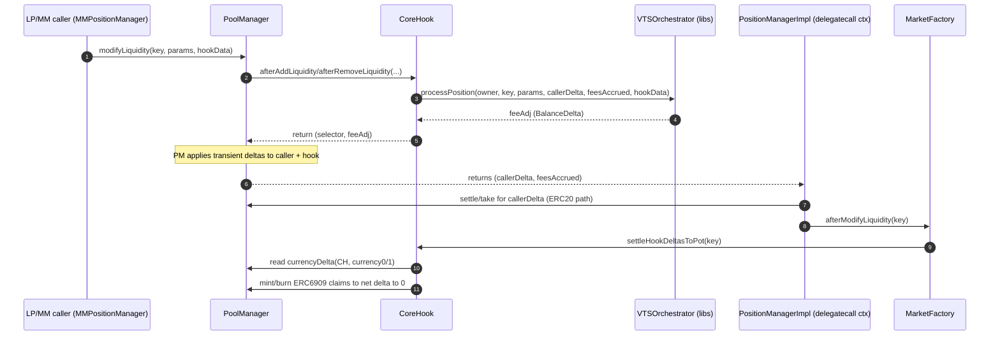

## FeeAdj Flow, Pot Accrual/Distribution, and Delta Settlement (No “Extra LCCs” Required)

This document expands on the research spec:

- `agents/spec/Tick-Indexed-Coverage-and-Fee-Sharing-in-VTSManager.md`

It focuses on the **runtime flow of `feeAdj`**, how **slashes accrue into claimables (ERC6909/LCC claims)**, how **bonuses are distributed**, and why **all PoolManager transient deltas are flushed** within the same `unlock` batch (so you do not need to pre-fund “extra LCCs” in `CoreHook` to make slashes/bonuses work).

---

## Key Actors / Concepts

- **LP / MM caller**: The account whose liquidity is being modified (in this repo that’s typically `MMPositionManager` via `MMPositionActionsImpl`).
- **Uniswap v4 `PoolManager`**: Maintains *transient* per-(address,currency) deltas during `unlock`.
- **`CoreHook`**: Returns `feeAdj` as hook delta; later clears its own transient deltas by minting/burning ERC6909 claims.
- **`VTSOrchestrator` + libs**: Computes slashes/bonuses, updates accounting (`pendingFeeAdj`, `protocolFeeAccrued`, `slashedPot`, etc.), returns `feeAdj`.
- **Fee pot state**:
  - `protocolFeeAccrued`: accounting of “fees burned / slashed” (used as the *source* for allocating bonuses, excluding self-contrib).
  - `slashedPot`: accounting of “materialized claimables available for paying bonuses”.
- **ERC6909 claims (LCC claims)**: minted/burned *inside PoolManager* to represent claimable balances without moving ERC20s.

---

## What `feeAdj` Means (Sign Conventions)

Within the after-liquidity hooks, `CoreHook` returns a `BalanceDelta feeAdj`.

Interpretation at the PoolManager level:

- **`feeAdj > 0` (per currency)**: the **hook is credited** that currency; the caller’s effective outcome is reduced by that amount. Practically, this is the **slash**: the caller “pays” into the hook/pot.
- **`feeAdj < 0`**: the **hook is debited** that currency; the caller is credited by that amount. Practically, this is a **bonus** paid out from the hook/pot to the caller.

Important: PoolManager accounts these as **transient deltas** for the caller and for the hook address during the `unlock` batch. Those deltas must net to **zero** by the end of the batch.

---

## High-Level End-to-End Sequence (Modify Liquidity)

The “happy path” is:

1. User triggers a liquidity modification (e.g. MM increase/decrease).
2. `PoolManager.modifyLiquidity()` calls into `CoreHook`’s after hook.
3. `CoreHook` calls `VTSOrchestrator.processPosition(...)` which returns `feeAdj`.
4. `CoreHook` returns `feeAdj` to PoolManager (as hook delta).
5. PoolManager applies deltas to:
   - the **caller**
   - the **hook** (CoreHook address)
6. Control returns to `PositionManagerImpl._modifySyntheticLiquidity(...)`, which:
   - settles/takes **callerDelta** (the caller’s part)
   - then calls `MarketFactory.afterModifyLiquidity(key)`
7. `MarketFactory.afterModifyLiquidity` calls `CoreHook.settleHookDeltasToPot(key)`
8. `CoreHook.settleHookDeltasToPot` reads its transient deltas and **mints/burns ERC6909 claims** to net them to zero.

### Sequence diagram (current architecture)



---

## How Pot Accrual Produces “Claimables” (Slashes)

### 1) Slash computation and queuing (accounting)

Slashes are ultimately derived from coverage usage and deficits (see the spec document for the tick-indexed mechanics).

Operationally in VTS:

- slashes increment `protocolFeeAccrued` (pool-level), and
- slashes are queued on the position as `pendingFeeAdj += slashAmount` (per token).

### 2) Materialization into `feeAdj` (hook-time)

On a later position modification, `processPositionFees(...)`:

- looks at `pendingFeeAdj` for the position,
- **materializes a portion** of it into `feeAdj` for this hook call (positive for slash, negative for bonus),
- updates state (reducing pending, updating `slashedPot` accounting, etc.).

### 3) PoolManager applies the hook delta (transient delta stage)

When `CoreHook` returns a **positive** `feeAdj` (slash):

- PoolManager credits `CoreHook` with a **positive transient delta** for the LCC currency.
- Correspondingly, the caller’s outcome is reduced (caller delta shifts).

### 4) CoreHook flushes that delta into ERC6909 claims (claimables)

After `modifyLiquidity` returns, `CoreHook.settleHookDeltasToPot(key)` runs and sees:

- for a slash, `currencyDelta(CoreHook, LCC) > 0`

To clear it, CoreHook calls:

- `CurrencySettler.take(poolManager, CoreHook, amount, claims=true)`

This results in PoolManager **minting ERC6909 claims to CoreHook**, and accounting the opposite delta such that the net transient delta becomes **zero**.

### Why no “extra LCCs” are needed

The key point: **the slash itself creates a credit (positive delta) to CoreHook**. CoreHook isn’t paying out of its ERC20 balance; it is *converting* that credit into ERC6909 claims (claimables). The `mint/burn` operations are used as the settlement mechanism for the transient delta, not as an external funding source.

---

## How Pot Distribution Works (Bonuses)

### 1) Bonus allocation (accounting) can happen independently of immediate payout

During `processPositionFees(...)`, bonuses are computed from:

- `potAvail = max(protocolFeeAccrued - selfContrib, 0)`
- weighted by `selfNet / totalNet`

This **allocates** a bonus by:

- reducing `protocolFeeAccrued` (accounting),
- and queuing `pendingFeeAdj -= bonus` (negative pending).

This is “who deserves what”, not yet “who got paid”.

### 2) Bonus materialization into `feeAdj` (hook-time)

When a position with negative `pendingFeeAdj` is modified:

- the system attempts to materialize a negative `feeAdj` (hook owes caller),
- but clamps the payout by available `slashedPot` (the materialized pot).

So even if a bonus is allocated, it **may not be payable yet** if `slashedPot` is empty.

### 3) PoolManager transient delta + CoreHook settlement

If `feeAdj` is negative (bonus):

- PoolManager records a **negative transient delta on CoreHook** (CoreHook “owes”)
- and a corresponding credit to the caller.

Then `CoreHook.settleHookDeltasToPot` sees `currencyDelta(CoreHook, LCC) < 0` and clears it via:

- `CurrencySettler.settle(poolManager, CoreHook, amount, claims=true)` (burning claims)

This burns ERC6909 claims from CoreHook to net the delta to **zero**.

### Why the hook can pay bonuses without ERC20 balances

Bonuses are paid by burning claims previously minted to the hook during slashes. The settlement happens through claim mint/burn that offsets the transient deltas. There is no requirement for CoreHook to hold extra ERC20 LCC tokens, provided bonuses are **clamped by available `slashedPot`** (i.e., do not over-distribute).

---

## Delta Flushing: Why `CurrencyNotSettled()` Should Not Happen (When Wired Correctly)

Within a single `unlock` batch:

- The caller’s deltas are settled in `PositionManagerImpl._modifySyntheticLiquidity` via `CurrencySettler.settle/take(..., claims=false)` (ERC20 transfer path).
- The hook’s deltas are settled in `CoreHook.settleHookDeltasToPot` via `CurrencySettler.take/settle(..., claims=true)` (ERC6909 claim mint/burn path).

Net effect:

- caller’s (address,currency) delta → 0
- hook’s (address,currency) delta → 0

So the batch should end with **no outstanding transient deltas**, avoiding `CurrencyNotSettled()`.

---

## The Ordering Edge Case: “Bonus Allocated Before Slashing Materializes”

Here's a subtle but real ordering scenario:
> bonuses could be allocated despite there being no slashing, because positions with bonuses modify and settle fee growth before positions that are to be slashed do.

This happens because **allocation** (reducing `protocolFeeAccrued` and setting `pendingFeeAdj -= bonus`) can occur as soon as:

- `protocolFeeAccrued` is non-zero, and
- the position has positive `selfNet`,
even if the positions responsible for the slashes haven’t yet performed the subsequent modifications that would **materialize** their own positive `pendingFeeAdj` into **`slashedPot` claimables**.

### What actually occurs

1) **Coverage event / settlement** increases `protocolFeeAccrued` and queues slashes as positive `pendingFeeAdj` on the slashed positions.

2) A “good actor” position B modifies liquidity first:
   - it runs `processPositionFees`
   - it sees `protocolFeeAccrued > 0`
   - it allocates itself a bonus:
     - `protocolFeeAccrued` decreases
     - `pendingFeeAdj_B` becomes negative (queued bonus)

3) Position B tries to materialize bonus in the same modification:
   - payout is **clamped by `slashedPot`**
   - if the slashed positions haven’t modified yet, `slashedPot` may still be **0**
   - so **no bonus is actually paid** (or only partially paid), and the remaining negative pending stays queued.

4) Later, a slashed position A modifies:
   - it materializes its positive pending into `feeAdj > 0`
   - hook receives transient credit and mints claims → `slashedPot` effectively becomes fundable/payable over time

5) On a subsequent modification of B (or another bonus claimant):
   - the queued negative `pendingFeeAdj` can now be materialized (up to available `slashedPot`)
   - the hook burns claims to pay it out.

### Sequence diagram for the edge case

```mermaid
sequenceDiagram
    autonumber
    participant PM as PoolManager
    participant CH as CoreHook
    participant VTS as VTSOrchestrator
    participant A as Slashed Position A
    participant B as Bonus Position B

    Note over VTS: Coverage event queues slashes (A.pending += +slash)\nprotocolFeeAccrued += slash

    B->>PM: modifyLiquidity (B)
    PM->>CH: after* hook (B)
    CH->>VTS: processPositionFees(B)
    Note over VTS: Allocates bonus from protocolFeeAccrued\nB.pending += -bonus
    VTS-->>CH: feeAdj (tries to materialize bonus)
    Note over VTS: materialization is clamped by slashedPot\n(if slashedPot==0 => feeAdj bonus may be 0)
    CH-->>PM: return feeAdj
    Note over PM: hook delta applied, then CH delta settled (claims burn)\n(if feeAdj==0 => nothing to burn)

    A->>PM: modifyLiquidity (A)
    PM->>CH: after* hook (A)
    CH->>VTS: processPositionFees(A)
    VTS-->>CH: feeAdj > 0 (slash materializes)
    CH-->>PM: return feeAdj
    Note over PM: hook receives credit; CH later mints claims to flush delta

    B->>PM: modifyLiquidity (B again)
    PM->>CH: after* hook (B)
    CH->>VTS: processPositionFees(B)
    VTS-->>CH: feeAdj < 0 (bonus now payable up to slashedPot)
    CH-->>PM: return feeAdj
    Note over PM: hook owes; CH burns claims to flush delta
```

### Practical implication

This ordering does **not** break delta settlement, but it does affect **when** bonuses become payable:

- bonuses can be **allocated** early (accounting),
- but payouts should remain **bounded by available materialized pot (`slashedPot`)**, ensuring the hook never needs external funding.

---

## Summary: Why No Further Intervention is Needed

- `feeAdj` is the single mechanism that expresses slashes (+) and bonuses (-) at hook-time.
- PoolManager transient deltas are expected and safe during `unlock`.
- The system is correct when:
  - caller deltas are settled via ERC20 settlement in `PositionManagerImpl`, and
  - hook deltas are settled via ERC6909 mint/burn in `CoreHook.settleHookDeltasToPot`.
- Pot accrual results in **minted claims** (not extra tokens), and pot distribution burns those claims.
- Ordering effects can cause **bonus allocation before pot materialization**, but payout remains safe if clamped by pot availability.
