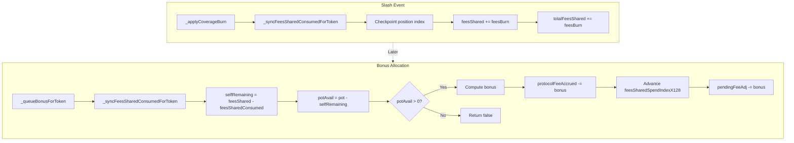

# Self‑Excluding Bonus Attribution via Contribution Spend Index (CSI): O(1) Self‑Exclusion Without Iteration

This document is a **research spec** for upgrading the fee‑sharing bonus mechanism described in:

- `agents/spec/Tick-Indexed-Coverage-and-Fee-Sharing-in-VTSManager.md`

It is designed to complement the broader bonus‑weighting upgrades (e.g. CISE) discussed in:

- `agents/spec/Coverage-Indexed-Bonus-Allocation-Upgrade.md`

The focus here is narrower:

- implement **self‑exclusion** (“a position cannot reclaim its own slashes”) in a way that remains correct over time, even as the pot is partially or fully distributed, **without iterating** over positions.

---

## 1. Context and motivation

The baseline fee‑sharing model is:

- Slashes (fee burns) accrue into a pool‑level accounting pot `protocolFeeAccrued_t` (per fee token \(t\)).
- Bonuses are allocated from that accounting pot, weighted by some eligibility/weight quantity (historically `selfNet`; upgraded to CISE exposure in `Coverage-Indexed-Bonus-Allocation-Upgrade.md`).
- To enforce self‑exclusion, the *available pot* for a position is reduced by its own contribution:

\[
\mathrm{potAvail}_t = \max(\mathrm{protocolFeeAccrued}_t - \mathrm{selfContrib}_t, 0)
\]

where \(\mathrm{selfContrib}_t\) is “fees this position contributed to the pot” (per token \(t\)).

### 1.1 The observed failure mode (lifetime selfContrib)

If \(\mathrm{selfContrib}_t\) is implemented as a **lifetime monotonically increasing counter** (e.g. `feesShared`), and `protocolFeeAccrued_t` decreases as bonuses are allocated, then over time:

- \(\mathrm{selfContrib}_t\) can remain larger than the current pot,
- causing \(\mathrm{potAvail}_t = 0\) for that position indefinitely, even when the *remaining* pot is no longer attributable to that position’s own slashes.

This violates the intended meaning of self‑exclusion: the position should be excluded only from the **currently remaining** portion of its own contributed slashes, not from “ever receiving bonuses until others have slashed more than it ever has”.

### 1.2 Design goals

We want:

1. **Correctness of self‑exclusion over time**: only the *remaining* self‑contribution currently in the pot should be excluded.
2. **No iteration**: all updates are \(O(1)\) per event/touch.
3. **Compatibility** with existing fee‑sharing pot flow:
   - `protocolFeeAccrued` as the accounting source for allocation,
   - negative `pendingFeeAdj` for bonus queuing,
   - `slashedPot` as the materialisation constraint.
4. **Composability**: self‑exclusion should be orthogonal to the choice of bonus weight (selfNet, CISE exposure, fee‑weighted exposure, etc.).

Non‑goals:

- Changing the slash formula or the core pot materialisation mechanics.
- Perfect conservation of rounding dust (integer division rounding is acceptable).

---

## 2. Key idea: treat self‑contribution as “shares”, and track “spent per share” with an index

We model contributions to the pot (slashed fees) as “shares”:

- A position earns contribution shares when it is slashed.
- When the system allocates bonuses from the accounting pot, it is conceptually “spending down” the pool’s contributed shares.

We implement the “spend down” without iterating over contributors by maintaining:

- a **pool‑global spend index** \(I^{\mathrm{spend}}_t\) (Q128) that advances whenever bonuses are allocated from token \(t\),
- a per‑position checkpoint of that index, and
- a derived per‑position “consumed contribution” counter.

This mirrors Uniswap v3’s fee growth per liquidity unit:

- “liquidity” \(\leftrightarrow\) “contribution shares”
- “fee growth” \(\leftrightarrow\) “spend growth”

---

## 3. Notation

For a pool \(p\) and fee token \(t \in \{0,1\}\):

### 3.1 Pool‑level

- \(\mathrm{P}_t\): current accounting pot, i.e. `protocolFeeAccrued_t`.
- \(\Sigma S_t\): total contribution shares ever minted, i.e. `totalFeesShared_t`.
- \(I^{\mathrm{spend}}_t\): spend‑per‑share index (Q128).

Scaling:

- \(Q128 = 2^{128}\).

### 3.2 Position‑level

For position \(r\):

- \(S_{r,t}\): position’s contribution shares, i.e. `feesShared_t` (monotonic).
- \(i_{r,t}\): position checkpoint of pool spend index, i.e. `feesSharedIndexLastX128_t`.
- \(C_{r,t}\): position’s “consumed contribution”, i.e. `feesSharedConsumed_t` (monotonic).

Derived:

- \(\mathrm{selfRemaining}*{r,t} = \max(S*{r,t} - C_{r,t}, 0)\).

---

## 4. Mechanics

### 4.1 Contribution (slash) event: mint shares

When a slash of amount \(x\) occurs in fee token \(t\):

- Increase the pool pot accounting:
  - \(\mathrm{P}_t \leftarrow \mathrm{P}_t + x\)
- Mint contribution shares:
  - \(S_{r,t} \leftarrow S_{r,t} + x\)
  - \(\Sigma S_t \leftarrow \Sigma S_t + x\)

**Ordering constraint (critical)**:

Before increasing \(S_{r,t}\), the position must be synchronised to the current pool index \(I^{\mathrm{spend}}_t\) (see §4.3), otherwise newly minted shares would incorrectly be treated as partially consumed by historical spend.

### 4.2 Bonus allocation: spend the pot and advance the pool index

Suppose a position \(r\) is allocating a bonus in fee token \(t\) of computed amount \(b\) (from some weight mechanism, e.g. CISE):

First compute the available pot excluding self:

\[
\mathrm{potAvail}_{r,t} = \max(\mathrm{P}*t - \mathrm{selfRemaining}*{r,t}, 0)
\]

Then compute:

\[
b = \mathrm{potAvail}*{r,t} \cdot \frac{w*{r,t}}{\sum w_t}
\]

Allocation accounting then:

- Decrease pot:
  - \(\mathrm{P}_t \leftarrow \mathrm{P}_t - b\)
- Queue bonus:
  - `pendingFeeAdj_t -= b`

**New step (CSI)**: advance the spend‑per‑share index:

If \(\Sigma S_t > 0\):

\[
\Delta I^{\mathrm{spend}}_t = \left\lfloor \frac{b \cdot Q128}{\Sigma S_t} \right\rfloor,\quad
I^{\mathrm{spend}}_t \leftarrow I^{\mathrm{spend}}_t + \Delta I^{\mathrm{spend}}_t
\]

If \(\Sigma S_t = 0\), then \(b\) must be zero (no shares exist, hence no pot should exist under consistent accounting), but implementations should still guard against division by zero.

**Interpretation**: each unit of contribution share has been “spent” by an additional \(\Delta I^{\mathrm{spend}}\) fraction of a token unit, in aggregate.

### 4.3 Position synchronisation (“checkpoint”): realise consumed contribution

On any position touch (and specifically before any read of `selfRemaining`), synchronise the position \(r\) for token \(t\):

Let:

\[
\Delta i_{r,t} = I^{\mathrm{spend}}*t - i*{r,t}
\]

Then compute incremental consumed contribution:

\[
\Delta C_{r,t} = \left\lfloor \frac{S_{r,t} \cdot \Delta i_{r,t}}{Q128} \right\rfloor
\]

Update:

- \(C_{r,t} \leftarrow C_{r,t} + \Delta C_{r,t}\)
- \(i_{r,t} \leftarrow I^{\mathrm{spend}}_t\)

Finally, the effective remaining self‑contribution used for self‑exclusion is:

\[
\mathrm{selfRemaining}*{r,t} = \max(S*{r,t} - C_{r,t}, 0)
\]

This value decreases over time as bonuses are allocated (because \(C_{r,t}\) increases), even though \(S_{r,t}\) never decreases.

---

## 5. Correctness properties

### 5.1 Self‑exclusion remains correct as the pot is spent

If a position was a major contributor early, and the pot was later distributed away, then:

- the pool index \(I^{\mathrm{spend}}\) increases as spending occurs,
- the position’s consumed contribution \(C\) rises on checkpoint,
- therefore \(\mathrm{selfRemaining}\) falls,
- therefore \(\mathrm{potAvail}\) is not permanently pinned to zero.

This matches the intended semantics in `Tick-Indexed-Coverage-and-Fee-Sharing-in-VTSManager.md`: exclude the position from reclaiming its **own slashes**, not from ever participating again.

### 5.2 O(1) updates

All operations are constant time:

- Slash: a few increments and one checkpoint call.
- Allocation: pot update + one index update.
- Touch: one `mulDiv` and a couple of stores per token.

### 5.3 Orthogonality to the weight mechanism

The weight mechanism used to compute \(w_{r,t}\) (selfNet, CISE exposure, fee‑weighted exposure, etc.) is independent of CSI. CSI only changes the computation of \(\mathrm{potAvail}\).

---

## 6. Rounding and dust

All index schemes using integer division have rounding dust:

- \(\Delta I^{\mathrm{spend}}\) floors; therefore the aggregate consumed computed across positions may be less than \(b\) by a small amount.
- This dust effectively remains in the system as “unattributed”; it slightly weakens self‑exclusion in favour of the system as a whole.

This is acceptable in practice; if exact conservation is required, a per‑pool remainder accumulator can be added (at the cost of more state and complexity).

---

## 7. Integration mapping (to current architecture)

This section is intentionally written to map to the code architecture implied by the existing research docs:

- `protocolFeeAccrued`: accounting pot for allocation.
- `pendingFeeAdj`: signed queued adjustments (+slash / -bonus).
- `slashedPot`: materialisation constraint for paying bonuses.

### 7.1 State variable additions (conceptual)

Per pool \(p\), per fee token \(t\):

- `totalFeesShared_t`  \(\leftrightarrow \Sigma S_t\)
- `feesSharedSpendIndexX128_t` \(\leftrightarrow I^{\mathrm{spend}}_t\)

Per position \(r\), per fee token \(t\):

- `feesSharedIndexLastX128_t` \(\leftrightarrow i_{r,t}\)
- `feesSharedConsumed_t` \(\leftrightarrow C_{r,t}\)

The existing:

- `feesShared_t` is reused as contribution shares \(S_{r,t}\) (monotonic).

### 7.2 Hook points

- **On slash accounting** (where `feesShared += feesBurn` happens):
  - call “sync consumed” first, then mint shares.
- **On bonus allocation**:
  - call “sync consumed” first, compute \(\mathrm{selfRemaining}\), compute `potAvail`, allocate bonus, then advance spend index by \(b\).
- **On any position touch** that might allocate bonus:
  - ensure sync happens before reading \(\mathrm{selfRemaining}\).

---

## 8. Security / gameability notes

- **No free self‑reclaim**: a position cannot allocate a bonus from the portion of the pot that is still attributable to its own remaining self‑contribution, because that portion is excluded via \(\mathrm{selfRemaining}\).
- **Front‑running with fresh shares**: prevented by the ordering constraint “checkpoint before minting new shares” (§4.1).
- **Share inflation attacks**: shares are minted only via slashes (fees burned), so an attacker cannot mint shares without paying the slash.

---

## 9. Summary

The baseline self‑exclusion formula in `Tick-Indexed-Coverage-and-Fee-Sharing-in-VTSManager.md`:

\[
\mathrm{potAvail} = \max(\mathrm{protocolFeeAccrued} - \mathrm{selfContrib}, 0)
\]

is correct only if \(\mathrm{selfContrib}\) represents the position’s **remaining** contribution currently embedded in the pot. Implementing \(\mathrm{selfContrib}\) as a lifetime counter causes pathological “potAvail stuck at 0” behaviour.

The Contribution Spend Index (CSI) upgrade fixes this while preserving \(O(1)\) complexity:

- `feesShared` becomes “contribution shares” (monotonic),
- a pool‑wide spend‑per‑share index advances when bonuses are allocated,
- each position checkpoints and realises `feesSharedConsumed`,
- self‑exclusion uses `selfRemaining = feesShared - feesSharedConsumed`.

CSI is orthogonal to how bonus weights are computed (selfNet vs CISE exposure), and cleanly composes with the broader feeAdj / pot materialisation architecture.

## 10. Diagram

