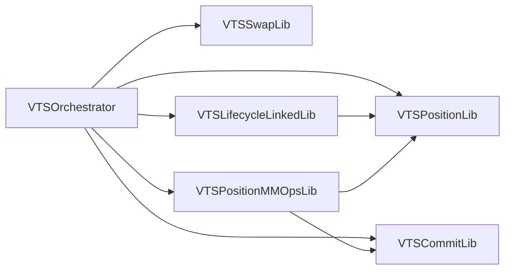

# VTS Hot/Cold Optimisation — Implementation Record

This document pins the **canonical function inventory**, **compiler buckets**, **deployment checklist**, and **validation gates** for the hot/cold split. It complements the runtime code layout (`VTSCommitLib`, `VTSPositionMMOpsLib`, `VTSLifecycleLinkedLib`, `VTSOrchestrator` routing).

## 1. Canonical function inventory (phase 1)

### Tier A — Hot / warm (`swap_hot`, `position_hot`, `lifecycle_hot`)

| Library | Symbol / area | Bucket | Notes |
|--------|-----------------|--------|--------|
| `VTSSwapLib` | `processSwap()` and tick/segment helpers | `swap_hot` | Highest runtime priority. |
| `VTSPositionLib` | `touchPosition()`, `settlePositionGrowths()`, `getRFS()`, growth/MM helpers | `position_hot` | Primary position facade; keep file name. |
| `VTSLifecycleLinkedLib` | `processPosition()`, `onMMSettle`, `_executeMMSettleFromParams`, `checkpointAfterGrowthNoCommitment` | `lifecycle_hot` | Orchestrator-facing warm lifecycle. |
| `VTSOrchestrator` | Router entrypoints only | `router_size` | Moderate-run surface; avoid growing logic here. |

### Tier B — Cold (`commit_cold`)

| Library | Symbol / area | Bucket | Notes |
|--------|-----------------|--------|--------|
| `VTSCommitLib` | `commitSignal*`, `renewSignal*`, `extendGracePeriod`, `validateSeize`, `checkpointAfterGrowthWithCommitment`, coverage, commitment economics | `commit_cold` | Canonical commitment domain owner. |

### Checkpoint split

- **Warm/hot:** `checkpointAfterGrowthNoCommitment` on `VTSLifecycleLinkedLib` (equivalent to `withCommitment == false`).
- **Cold:** `checkpointAfterGrowthWithCommitment` on `VTSCommitLib` (delegates to `VTSCommitLib.checkpointWithCommitment` as needed).

### Optional later phase

- **`VTSCommitValidationLib`:** extract `validateLiquidityDelta()` (+ valuation helpers) from `VTSCommitLib` if hot paths still pull too much cold code. Not required for phase 1.

## 2. Compiler profile buckets (target)

**Target mapping** (v4-periphery `additional_compiler_profiles` + `compilation_restrictions` pattern).  
**Current constraint:** `VTSOrchestrator` imports the hot libraries and cold commit libraries in one link graph; Foundry rejects *incompatible* per-file `optimizer_runs` on a single import closure. Until the deploy graph is split further (or separate compilation artifacts are introduced), keep **`[profile.prod]`** on a **single** `optimizer_runs` / `via_ir` policy and treat the table below as the **budget** to apply after gas/size measurement (for example via separate profiles that compile **only** subsets, or future linker/layout changes).

| Profile name | `via_ir` | `optimizer_runs` (target range) | Intended paths |
|--------------|----------|----------------------------------|----------------|
| `swap_hot` | true | 30000–50000 | `src/libraries/VTSSwapLib.sol` |
| `position_hot` | true | 15000–30000 | `src/libraries/VTSPositionLib.sol` |
| `lifecycle_hot` | true | 10000–20000 | `src/libraries/VTSLifecycleLinkedLib.sol` |
| `router_size` | true | 500–3000 | `src/VTSOrchestrator.sol`, `src/modules/**` |
| `commit_cold` | true | 300–2000 | `src/libraries/VTSCommitLib.sol` |

**Policy:** Do not tune `optimizer_runs` without a like-for-like benchmark against the previous layout (see §4).

**Scripts project:** `contracts/evm-scripts/foundry.toml` continues to own **linked `libraries = [...]`** for deploy/CI; keep `profile.default` unlinked for local dry-runs. The **`e2e_non_ir`** profile there remains for E2E stack-depth policy.

## 3. Deployment and deterministic linking

### CREATE3 order (`DeployLibraries.s.sol`)

1. … (existing LCC / LiquidityHub / fee / commit / swap)  
2. `VTSPositionLib`  
3. `VTSPositionMMOpsLib` (depends on linked `VTSCommitLib` + `VTSPositionLib` in bytecode)  
4. `VTSLifecycleLinkedLib`  

### After any library bytecode change

1. Update **`contracts/evm-scripts/foundry.toml`** `libraries` entries for every affected profile (`deploy`, `ci`, `deploy-eth-sepolia`, `deploy-arbitrum-sepolia`).  
2. Re-run **`DeployLibraries.s.sol`** (or predict `getCreate3Contract` + deployer) and paste addresses.  
3. Refresh **`deployments/*_libraries_deployments.json`** / JSON outputs from the script.  
4. If Echidna linked addresses move, re-run **`just echidna-prepare`** (or any `just echidna …` target, which runs prepare via `echidna.sh`).  
5. Review CI/E2E assumptions (`FOUNDRY_PROFILE=ci` in `.github/workflows/e2e.yml`).

**Note:** Pinned addresses are **deployer- and factory-specific**. Testnet profiles may use placeholders until the library is deployed on that chain; replace with the value printed by `DeployLibraries` for the same `PRIVATE_KEY` + `CREATE3_FACTORY` as other libs on that network.

## 4. Validation and release gates

### Bytecode size

- Report runtime bytecode size for every **deployed contract** and **linked library** touched by a change.

### Gas benchmark corpus (rerun after each structural split and after compiler-profile changes)

1. Representative intra-tick swap  
2. Representative multi-tick swap  
3. Common `processPosition()` add-liquidity path  
4. Common `processPosition()` remove-liquidity path  
5. Common `onMMSettle()` settle-from-deltas path  
6. `checkpointAfterGrowthNoCommitment`  
7. `checkpointAfterGrowthWithCommitment`  
8. One seize-adjacent validation path (`validateSeize` / related)  

### Acceptance

- No material regression on swap, common position touch, and common MM settle after splits.  
- `afterCoreSwap` / `VTSSwapLib` remain in the **highest** optimisation tier.  
- Cold commit/seizure/grace paths are not forced into hot library units.  
- Deploy scripts and pinned profiles stay coherent.

## 5. Anti-drift guardrails

- **Inventory:** Keep §1 updated when symbols move.  
- **Dependencies:** `VTSSwapLib` must not import cold commit lifecycle code. Hot libraries may use hot peers and (optionally) a future `VTSCommitValidationLib`; they must not import `VTSCommitLib` unless a deliberate exception is documented.  
- **Orchestrator:** Stays the router; cold entrypoints call `VTSCommitLib` directly where previously thin proxies.  
- **Benchmarks:** Any compiler-profile or file-split PR should attach size + gas deltas for the corpus above.

## 6. Dependency diagram (phase 1)

