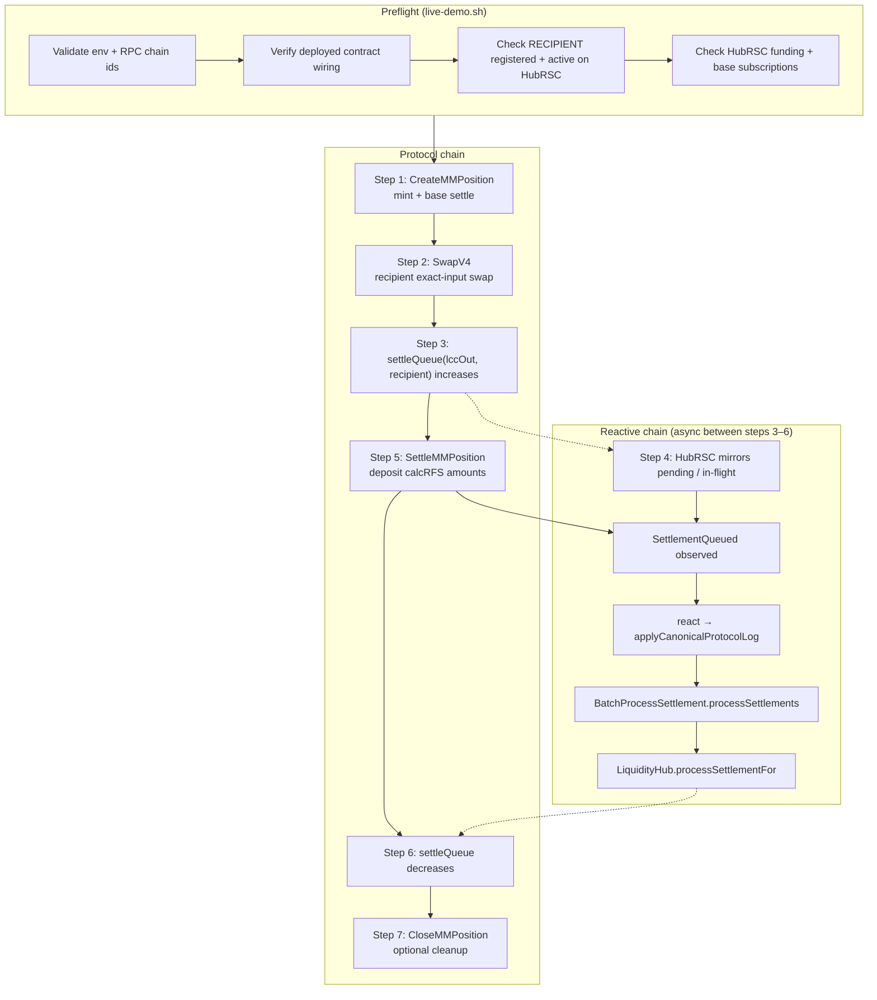
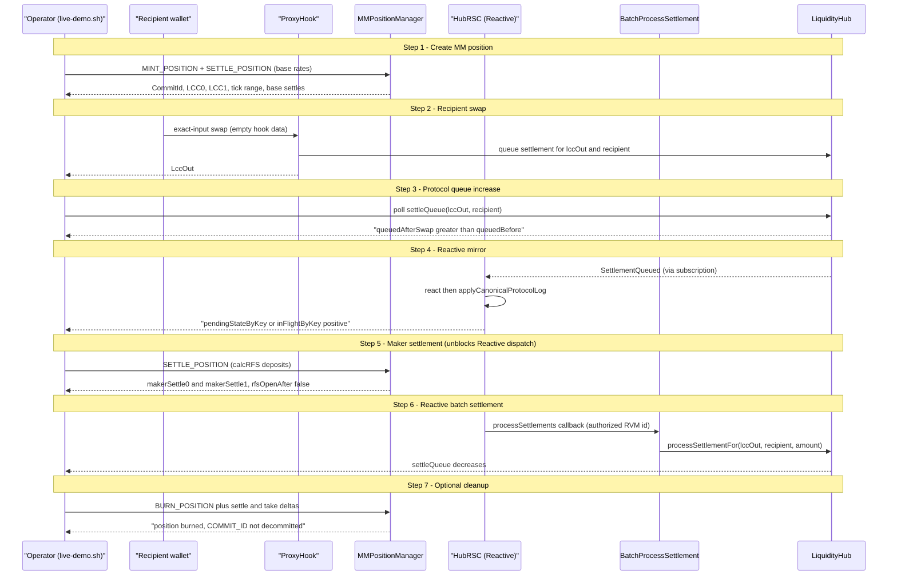

# Live Reactive Demo

`scripts/live-demo.sh` is an operator harness for existing Fiet and Reactive deployments. It does not run, emulate, or integrate with a Maker service.

See also [`README.md`](./README.md) for deployment wiring, env variables, and troubleshooting. For an executed run with Arbiscan/Reactscan links, see [`LIVE_DEMO_RUN-07062026.md`](./LIVE_DEMO_RUN-07062026.md).

## Maker Dependency

The live demo depends on an external Maker system to provide one of:

- an active `COMMIT_ID` with an existing `MMPositionManager` NFT owned by or approved to the locker signer, with enough remaining validity for the run; or
- a fresh ABI-encoded unified owner/advancer `LIQUIDITY_SIGNAL_HEX` accepted by `MMPositionManager`.

`COMMIT_ID` is the preferred mode because it reuses a live Maker commitment that is already represented by
`MMPositionManager`. The create script reads `commitOf(COMMIT_ID)`, verifies the commitment advancer matches
`vm.addr(MM_LOCKER_PRIVATE_KEY)` (or legacy `MM_PRIVATE_KEY`), optionally verifies the commitment owner against
`MM_PROOF_OWNER` / `MM_PROOF_OWNER_PRIVATE_KEY`, requires the locker to own or be approved for `ownerOf(COMMIT_ID)`,
requires `expiresAt > block.timestamp + COMMIT_MIN_VALIDITY_SECONDS`, and mints the next position at `positionCount`.
If `ownerOf(COMMIT_ID)` reverts, the commit is VTS-only and cannot be used by this harness.

Fresh-commit fallback remains available for manual testing by omitting `COMMIT_ID` and supplying `LIQUIDITY_SIGNAL_HEX`.
This fallback is still a unified direct-commit path: the signal owner and advancer must both match the locker signer. The
repository does not generate that signal in this harness.

## Workflow Overview

The harness runs on two chains:

- **Protocol chain** (`PROTOCOL_RPC`): Fiet core — `LiquidityHub`, `MMPositionManager`, proxy/core pools, `BatchProcessSettlement`.
- **Reactive chain** (`REACTIVE_RPC`): `HubRSC` observes protocol events and dispatches settlement callbacks.

At a high level, the demo proves that a recipient swap creates queued settlement on the protocol, Reactive mirrors and
processes that work, and the protocol queue decreases after the maker settles the backing MM position.

### Reactive automation path (steps 4–6)

Steps 5–6 on the protocol chain are **operator-driven**. The queue decrease in step 6 is **Reactive-driven** once step 5
closes the maker RFS and emits the liquidity the batch receiver needs.

## Step-by-Step Walkthrough

The script prints the same seven steps in its workflow summary (`print_workflow`). Each step maps to a Forge script or a
polling gate.

| Step | Action | Script / check | Pass condition |
|------|--------|----------------|----------------|
| 0 | Preflight | `live-demo.sh` | Env, wiring, recipient activation, HubRSC funding |
| 1 | Create MM position | `CreateMMPosition.s.sol` | Parses `CommitId`, `LCC0`/`LCC1`, tick range, base settles |
| 2 | Recipient exact-input swap | `SwapV4.s.sol` | Parses `LccOut`; `RECIPIENT` equals swap signer |
| 3 | Protocol queue increase | poll `LiquidityHub.settleQueue` | `queuedAfterSwap > queuedBefore` for `lccOut` |
| 4 | HubRSC mirror | poll `HubRSC` pending / in-flight | `pendingStateByKey` exists or `inFlightByKey > 0` |
| 5 | Maker position settlement | `SettleMMPosition.s.sol` | `rfsOpenAfterSettle == false` |
| 6 | Reactive queue decrease | poll `LiquidityHub.settleQueue` | `queuedFinal < queuedAfterSwap` |
| 7 | Close demo MM position | `CloseMMPosition.s.sol` | Optional; default `CLOSE_POSITION_AFTER_DEMO=true` |

### Step 0 — Preflight

Before any Forge script runs, the harness validates:

- Required env vars: RPCs, `NETWORK`, `CORE_POOL_ID`, deployment addresses, `RECIPIENT`, `MM_RANGE_WIDTH`,
  `MM_POSITION_USD_WAD`, locker key (`MM_LOCKER_PRIVATE_KEY` or legacy `MM_PRIVATE_KEY`), and swap sizing (`AMOUNT` or
  `EAMOUNT`).
- Commit mode: `COMMIT_ID` **or** `LIQUIDITY_SIGNAL_HEX` (fresh-commit fallback).
- Swap signer: `SWAP_PRIVATE_KEY` (or fallbacks) must derive to `RECIPIENT`. Empty hook data relies on `ProxyHook`
  resolving the recipient from the swap `msg.sender`.
- Deployment wiring:
  - `BATCH_RECEIVER.liquidityHub() == LIQUIDITY_HUB`
  - `HubRSC.liquidityHub() == LIQUIDITY_HUB`
  - `HubRSC.destinationReceiverContract() == BATCH_RECEIVER`
  - optional `HUB_RVM_ID` matches `BATCH_RECEIVER.hubRVMId()` (callback origin whitelist)
- Reactive readiness: `RECIPIENT` registered and active on `HubRSC`, base subscriptions active, `maxDispatchItems > 0`,
  and visible Reactive reserves or native balance on `HubRSC`.

### Step 1 — Create MM position

Forge script: `contracts/evm-scripts/script/CreateMMPosition.s.sol`.

- **Existing commit** (`COMMIT_ID` set): batches `MINT_POSITION → SETTLE_POSITION` at `positionCount`.
- **Fresh commit** (`COMMIT_ID` unset): batches `COMMIT_SIGNAL → MINT_POSITION → SETTLE_POSITION` using
  `LIQUIDITY_SIGNAL_HEX`.

Position sizing is derived at runtime:

- `TickLower` / `TickUpper` = current core-pool tick ± `MM_RANGE_WIDTH` (aligned to pool `tickSpacing`).
- `Liquidity` is chosen to approximate `MM_POSITION_USD_WAD` effective USD exposure via oracle prices.
- Base settlement deposits (`BaseSettle0`, `BaseSettle1`) are computed from commitment maxima and VTS base rates.

The script prints labels the harness parses: `CommitId`, `PositionIndex`, `LCC0`, `LCC1`, `TickLower`, `TickUpper`,
`Liquidity`, `Amount0Max`, `Amount1Max`, `PositionUsdWad`, `BaseSettle0`, `BaseSettle1`.

### Step 2 — Recipient exact-input swap

Forge script: `contracts/evm-scripts/script/SwapV4.s.sol`.

- Signed by `SWAP_PRIVATE_KEY` (must equal `RECIPIENT`).
- Uses exact-input modes only (`SWAP_TYPE` 0, 1, or 2).
- Leaves hook data empty so `ProxyHook` attributes queued settlement to the swap signer.
- Outputs `LccOut`: the LCC for the swap output asset. This is the queue key used in steps 3 and 6.

### Step 3 — Protocol queue increase

After the swap transaction is mined, the harness polls `LiquidityHub.settleQueue(lccOut, RECIPIENT)` until it exceeds the
pre-swap baseline (`queuedBefore`). Failure here usually means the swap size was too small, the recipient did not sign
the swap, or the swap did not create an output-side settlement obligation.

### Step 4 — HubRSC mirror

The harness polls Reactive state for the `(lccOut, recipient)` key:

- `pendingStateByKey(key)` — mirrored pending amount with `exists == true`
- `inFlightByKey(key)` — dispatch currently in flight

This confirms `HubRSC` observed the protocol `SettlementQueued` path and recorded work. Failure here points to recipient
registration/funding, subscription propagation, callback proxy delivery, or insufficient Reactive funding on `HubRSC`.

### Step 5 — Maker position settlement

Forge script: `contracts/evm-scripts/script/SettleMMPosition.s.sol`.

- Deposits the positive RFS amounts from `calcRFS(COMMIT_ID, POSITION_INDEX, false)`.
- The harness **requires** `rfsOpenAfterSettle == false` before continuing. An open RFS would leave backing liquidity
  unavailable for the Reactive batch path.

This step is what the operator broadcasts; it does not by itself decrease `settleQueue`. It unblocks the liquidity
Reactive needs to dispatch in step 6.

### Step 6 — Reactive queue decrease

After maker settlement, the harness polls until `settleQueue(lccOut, RECIPIENT)` drops below `queuedAfterSwap`.

Reactive automation (between steps 5 and 6):

1. Protocol emits settlement-related events consumed by `HubRSC` subscriptions.
2. `HubRSC.react()` / `applyCanonicalProtocolLog` updates canonical pending state on Reactive.
3. `HubRSC` dispatches to `BatchProcessSettlement.processSettlements` on the protocol chain (callback origin = `hubRVMId`).
4. `BatchProcessSettlement` calls `LiquidityHub.processSettlementFor`, reducing the recipient queue.

`queueSettledAmount` in the summary is `queuedAfterSwap - queuedFinal` (observed protocol-side reduction).

### Step 7 — Close demo MM position (optional)

Forge script: `contracts/evm-scripts/script/CloseMMPosition.s.sol`.

- Runs only after step 6 succeeds and only when `CLOSE_POSITION_AFTER_DEMO=true` (default).
- Burns the demo position with `BURN_POSITION → SETTLE_POSITION_FROM_DELTAS → TAKE → TAKE`.
- **Never** sends `DECOMMIT_SIGNAL`; `COMMIT_ID` remains live for the external Maker system.

Set `CLOSE_POSITION_AFTER_DEMO=false` to leave the position open for inspection.

## Dry-Run Mode

With `BROADCAST=false`, the harness:

- Runs Forge simulations for steps 1 and 2.
- Skips on-chain polling for steps 3–6 and cleanup.
- Prints the workflow table with `DRY-RUN` / `SKIP` results.
- Exits `PASS (dry-run only; no live transactions broadcast)`.

Use dry-run to validate commit wiring, tick range, and swap simulation before spending gas or Reactive budget.

## Run Summary

On completion (pass or fail), the harness prints:

1. **Workflow table** — per-step `PASS` / `FAIL` / `SKIP` / `DRY-RUN` with tx hashes or queue deltas.
2. **Detail block** — commit/position fields, maker vs queue amounts, HubRSC pending/in-flight, and deployed addresses.

Important distinctions:

| Field | Meaning |
|-------|---------|
| `makerSettle0` / `makerSettle1` | Deposits from `SettleMMPosition` (step 5) |
| `queueSettledAmount` | Observed `settleQueue` reduction after Reactive processing (step 6) |
| `baseSettle0` / `baseSettle1` | Base-rate deposits at position creation (step 1) |
| `pending` / `inFlight` | Final HubRSC mirror state for `(lccOut, recipient)` |

## What The Harness Does Not Do

The harness does not subscribe to Maker APIs, request proofs, refresh expiring commitments, rebalance Maker inventory,
decommit Maker commitments, or manage Maker operational state. Those steps must happen outside this demo before the
script is run.