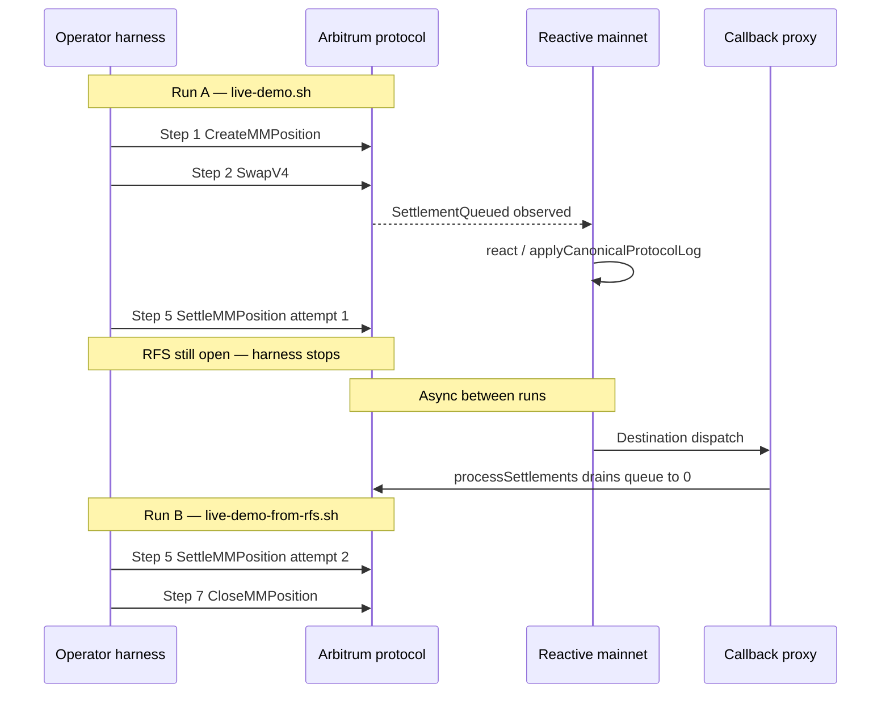

# Live Demo Run — 7 June 2026

This document records one cohesive seven-step Reactive settlement demo stitched from two harness invocations on **commit 3, position 1**. A recipient swap queues settlement on Arbitrum; `HubRSC` mirrors the work on Reactive mainnet; the maker closes the position RFS; Reactive dispatches `processSettlements` back to the protocol chain; the queue drains; the demo position is burned.

For harness mechanics, env variables, and troubleshooting, see [`LIVE_DEMO.md`](./LIVE_DEMO.md).

## Networks and explorers

| Role | Chain | Chain ID | Explorer |
|------|-------|----------|----------|
| Protocol (Fiet core) | Arbitrum One | `42161` | [Arbiscan](https://arbiscan.io/) |
| Reactive (HubRSC) | Reactive mainnet | `1597` | [Reactscan](https://reactscan.net/) |

## Deployment constants (this run)

| Name | Address |
|------|---------|
| `LiquidityHub` | `0x55Aea7D8595812b71653B5a9e4cF37B3B74b0E7E` |
| `BatchProcessSettlement` | `0x663e527CbC7aDb089Adb81687dd4D7420f114201` |
| `HubRSC` | `0x8dF362Cc94AFAD44c9461297C1c56286d51cED6e` |
| `MMPositionManager` | `0x431ad664591b53B0D9365faAC98c26C4D3a2f2Da` |
| Locker / operator | `0xE64B2f840b54C906e8dA26E96DBC9904b3B7f95a` |
| Recipient / RVM id | `0x93Af6d19a1738E52295014AC0103b005048DF388` |
| `lccOut` (ARB LCC) | `0x1BE0d3F614f8b77B0B425F9740fA35242eba86Cf` |
| Reactive callback proxy | `0x777f67156e2bb3ee9CEA6866C2656b099b67D132` |
| Reactive system contract | `0x0000000000000000000000000000000000fffFfF` |

## Run overview

Two operator harness runs compose one interrupted-then-resumed workflow:

| Run | Command | Outcome |
|-----|---------|---------|
| **A** | `just live-demo` (`scripts/live-demo.sh`) | Steps 1–4 **PASS**; step 5 partial (`RfsOpenAfter=true`); harness **FAIL** before queue wait/close |
| **B** | `just live-demo-from-rfs` (`scripts/live-demo-from-rfs.sh`) | Queue already `0`; step 5 attempt 2 closes RFS; step 7 close **PASS** |



| Step | Cohesive action | Run A | Run B |
|------|-----------------|-------|-------|
| 1 | Create MM position | `CreateMMPosition` | — |
| 2 | Recipient swap | `SwapV4` | — |
| 3 | Queue increase | `0 → 34787059612735998347` | — |
| 4 | HubRSC mirror | pending/in-flight observed | — |
| 5 | Maker settlement | attempt 1: partial RFS deposit | attempt 2: RFS closed |
| 6 | Queue decrease | async between runs | observed already `0` |
| 7 | Close position | — | `CloseMMPosition` |

---

## Step-by-step workflow

### Step 1 — Create MM position

**What happened.** Run A minted and base-settled position index `1` on existing commit `3` via the locker (`0xE64B…f95a` → `MMPositionManager`).

**Measured outcome.**

| Field | Value |
|-------|-------|
| `positionIndex` | `1` |
| `liquidity` | `3090923199598262` |
| `tickLower` / `tickUpper` | `298980` / `303780` |
| `baseSettle0` / `baseSettle1` | `2124532` / `26024104570249464181` |

**Transactions.**

| Kind | Explorer | Link | Notes |
|------|----------|------|-------|
| Origin | Arbiscan | [0x397f6e69…b32b](https://arbiscan.io/tx/0x397f6e69b91a82678edbed385617930d299bb3c98238420eda01d6a24254b32b) | `CreateMMPosition`; block `470877311` (~03:58:01 UTC) |

---

### Step 2 — Recipient exact-input swap

**What happened.** The registered recipient (`0x93Af…388`) signed an exact-input `SwapV4` through the Universal Router proxy.

**Measured outcome.**

| Field | Value |
|-------|-------|
| `lccOut` | `0x1BE0d3F614f8b77B0B425F9740fA35242eba86Cf` |

**Transactions.**

| Kind | Explorer | Link | Notes |
|------|----------|------|-------|
| Origin | Arbiscan | [0x1967ba9e…d41e](https://arbiscan.io/tx/0x1967ba9e38183ed9c6e553b069063097393d435085a195c8f71c4e33c7c0d41e) | `SwapV4`; block `470877464` (~03:58:39 UTC) |

---

### Step 3 — Protocol queue increase

**What happened.** After the swap mined, `LiquidityHub.settleQueue(lccOut, recipient)` rose from `0` to the swap output obligation.

**Measured outcome.**

| Field | Value |
|-------|-------|
| `queuedBefore` | `0` |
| `queuedAfterSwap` | `34787059612735998347` |

**Transactions.**

| Kind | Explorer | Link | Notes |
|------|----------|------|-------|
| Origin | Arbiscan | [0x1967ba9e…d41e](https://arbiscan.io/tx/0x1967ba9e38183ed9c6e553b069063097393d435085a195c8f71c4e33c7c0d41e) | `SettlementQueued` emitted in the swap tx |

---

### Step 4 — HubRSC pending / in-flight mirror

**What happened.** Run A polling confirmed `HubRSC` recorded work for `(lccOut, recipient)` — either `pendingStateByKey.exists == true` with amount `> 0`, or `inFlightByKey > 0`.

**Measured outcome.** Harness step 4 **PASS** in Run A.

**Transactions.**

| Kind | Explorer | Link | Notes |
|------|----------|------|-------|
| Reactive | Reactscan | [0x2c6c4d51…07fa](https://reactscan.net/tx/0x2c6c4d510e4a1f5dc46d08d493def6eb1a755ab39718ee5943185cb8405d07fa) | RVM `0x93Af…` → `HubRSC.react`; block `5606707` |
| Reactive | Reactscan | [0x0e04a6f0…13b6](https://reactscan.net/tx/0x0e04a6f0b70dbdb49cc17705feb854622746939080873ed277eff5f8f97013b6) | Follow-on `react` on `HubRSC`; block `5606709` |

Selection criterion: earliest `react` calls from the recipient RVM to `HubRSC` in the swap window. Harness mirror state is the authoritative pass signal.

---

### Step 5 — Maker position settlement

**What happened.** The maker must deposit positive RFS deltas before Reactive can fully dispatch queued settlement. Run A deposited the full queued lane-1 amount but left the RFS open; Run B deposited the remaining lane-1 delta and closed the RFS.

**Measured outcome.**

| Attempt | Run | Tx | `Settle0` | `Settle1` | `RfsOpenAfter` |
|---------|-----|-----|-----------|-----------|----------------|
| 1 | A | [0xb5edbb22…0e2c](https://arbiscan.io/tx/0xb5edbb2281570fb323400b0e2dde0658a4f89f7269200b1d4cd2a63bd0dc0e2c) | `0` | `34787059612735998351` | `true` |
| 2 | B | [0x39fa18d9…dccd](https://arbiscan.io/tx/0x39fa18d9c6aea9966d1a04e9124575d4eddf1501fea9630e192e46edd70bdccd) | `0` | `13792596361082061738` | `false` |

Run B logs also recorded `RfsDeltaBefore1: 13792596361082061738` → `RfsDeltaAfter1: 0`.

**Transactions.**

| Kind | Explorer | Link | Notes |
|------|----------|------|-------|
| Origin (attempt 1) | Arbiscan | [0xb5edbb22…0e2c](https://arbiscan.io/tx/0xb5edbb2281570fb323400b0e2dde0658a4f89f7269200b1d4cd2a63bd0dc0e2c) | Run A; block `470877684` (~03:59:35 UTC) |
| Origin (attempt 2) | Arbiscan | [0x39fa18d9…dccd](https://arbiscan.io/tx/0x39fa18d9c6aea9966d1a04e9124575d4eddf1501fea9630e192e46edd70bdccd) | Run B; block `470892948` (~05:03:56 UTC) |

---

### Step 6 — Reactive queue decrease

**What happened.** `settleQueue(lccOut, recipient)` must fall below `queuedAfterSwap`. Run A stopped before this poll. Between Run A and Run B, Reactive automation drained the full queued amount; Run B observed `queuedFinal = 0` immediately.

**Measured outcome.**

| Field | Value |
|-------|-------|
| `queuedAfterSwap` | `34787059612735998347` |
| `queuedFinal` | `0` |
| `queueSettledAmount` | `34787059612735998347` |

**Transactions.**

| Kind | Explorer | Link | Notes |
|------|----------|------|-------|
| Reactive | Reactscan | [0xbe087047…e4712](https://reactscan.net/tx/0xbe08704709faa0ec689adc8c6766d8560aa1ea7c7fc25950ec00de6d8a9e4712) | Callback proxy → system `0xfffFfF`; block `5606825` (~03:58:53 UTC) |
| Reactive | Reactscan | [0xac3ddbc7…ddbf](https://reactscan.net/tx/0xac3ddbc7c04b8edd402a9c7bd6af5bf095455ff6b34bf4d9c4e2c9a99193ddbf) | Follow-on dispatch chain; block `5606827` |
| Reactive | Reactscan | [0x720f6105…fce5](https://reactscan.net/tx/0x720f610517d82d603771a5a4f8e2258ccd1715db7365bd54e3677bd39908fce5) | Follow-on dispatch chain; block `5606828` |
| Callback | Arbiscan | [0x703289d2…5187](https://arbiscan.io/tx/0x703289d26d55b9b8db75c08d82974dfe22715b0978cf34ece562089b213a5187) | `BatchProcessSettlement.processSettlements`; settled `34787059612735998347`; block `470877548` (~03:59:01 UTC) |

The protocol callback receipt shows `LiquidityHub` settlement events and LCC transfer to the recipient for the full queued amount.

---

### Step 7 — Close demo MM position

**What happened.** Run B burned the demo position after the queue reached zero and the RFS was closed. `COMMIT_ID=3` was not decommitted.

**Measured outcome.**

| Field | Value |
|-------|-------|
| `closeStatus` | `closed` |
| `closedLiquidity` | `3090923199598262` |
| `positionActiveAfterClose` | `false` |

**Transactions.**

| Kind | Explorer | Link | Notes |
|------|----------|------|-------|
| Origin | Arbiscan | [0xf6260d42…023b](https://arbiscan.io/tx/0xf6260d42c30cfa39b0065eef6024528d5d52e285f98369bbdb1f4560db14023b) | `CloseMMPosition`; block `470893119` (~05:04:40 UTC) |

---

## Reactive payment verification

Both harness preflights reported healthy Reactive funding:

```
Reactive funding: reserves=1008616491128000000000 debts=0 hubBalance=1200000000010001000
```

Evidence that billing and automation worked without additional runs:

1. **Preflight reserves** — `HubRSC` held ~`1.008e21` Reactive reserves with `debts=0` before both runs.
2. **Step 4 mirror** — Run A observed pending/in-flight state on `HubRSC` for `(lccOut, recipient)`.
3. **Step 6 settlement** — Protocol callback settled exactly `34787059612735998347`, matching `queuedAfterSwap`.
4. **Reactscan checks** — For each Reactive tx above, inspect debt/reserve movement on the system contract (`0xfffFfF`) and `HubRSC` dispatch logs.

---

## Appendix

### Resume when Run A fails at step 5

Use `scripts/live-demo-from-rfs.sh` when steps 1–4 already succeeded. Required env from the Run A summary:

```bash
COMMIT_ID=3
POSITION_INDEX=1
LCC_OUT=0x1BE0d3F614f8b77B0B425F9740fA35242eba86Cf
QUEUED_AFTER_SWAP=34787059612735998347
```

```bash
cd contracts/reactive
BROADCAST=true just live-demo-from-rfs
```

### Refresh explorer links

```bash
cd contracts/reactive
just collect-live-demo-txs
```

The collector reads Forge broadcast artifacts when present and falls back to `TX_*` env overrides (defaults match this run). Override example:

```bash
TX_CREATE=0x397f6e69b91a82678edbed385617930d299bb3c98238420eda01d6a24254b32b \
TX_SWAP=0x1967ba9e38183ed9c6e553b069063097393d435085a195c8f71c4e33c7c0d41e \
just collect-live-demo-txs
```

### Broadcast artifact paths

When broadcasting from an operator machine, Forge writes:

- `contracts/evm-scripts/broadcast/CreateMMPosition.s.sol/42161/run-latest.json`
- `contracts/evm-scripts/broadcast/SwapV4.s.sol/42161/run-latest.json`
- `contracts/evm-scripts/broadcast/SettleMMPosition.s.sol/42161/run-latest.json` (may contain multiple attempts)
- `contracts/evm-scripts/broadcast/CloseMMPosition.s.sol/42161/run-latest.json`

### Related prior create (not this position)

An earlier create on the same commit minted position `0`: [0xc4eb4917…7e10](https://arbiscan.io/tx/0xc4eb491724143312e3ca893cde7a6379bb28d2a7c37928e62b2673df85c37e10) (block `470874672`). This run uses **position 1**.