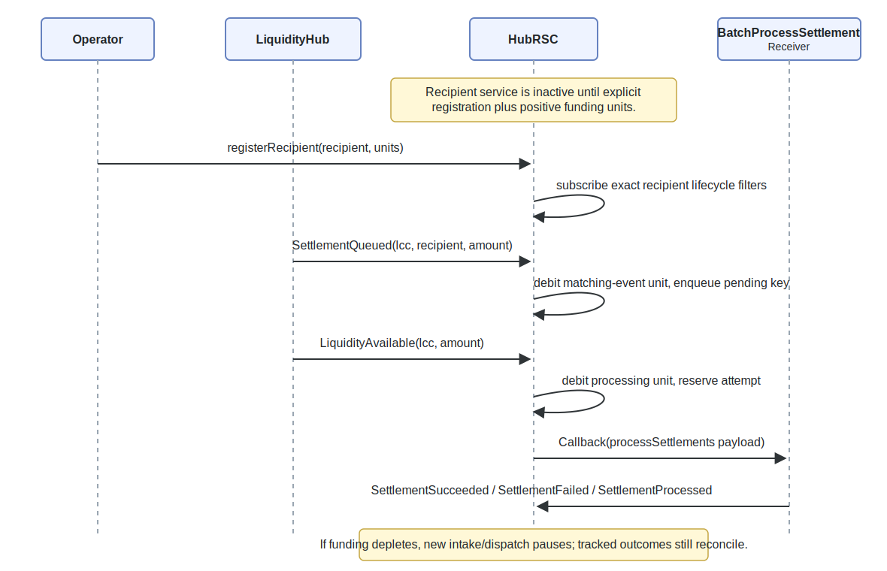

# Fiet x Reactive Network — queued settlement automation

This package provides the [Reactive Network](https://reactive.network/) contracts and deployment helpers that automate _queued settlement_ processing for Fiet markets.

When a user unwraps an LCC and there is insufficient immediate underlying liquidity, Fiet queues the shortfall as a settlement claim. This automation stack watches the queue events and, when liquidity becomes available, automatically calls `LiquidityHub.processSettlementFor(lcc, recipient, maxAmount)` to settle the claim.

## Reactive Network Context

This project is built for the Reactive Network execution model:

- Origin-chain events are observed via subscriptions.
- Reactive contracts execute `react()` logic in ReactVM.
- Cross-chain actions are emitted as callbacks and executed on destination chains.

## Terminology

- **Protocol chain**: The chain where Fiet’s `LiquidityHub` lives (e.g. Arbitrum One for MVP).
- **Reactive chain**: The Reactive Network chain where `SpokeRSC` and `HubRSC` execute.
- **LCC**: A Fiet token representing the market maker’s settlement commitment.
- **Recipient**: The address that ultimately receives underlying when a settlement is processed.
- **Queued settlement**: A claim created when an unwrap cannot be fulfilled immediately.
- **Spoke**: A per‑recipient reactive contract that subscribes to queue events and reports them.
- **Hub**: A reactive contract that aggregates pending settlements and dispatches settlement batches.
- **Receiver**: A destination‑chain contract that receives Reactive callbacks and performs batched calls to `LiquidityHub.processSettlementFor(...)`.

## High-level flow

(_What happens on-chain_)



1. **Queue**: `LiquidityHub` emits `SettlementQueued(lcc, recipient, amount)` on the _protocol chain_.
2. **Spoke filter**: The recipient’s `SpokeRSC` (one per recipient) is subscribed with a strict recipient filter and only reacts to that user’s queue events.
3. **Callback normalisation**: `SpokeRSC` emits a callback to `HubCallback.recordSettlement(...)` on the _reactive chain_.
4. **Admin whitelist**: `HubCallback` only accepts a settlement report if the recipient is whitelisted to the expected Spoke address (`setSpokeForRecipient(recipient, spoke)`).
5. **Aggregation**: `HubRSC` reacts to `SettlementReported` events and queues pending work.
6. **Liquidity arrival**: `LiquidityHub` emits `LiquidityAvailable(...)` on the _protocol chain_.
7. **Bounded dispatch**: `HubRSC` scans pending work with explicit bounds and emits a callback to the _protocol chain_ Receiver.
8. **Settlement execution**: The Receiver calls `LiquidityHub.processSettlementFor(...)` for each batch item.

## Contracts and artefacts

### Reactive chain

- `src/SpokeRSC.sol`
  - Subscribes to `SettlementQueued(...)` on the protocol chain filtered by `recipient`.
  - Deduplicates by on-chain log identity and forwards a bounded payload to `HubCallback`.
- `src/HubCallback.sol`
  - Authorised callback entrypoints.
  - Admin whitelist: `setSpokeForRecipient(recipient, spoke)` must be set correctly for reports to be accepted.
  - Emits `SettlementReported(recipient, lcc, amount, nonce)` for the Hub.
- `src/HubRSC.sol`
  - Aggregates pending settlements in a linked-list queue and dispatches bounded settlement batches when liquidity becomes available.

### Protocol chain

- `src/dest/BatchProcessSettlement.sol`
  - Destination receiver for Reactive callbacks.
  - Entry point is `processSettlements(address callbackOrigin, address[] lcc, address[] recipient, uint256[] maxAmount)`.
  - Calls `LiquidityHub.processSettlementFor(...)` per item and **continues on individual failures** (emits success/failure events).

### Testing

- Unit tests: `forge test`
- E2E harness: `just e2e` (deploys mocks, deploys Hub/Spoke/Receiver, triggers events, checks observed state)

## Bounds, throughput, and failure semantics (important for expectations)

### Hub dispatch bounds

- `HubRSC.MAX_DISPATCH_ITEMS` is a **hard cap** on how many queue entries are scanned/processed per liquidity-triggered dispatch round.
- Pending work is stored in a linked list (`LinkedQueue`), so backlog is not dropped when congestion increases.

### Receiver batch bounds

- `AbstractBatchProcessSettlement.MAX_BATCH_SIZE` is a **hard cap** on the number of settlement calls per receiver batch.

### Continue-on-error semantics

The receiver uses `try/catch` per item and **does not revert the whole batch** if one item fails. It emits per‑item success/failure events.

### Multi-round processing (“recursive” completion)

If a hub dispatch round ends with remaining liquidity, the hub triggers `HubCallback.triggerMoreLiquidityAvailable(...)` to emit a `MoreLiquidityAvailable` event, which starts another bounded dispatch round. This avoids unbounded loops while still allowing large backlogs to be drained over multiple callback rounds.

## Quickstart (partner integration)

### Prerequisites

- A deployed `LiquidityHub` on the protocol chain.
- The correct **Reactive callback proxy addresses** for each chain (Reactive publishes these per network).
- Funds for:
  - Protocol chain gas (to deploy Receiver, if you deploy it)
  - Reactive chain gas and kREACT (to deploy/fund Hub/Spoke/Callback and cover execution)

### Address & version registry (fill this in per deployment)

| Name                              | Chain    | Address | Notes                                               |
| --------------------------------- | -------- | ------- | --------------------------------------------------- |
| LiquidityHub                      | protocol | `0x…`   | canonical Fiet protocol contract                    |
| BatchProcessSettlement (Receiver) | protocol | `0x…`   | destination receiver                                |
| HubCallback                       | reactive | `0x…`   | whitelist admin                                     |
| HubRSC                            | reactive | `0x…`   | aggregator/dispatcher                               |
| SpokeRSC (per recipient)          | reactive | `0x…`   | one per user                                        |
| PROTOCOL_CALLBACK_PROXY           | protocol | `0x…`   | from [Reactive docs](https://dev.reactive.network/) |
| REACTIVE_CALLBACK_PROXY           | reactive | `0x…`   | from [Reactive docs](https://dev.reactive.network/) |

## Integration flows

### Flow A — “Fiet UI deploys and funds a Spoke for the user”

This is the typical “set and forget” UX:

1. **Deploy the Spoke** for `recipient`.
2. **Whitelist** that Spoke address for the recipient on `HubCallback` (admin action).
3. **Fund** the Spoke on Reactive (kREACT deposit) so it can pay for execution.
4. The user performs swaps/unwraps as normal. When a settlement is queued, their Spoke will report it and the Hub will eventually dispatch settlement when liquidity becomes available.

### Flow B — “Partner deploys Spokes programmatically for their users”

Same as Flow A, except the partner manages:

- Spoke deployment
- initial funding
- requesting or performing the admin whitelist step
- operational monitoring (alerts when underfunded or misconfigured)

## Operational guidance (how to observe what’s going on)

### Confirm a settlement was queued (protocol chain)

- Watch for `SettlementQueued(lcc, recipient, amount)` from `LiquidityHub`.
- Optionally read `LiquidityHub.settleQueue(lcc, recipient)` (if you want current queued amount rather than a log).

Copy-paste read (example):

```bash
cast call "$LIQUIDITY_HUB" \
  "settleQueue(address,address)(uint256)" \
  "$LCC" \
  "$RECIPIENT" \
  --rpc-url "$PROTOCOL_RPC"
```

### Confirm the Spoke is correctly subscribed and reporting (reactive chain)

The most common misconfiguration is **whitelisting the wrong address**.

- `SpokeRSC` calls `HubCallback.recordSettlement(...)` with `spokeAddress = address(this)` (the Spoke contract address).
- Therefore, `HubCallback.setSpokeForRecipient(recipient, spoke)` must be set to the **deployed SpokeRSC address**, not an EOA.

Useful read:

- `HubCallback.getTotalAmountProcessed(lcc, recipient)` should increase after queue events are observed and accepted.

Copy-paste read (example):

```bash
cast call "$HUB_CALLBACK" \
  "getTotalAmountProcessed(address,address)(uint256)" \
  "$LCC" \
  "$RECIPIENT" \
  --rpc-url "$REACTIVE_RPC"
```

### Confirm the Hub has pending work (reactive chain)

`HubRSC` keeps pending state in:

- `HubRSC.pending(HubRSC.computeKey(lcc, recipient))`
- `HubRSC.queueSize()` for total queued keys

Copy-paste read (example):

```bash
KEY="$(cast call "$HUB_RSC" \
  "computeKey(address,address)(bytes32)" \
  "$LCC" \
  "$RECIPIENT" \
  --rpc-url "$REACTIVE_RPC")"

cast call "$HUB_RSC" \
  "pending(bytes32)(address,address,uint256,bool)" \
  "$KEY" \
  --rpc-url "$REACTIVE_RPC"

cast call "$HUB_RSC" \
  "queueSize()(uint256)" \
  --rpc-url "$REACTIVE_RPC"
```

### Confirm settlement execution happened (protocol chain)

- Watch for receiver events (`BatchReceived`, `SettlementSucceeded`, `SettlementFailed`).
- Watch for `LiquidityHub.processSettlementFor(...)` effects (e.g. queue decreases, underlying transfers, etc.).

### Expected latency model

This system is event-driven. “Time to process” depends on:

- Reactive Network log ingestion + callback execution latency
- available liquidity events (`LiquidityAvailable(...)`) on the protocol chain
- bounded dispatch behaviour (large backlogs may take multiple bounded rounds)

## Troubleshooting & FAQ

### “Queue events exist, but nothing is processed”

Check the usual suspects:

- **Spoke not whitelisted** (or whitelisted to the wrong address):
  - `HubCallback` will emit `SpokeNotForRecipient(recipient, expectedSpoke, actualSpoke)` and drop the report.
  - Fix: whitelist the **SpokeRSC contract address** for that recipient.
- **Underfunded reactive contracts**:
  - The Spoke and Hub must have enough kREACT deposited to execute subscriptions/callbacks.
  - Fix: fund via the system contract `depositTo(address)` (see below).
- **Wrong callback proxies / chain IDs**:
  - If callback proxy addresses or chain IDs are incorrect, callbacks will not be authorised or delivered as expected.

### “The Hub only processes a small number of users per liquidity event”

This is expected due to explicit bounds:

- The Hub processes at most `MAX_DISPATCH_ITEMS` per round.
- Large backlogs are drained over multiple rounds (via `MoreLiquidityAvailable`) when liquidity remains.

### “Receiver emitted failures but continued”

The Receiver is intentionally continue-on-error for batch robustness. Check `SettlementFailed(...)` reasons to identify the failing item(s).

### “`just deploy-hub` fails on CI/Linux”

Some environments use case-sensitive filesystems. Ensure the script name referenced by `Justfile` matches the actual filename under `scripts/`.

## Developer commands (local)

### Unit tests

```bash
forge test
```

### End-to-end harness

Important:

- To run integration tests, fund the deployer wallet with at least `0.01` Sepolia ETH and `5` kREACT.
- You can obtain testnet REACT (kREACT) from the Reactive documentation.

Run:

```bash
just e2e
```

## Deployment guide (scripts)

### Environment variables

Review `contracts/reactive/env.sample`, copy it into `.env`, then fill in values for your target chains and deployment addresses.

### Steps

#### 1) Deploy mock LiquidityHub (protocol chain, test only)

```bash
just deploy-mock-liquidity-hub
```

#### 2) Deploy BatchProcessSettlement receiver (protocol chain)

Required env vars:

- `LIQUIDITY_HUB` (deployed LiquidityHub address on protocol chain)

```bash
just deploy-receiver
```

#### 3) Deploy HubCallback + HubRSC (reactive chain)

Required env vars:

- `LIQUIDITY_HUB` (protocol LiquidityHub address)
- `BATCH_RECEIVER` (deployed receiver address)

```bash
just deploy-hub
```

#### 4) Deploy SpokeRSC (reactive chain, per recipient)

Required env vars:

- `LIQUIDITY_HUB`
- `HUB_CALLBACK`

```bash
just deploy-spoke 0xb797466544DeB18F1e19185e85400A26FC5d3E95
```

#### 5) Whitelist spoke for recipient (reactive chain, admin step)

Required env vars:

- `HUB_CALLBACK`
- `RECIPIENT`
- `RVM_ID` (set this to the **deployed SpokeRSC address** for the recipient)

```bash
just whitelistspokeforrecipient
```

This calls:

```solidity
setSpokeForRecipient(recipient, spoke)
```

## Funding reactive contracts (kREACT deposit)

On Reactive, the system contract and callback proxy share this fixed address:

`0x0000000000000000000000000000000000fffFfF`

Use the helper:

```bash
just fund-contract <CONTRACT_ADDR> <AMOUNT_WEI>
```

Under the hood this calls:

```bash
cast send --rpc-url $REACTIVE_RPC --private-key $REACTIVE_PRIVATE_KEY <SYSTEM_CONTRACT> "depositTo(address)" <CONTRACT_ADDR> --value <AMOUNT_WEI>
```
