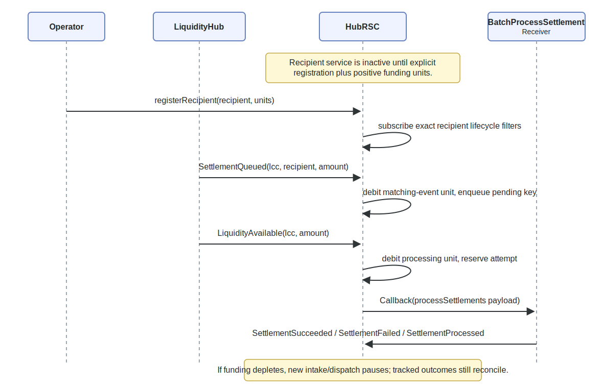

# Fiet x Reactive Network — queued settlement automation

This package provides the [Reactive Network](https://reactive.network/) contracts and deployment helpers that automate _queued settlement_ processing for Fiet markets.

When a user unwraps an LCC and there is insufficient immediate underlying liquidity, Fiet queues the shortfall as a settlement claim. This automation stack watches queue additions and authoritative queue decrements and, when liquidity becomes available, automatically calls `LiquidityHub.processSettlementFor(lcc, recipient, maxAmount)` to settle the claim.

## Reactive Network Context

This project is built for the Reactive Network execution model:

- Origin-chain events are observed via subscriptions.
- Reactive contracts execute `react()` logic in ReactVM.
- Cross-chain actions are emitted as callbacks and executed on destination chains.

## Terminology

- **Protocol chain**: The chain where Fiet’s `LiquidityHub` lives (e.g. Arbitrum One for MVP).
- **Reactive chain**: The Reactive Network chain where `HubRSC` executes.
- **LCC**: A Fiet token representing the market maker’s settlement commitment.
- **Recipient**: The address that ultimately receives underlying when a settlement is processed.
- **Queued settlement**: A claim created when an unwrap cannot be fulfilled immediately.
- **Hub**: A reactive contract that aggregates pending settlements and dispatches settlement batches.
- **Receiver**: A destination‑chain contract that receives Reactive callbacks and performs batched calls to `LiquidityHub.processSettlementFor(...)`.
- **Recipient balance**: HubRSC’s signed native-token accounting balance for a registered recipient. Payable registration/top-up credits the balance; newly observed Reactive system debt is allocated to the prior lifecycle or dispatch context and can drive the balance negative.

## High-level flow

(_What happens on-chain_)



1. **Queue**: `LiquidityHub` emits `SettlementQueued(lcc, recipient, amount)` on the _protocol chain_.
2. **Recipient activation**: An operator calls payable `HubRSC.registerRecipient(recipient)` or later `fundRecipient(recipient)` with native value.
3. **Exact-match subscriptions**: Once a registered recipient has a positive `recipientBalance`, `HubRSC` owns recipient-scoped exact-match subscriptions for that recipient’s settlement lifecycle logs.
4. **Hub intake**: `HubRSC` mirrors matching lifecycle logs only for registered, funded, active recipients.
5. **Aggregation**: `HubRSC` queues pending work keyed by `(lcc, recipient)`.
6. **Liquidity arrival**: `LiquidityHub` emits `LiquidityAvailable(...)` on the _protocol chain_.
7. **Bounded dispatch**: `HubRSC` scans dispatchable work (`pending - inFlight`) with explicit bounds and emits a callback to the _protocol chain_ Receiver.
8. **Settlement execution**: The Receiver calls `LiquidityHub.processSettlementFor(...)` for each batch item.
9. **Direct reconciliation**: `HubRSC` subscribes directly to authoritative `SettlementProcessed`, `SettlementAnnulled`, `SettlementSucceeded`, and `SettlementFailed` events for active recipients.
10. **Self-continuation**: Large backlogs continue through `HubRSC`-emitted `MoreLiquidityAvailable(...)` events. `HubCallback` and `SpokeRSC` are no longer part of the shipped runtime path.

## Contracts and artefacts

### Reactive chain

- `src/HubRSC.sol`
  - Public reactive facade for constructor wiring, `react()` ingress, queue accessors, and subscriptions.
  - Registers recipients, tracks signed per-recipient native balances, and owns recipient-scoped exact-match lifecycle subscriptions.
  - Deactivates and unsubscribes recipients whose balance is not positive until top-up reactivation.
  - Keeps the surviving Hub runtime contract while delegating storage and policy-heavy internals into focused modules under `src/hub/`.
- `src/hub/HubRSCStorage.sol`
  - Declares HubRSC storage, queue structs, constants, events, and constructor-time immutable validation.
- `src/hub/HubRSCRouting.sol`
  - Owns dispatch-lane selection, LCC-underlying registration, and bounded shared-underlying backfill accounting.
- `src/hub/HubRSCReconciliation.sol`
  - Owns authoritative decrease buffering, in-flight release, retry/terminal failure policy, and processed-success ordering reconciliation.
- `src/hub/HubRSCDispatch.sol`
  - Owns queue intake, liquidity wake handling, bounded batch assembly, and zero-batch continuation retries.

### Protocol chain

- `src/dest/BatchProcessSettlement.sol`
  - Destination receiver for Reactive callbacks.
  - Entry point is `processSettlements(address callbackOrigin, address[] lcc, address[] recipient, uint256[] maxAmount)`.
  - Calls `LiquidityHub.processSettlementFor(...)` per item and **continues on individual failures** (emits success/failure events).

### Testing

- Focused Hub suites: `forge test --match-path 'test/hub/*.t.sol'`
- Deterministic local simulation: `just local-simulation` (single-contract HubRSC coverage using Foundry mocks and direct `react()` calls; no live Reactive Network access or secrets)
- Unit tests: `forge test`
- Lasna-only Reactive Network pseudo-e2e smoke harness: `just e2e` (deploys mocks, deploys Hub/Receiver, registers funded recipients, triggers events, checks observed state; gated manually and requires `REACTIVE_RPC` plus a kREACT-funded key)
- Post-refactor reactive findings matrix: [`docs/task-40.3-task-35-regression-validation.md`](docs/task-40.3-task-35-regression-validation.md)
- Post-single-hub validation plan: [`docs/post-single-hub-validation-plan.md`](docs/post-single-hub-validation-plan.md)

## Bounds, throughput, and failure semantics (important for expectations)

### Hub dispatch bounds

- `HubRSC.MAX_DISPATCH_ITEMS` is a **hard cap** on how many queue entries are scanned/processed per liquidity-triggered dispatch round.
- Pending work is stored in a linked list (`LinkedQueue`), so backlog is not dropped when congestion increases.

### Receiver batch bounds

- `AbstractBatchProcessSettlement.MAX_BATCH_SIZE` is a **hard cap** on the number of settlement calls per receiver batch.
- `HubRSC.maxDispatchItems` must be configured at or below `AbstractBatchProcessSettlement.MAX_BATCH_SIZE`, or deployment reverts with `InvalidConfig`.

### Continue-on-error semantics

The receiver uses `try/catch` per item and **does not revert the whole batch** if one item fails. It emits per-item
success/failure events; `HubRSC` classifies those failures so unknown faults remain retryable behind a per-key retry
hold, policy failures are quarantined, and downstream `LiquidityError(...)` scrubs speculative budget until a fresh
liquidity wake-up arrives.

### Multi-round processing (“recursive” completion)

If a hub dispatch round ends with remaining liquidity, the hub emits `MoreLiquidityAvailable(...)` from `HubRSC` itself, which starts another bounded dispatch round through the same contract. This avoids unbounded loops while still allowing large backlogs to be drained over multiple rounds without a `HubCallback` dependency.

### Persisted liquidity budget and trusted release

`HubRSC` persists dispatch budget per dispatch lane (`availableBudgetByDispatchLane`) instead of treating a `LiquidityAvailable(...)` payload as a one-shot wake-up. This matters when liquidity arrives before a queued settlement is mirrored into the reactive queue: the budget remains available and the later queue insertion immediately triggers dispatch.

Budget is consumed only when the hub reserves new in-flight work. `MoreLiquidityAvailable(...)` is therefore a
continuation signal, not an authoritative liquidity snapshot. Failed settlements usually restore the reserved amount
back into the same dispatch lane, but retryable keys are blocked for the rest of that wake chain so the hub can spend
restored budget on siblings instead of immediately redispatching the same failing key. `LiquidityError(...)`
deliberately does not restore budget: it burns the speculative credit for that attempt so duplicate or stale
`LiquidityAvailable(...)` deliveries cannot leave persistent phantom budget behind.

`SettlementProcessed(...)` remains authoritative for queue reduction, but its `requestedAmount` input is not trusted for releasing reservations. In-flight reservations are released only after the hub observes trusted receiver `SettlementSucceeded(...)` or `SettlementFailed(...)` events.

### Shared-underlying routing and backfill

LCCs that share the same underlying eventually dispatch through a shared underlying lane so liquidity on one sibling can satisfy another sibling's queue. Historical per-LCC entries are mirrored into that shared lane by bounded backfill.

While backfill is still in progress, the hub prefers the per-LCC lane when it has local entries. If the triggering LCC has no local queue, the hub emits another bounded `MoreLiquidityAvailable(...)` wake-up and continues backfill until the shared lane is fully safe to use.

## Quickstart (partner integration)

### Prerequisites

- A deployed `LiquidityHub` on the protocol chain.
- The correct **Reactive callback proxy addresses** for each chain (Reactive publishes these per network).
- Funds for the default Lasna-only smoke lane:
  - kREACT on the `REACTIVE_CI_PRIVATE_KEY` / `PRIVATE_KEY` signer to deploy the mock protocol producer, receiver, and HubRSC, register/fund recipients, and cover execution.
  - No Sepolia ETH is required by default.
- Optional stronger full cross-chain validation can use a foreign protocol chain such as Ethereum Sepolia, but that is outside the required TASK-38.1 CI lane and needs its own RPC, callback proxy, chain id, and gas funding.

### Address & version registry (fill this in per deployment)

| Name                              | Chain    | Address | Notes                                               |
| --------------------------------- | -------- | ------- | --------------------------------------------------- |
| LiquidityHub                      | protocol | `0x…`   | canonical Fiet protocol contract                    |
| BatchProcessSettlement (Receiver) | protocol | `0x…`   | destination receiver                                |
| HubRSC                            | reactive | `0x…`   | aggregator/dispatcher                               |
| PROTOCOL_CALLBACK_PROXY           | protocol | `0x0000000000000000000000000000000000fffFfF` by default | Lasna-only smoke callback proxy; override only for optional foreign-chain validation |

## Integration flows

### Flow A — “Deploy the single Hub stack”

This is the default automation path:

1. **Deploy `HubRSC`** and the destination receiver.
2. **Fund** the reactive HubRSC contract with kREACT so it can maintain subscriptions and callbacks.
3. **Register each recipient** with payable `registerRecipient(recipient)` and native value.
4. **Top up recipients** with payable `fundRecipient(recipient)` before their balance is exhausted.
5. Users perform swaps/unwraps as normal. When a settlement is queued for an active recipient, `HubRSC` observes it directly from `LiquidityHub` and eventually dispatches settlement when liquidity becomes available.

`SpokeRSC` and `HubCallback` have been retired from the active runtime and deployment model. Recipient filtering remains exact-match and recipient-driven, but HubRSC now owns the subscriptions directly.

### Recipient registration and funding policy

Registration is explicit. A recipient with no `recipientRegistered(recipient)` entry receives no lifecycle intake, even if matching protocol-chain logs exist. Registration with no native value records the recipient but does not activate subscriptions.

Activation requires a positive `recipientBalance(recipient)`. On activation, HubRSC subscribes to exact-match lifecycle logs where indexed `recipient` equals the registered address:

- `SettlementQueued`
- `SettlementAnnulled`
- `SettlementProcessed`
- receiver `SettlementSucceeded`
- receiver `SettlementFailed`

HubRSC uses the Reactive system contract’s `debt(address(this))` as the source of actual service cost. Because `reactive-lib` exposes debt only as an observed aggregate, HubRSC uses deferred attribution at safe boundaries: every recorded lifecycle or dispatch debt context appends to an indexed FIFO, and each `react()`, registration, top-up, or explicit `syncSystemDebt()` first allocates any newly observed positive debt delta to the FIFO head. Lifecycle debt is allocated to that context's recipient; dispatch callback debt is split across the recipients included in that FIFO context. After allocation, HubRSC clears/deletes the consumed indexed context and increments the FIFO head. Ignored, duplicate, wrong-chain, and other non-billable paths do not clear deferred contexts, and zero-delta syncs do not advance the FIFO. If no context exists, `UnallocatedDebtObserved` is emitted and no recipient is charged. Existing pending state is retained when a balance becomes non-positive, but no new recipient intake or dispatch work is reserved until the recipient is topped up. Outcome logs for already tracked pending or in-flight work can still reconcile after depletion, so a dispatch is not stranded before its `SettlementSucceeded`, `SettlementFailed`, or `SettlementProcessed` logs arrive.

See [`docs/recipient-payment-model.md`](docs/recipient-payment-model.md) for the full recipient payment and indexed FIFO debt-context attribution model.

Top-up uses payable `fundRecipient(recipient)`. If the recipient is registered and the top-up makes `recipientBalance(recipient)` positive, HubRSC reactivates exact-match subscriptions and pending work can resume on the next queue mutation, liquidity wake, or self-continuation.

## Operational guidance (how to observe what’s going on)

### Confirm a settlement was queued (protocol chain)

- Watch for `SettlementQueued(lcc, recipient, amount)` from `LiquidityHub`.
- Optionally read `LiquidityHub.settleQueue(lcc, recipient)` (if you want current queued amount rather than a log).

Copy-paste read (example):

```bash
cast call "$LIQUIDITY_HUB" \
  "settleQueue(address,address)(uint256)" \
  "$LCC" \
  "$RECIPIENT" \
  --rpc-url "$PROTOCOL_RPC"
```

### Confirm recipient registration and funding (reactive chain)

Copy-paste read (example):

```bash
cast call "$HUB_RSC" \
  "recipientRegistered(address)(bool)" \
  "$RECIPIENT" \
  --rpc-url "$REACTIVE_RPC"

cast call "$HUB_RSC" \
  "recipientActive(address)(bool)" \
  "$RECIPIENT" \
  --rpc-url "$REACTIVE_RPC"

cast call "$HUB_RSC" \
  "recipientBalance(address)(int256)" \
  "$RECIPIENT" \
  --rpc-url "$REACTIVE_RPC"
```

### Confirm the Hub has pending work (reactive chain)

`HubRSC` keeps queue mirror state in:

- `HubRSC.pendingStateByKey(HubRSC.computeKey(lcc, recipient))`
- `HubRSC.inFlightByKey(HubRSC.computeKey(lcc, recipient))`
- `HubRSC.queueSize()` for total queued keys

Copy-paste read (example):

```bash
KEY="$(cast call "$HUB_RSC" \
  "computeKey(address,address)(bytes32)" \
  "$LCC" \
  "$RECIPIENT" \
  --rpc-url "$REACTIVE_RPC")"

cast call "$HUB_RSC" \
  "pendingStateByKey(bytes32)(uint256,bool)" \
  "$KEY" \
  --rpc-url "$REACTIVE_RPC"

cast call "$HUB_RSC" \
  "inFlightByKey(bytes32)(uint256)" \
  "$KEY" \
  --rpc-url "$REACTIVE_RPC"

cast call "$HUB_RSC" \
  "queueSize()(uint256)" \
  --rpc-url "$REACTIVE_RPC"
```

### Confirm settlement execution happened (protocol chain)

- Watch for receiver events (`BatchReceived`, `SettlementSucceeded`, `SettlementFailed`).
- Watch for authoritative hub decrement events (`SettlementProcessed`, `SettlementAnnulled`).
- Watch for `LiquidityHub.processSettlementFor(...)` effects (e.g. queue decreases, underlying transfers, etc.).

### Expected latency model

This system is event-driven. “Time to process” depends on:

- Reactive Network log ingestion + callback execution latency
- available liquidity events (`LiquidityAvailable(...)`) on the protocol chain
- bounded dispatch behaviour (large backlogs may take multiple bounded rounds)

## Troubleshooting & FAQ

### “Queue events exist, but nothing is processed”

Check the usual suspects:

- **Recipient not registered or inactive**:
  - `HubRSC.recipientRegistered(recipient)` must be true.
  - `HubRSC.recipientActive(recipient)` must be true and `recipientBalance(recipient)` must be positive.
  - Fix: call payable `registerRecipient(recipient)` or `fundRecipient(recipient)` with enough native value to make the balance positive.
- **Underfunded reactive HubRSC contract**:
  - HubRSC must have enough kREACT deposited to execute subscriptions/callbacks.
  - Fix: fund via the system contract `depositTo(address)` (see below).
- **Wrong callback proxies / chain IDs**:
  - If callback proxy addresses or chain IDs are incorrect, callbacks will not be authorised or delivered as expected.

### “The Hub only processes a small number of users per liquidity event”

This is expected due to explicit bounds:

- The Hub processes at most `MAX_DISPATCH_ITEMS` per round.
- Large backlogs are drained over multiple rounds (via `MoreLiquidityAvailable`) when liquidity remains.

### “Receiver emitted failures but continued”

The Receiver is intentionally continue-on-error for batch robustness. Check `SettlementFailed(...)` reasons to identify the failing item(s).

### “`just deploy-hub` fails on CI/Linux”

Some environments use case-sensitive filesystems. Ensure the script name referenced by `Justfile` matches the actual filename under `scripts/`.

## Developer commands (local)

### Unit tests

```bash
forge test
```

### Deterministic local simulation

This is the default validation lane for single-contract HubRSC changes. It runs fully inside Foundry with
`HubRSCTestBase`, `MockLiquidityHub`, `MockSystemContract`, receiver mocks, and direct `react()` calls. It is supporting local simulation coverage rather than the full Lasna pseudo-e2e proof. It covers:

- unregistered, registered-underfunded, and active funded recipient intake;
- matching lifecycle and processing debt attribution;
- depletion pause and top-up reactivation;
- duplicate log dedupe, bounded self-continuation, retry blocking, terminal quarantine, shared-underlying dispatch, and an MM-custodian-shaped recipient.

Run:

```bash
just local-simulation
```

`just pseudo-e2e` remains as a compatibility alias for the same local simulation suite.

### Reactive validation lanes

There are three Reactive validation lanes:

- Deterministic local simulation: `just local-simulation`, no live secrets, runs automatically for Reactive path changes.
- Default Lasna-only live smoke: `just e2e` with both Reactive and protocol-side mock event producer on Lasna.
- Optional Ethereum Sepolia cross-chain smoke: the same live harness with the protocol side pointed at Ethereum Sepolia for stronger cross-chain validation.

### Lasna-only Reactive Network pseudo-e2e smoke harness

Important:

- This lane is manually gated and is not required for deterministic CI.
- Pull-request live smoke runs require relevant `contracts/reactive/src/**`, `contracts/reactive/scripts/**`, `contracts/reactive/test/e2e.sh`, or `.github/workflows/reactive-e2e.yml` changes plus the `reactive-e2e` label; manual runs require `workflow_dispatch` with `run_smoke=true`.
- The default GitHub Actions smoke lane is Lasna-only: `REACTIVE_CHAIN_ID=5318007`, `PROTOCOL_CHAIN_ID=5318007`, `REACTIVE_RPC=${REACTIVE_RPC}`, `PROTOCOL_RPC=${REACTIVE_RPC}`, and `PROTOCOL_CALLBACK_PROXY=0x0000000000000000000000000000000000fffFfF`.
- The workflow probes the configured Lasna `REACTIVE_RPC` value first and then the alternate trailing-slash form, accepting the first URL whose `cast chain-id` returns `5318007`.
- Same-chain Lasna smoke defaults `RECEIVER_PREFUND_WEI=0`; foreign-chain profiles keep the receiver prefund default at `0.01 ether` unless overridden.
- Use a kREACT-funded live key only for this lane, for example `REACTIVE_CI_PRIVATE_KEY` from GitHub Actions secrets or Vault.
- The live key deploys/funds the HubRSC, registers and funds recipients, emits mock protocol events on Lasna, and polls HubRSC/receiver state for Reactive Network callback delivery.
- Ephemeral wallets are not used by the current single-HubRSC smoke harness. The same funded live key signs deployment, recipient registration/funding, and mock protocol events so the HubRSC RVM id, receiver callback origin, and funded recipient lifecycle are stable for the run. Do not reuse this key in deterministic local simulation coverage.
- To run the default smoke manually, set `REACTIVE_RPC`, set both `PRIVATE_KEY` and `REACTIVE_CI_PRIVATE_KEY` to the funded signer, set `PROTOCOL_RPC=$REACTIVE_RPC`, and fund the signer with kREACT. You can obtain testnet REACT (kREACT) from the Reactive documentation.

CI delivery:

- Deterministic Reactive local simulation runs automatically for Reactive path changes.
- Default Lasna-only live smoke and optional Sepolia cross-chain smoke run on pull requests only when the `reactive-e2e` label is present and relevant live-smoke files changed.
- Manual full smoke uses the `Reactive Validation` workflow with `workflow_dispatch` and `run_smoke=true`.
- Required repository secrets for the default Lasna-only smoke are `REACTIVE_RPC` and `REACTIVE_CI_PRIVATE_KEY`; pull-request live smoke skips the live run when those secrets are unavailable, while manual `workflow_dispatch` remains strict and fails if they are missing.
- Optional Sepolia cross-chain smoke additionally requires `ETH_SEPOLIA_RPC_URL` and Sepolia ETH on the `REACTIVE_CI_PRIVATE_KEY` wallet. It preflights the Sepolia RPC and signer balance with `cast balance`, then skips cleanly with a notice when either requirement is missing.

Optional stronger full cross-chain validation uses `PROTOCOL_RPC=${ETH_SEPOLIA_RPC_URL}`, `PROTOCOL_CHAIN_ID=11155111`, and `PROTOCOL_CALLBACK_PROXY=0xc9f36411C9897e7F959D99ffca2a0Ba7ee0D7bDA`. That profile is not required for TASK-38.1 default CI and is separate from the canonical Lasna-only live smoke lane.

Run:

```bash
just e2e
```

## Deployment guide (scripts)

### Environment variables

Review `contracts/reactive/env.sample`, copy it into `.env`, then fill in values for your target chains and deployment addresses.

### Steps

#### 1) Deploy mock LiquidityHub (protocol chain, test only)

```bash
just deploy-mock-liquidity-hub
```

#### 2) Deploy BatchProcessSettlement receiver (protocol chain)

Required env vars:

- `LIQUIDITY_HUB` (deployed LiquidityHub address on protocol chain)
- `HUB_RVM_ID` (deployed HubRSC RVM id allowed as `callbackOrigin`)

```bash
just deploy-receiver
```

#### 3) Deploy HubRSC (reactive chain)

Required env vars:

- `LIQUIDITY_HUB` (protocol LiquidityHub address)
- `BATCH_RECEIVER` (deployed receiver address)

```bash
just deploy-hub
```

#### 4) Register or top up a recipient (reactive chain)

```solidity
registerRecipient(recipient) payable
fundRecipient(recipient) payable
```

## Funding reactive contracts (kREACT deposit)

On Reactive, the system contract and callback proxy share this fixed address:

`0x0000000000000000000000000000000000fffFfF`

Use the helper:

```bash
just fund-contract <CONTRACT_ADDR> <AMOUNT_WEI>
```

Under the hood this calls:

```bash
cast send --rpc-url $REACTIVE_RPC --private-key $REACTIVE_PRIVATE_KEY <SYSTEM_CONTRACT> "depositTo(address)" <CONTRACT_ADDR> --value <AMOUNT_WEI>
```
