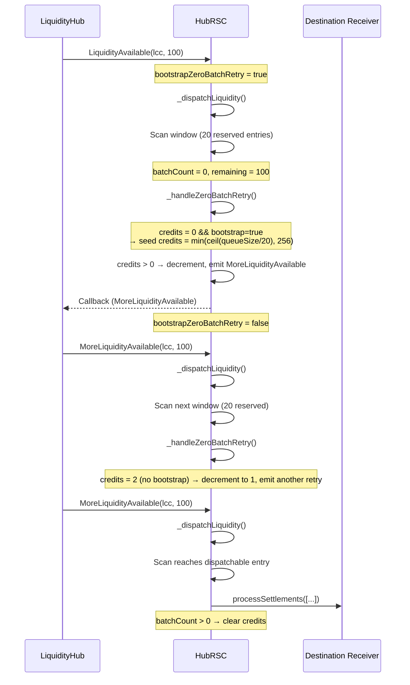

# Zero-Batch Retry Mechanism in Reactive Contracts

## Purpose

The **zero-batch retry mechanism** exists to prevent **liquidity stall** when a bounded scan window contains only reserved (in-flight) or non-dispatchable entries, even though later dispatchable entries exist in the queue and liquidity is available.

Without this mechanism, a single `LiquidityAvailable` event could scan a window of reserved entries, emit no dispatch, and never retry — leaving valid settlements stranded until another unrelated liquidity event arrives.

## Problem Statement

Consider this queue state (simplified):

```text
Head → [R1, R2, ..., R20, D1] ← Tail
       ^                     ^
   reserved (in-flight)   dispatchable
```

- `maxDispatchItems = 20`
- A `LiquidityAvailable` event arrives with 100 tokens
- The scan processes the first 20 reserved entries → `batchCount = 0`, `remainingLiquidity = 100`
- Without retry logic, the dispatch ends and `D1` is never reached until the next external liquidity event

This creates **head-of-line blocking** for dispatchable entries behind long reserved prefixes.

## Solution: Credit-Based Chained Retries

The mechanism uses `zeroBatchRetryCreditsRemaining[lane]` to allow a bounded number of follow-up callbacks (`MoreLiquidityAvailable`) that advance the cursor across reserved windows.

### Core Logic (`_handleZeroBatchRetry`)

```solidity
function _handleZeroBatchRetry(
    address dispatchLane,
    address triggerLcc,
    uint256 batchCount,
    uint256 remainingLiquidity,
    uint256 queueSizeAtStart
) internal returns (bool shouldReturn) {
    if (batchCount == 0 && remainingLiquidity > 0) {
        uint256 credits = zeroBatchRetryCreditsRemaining[dispatchLane];

        // Only bootstrap credits on the initial LiquidityAvailable path
        if (credits == 0 && bootstrapZeroBatchRetry) {
            uint256 maxWindows = (queueSizeAtStart + maxDispatchItems - 1) / maxDispatchItems;
            if (maxWindows == 0) maxWindows = 1;
            if (maxWindows > MAX_ZERO_BATCH_RETRY_WINDOWS) 
                maxWindows = MAX_ZERO_BATCH_RETRY_WINDOWS;
            credits = maxWindows;
        }

        if (credits > 0) {
            zeroBatchRetryCreditsRemaining[dispatchLane] = credits - 1;
            _triggerMoreLiquidityAvailable(triggerLcc, remainingLiquidity);
            return true;
        }
        zeroBatchRetryCreditsRemaining[dispatchLane] = 0;
    }

    if (batchCount > 0) {
        zeroBatchRetryCreditsRemaining[dispatchLane] = 0;
    }

    return false;
}
```

### Key Design Decisions

1. **Bootstrap only on initial event**: `bootstrapZeroBatchRetry` is set `true` only in `_handleLiquidityAvailable` and reset immediately after. Follow-up callbacks cannot re-seed credits.
2. **Credit calculation**: Based on current queue size at start of scan (`startSize`), giving enough retries to cover the entire queue in the worst case (capped at 256).
3. **Clear on success**: Any successful batch (`batchCount > 0`) immediately clears credits.
4. **Stale lane clearing**: `_clearInactiveZeroBatchRetryCredits()` prevents stale credits from suppressing retries when routing switches between shared-underlying and per-LCC lanes.

## Visual Flow



## Test Coverage

Two dedicated tests validate the mechanism:

1. **`test_zeroBatchSharedUnderlyingScanEmitsRetryThenDispatchesNextWindow()`**  
   - Single window of reserved entries + one dispatchable entry
   - Verifies exactly one retry callback reaches the dispatchable entry

2. **`test_zeroBatchSharedUnderlyingLongReservedPrefixDispatchesAfterMultipleRetries()`**  
   - `2 * maxDispatchItems + 1` reserved entries + one dispatchable
   - Verifies multiple retry steps are required and succeed

3. **`test_zeroBatchRetryCreditsDoNotReseedOnFollowupWhenAllReserved()`**  
   - Proves that once credits are exhausted, follow-up callbacks do **not** re-seed them

## Why This Design?

- **Safety**: Bounded retries (max 256) prevent gas exhaustion or infinite loops
- **Liveness**: Guarantees progress across reserved prefixes
- **Efficiency**: Only emits the minimum number of callbacks needed
- **Correctness**: Credits are lane-specific and cleared on routing changes or successful dispatch
- **Testability**: Clear separation between bootstrap and continuation paths

This mechanism was introduced to address a vulnerability where long reserved prefixes could cause permanent stall of dispatchable liquidity.

**Document created**: `contracts/reactive/docs/zero-batch-retry-mechanism.md`
