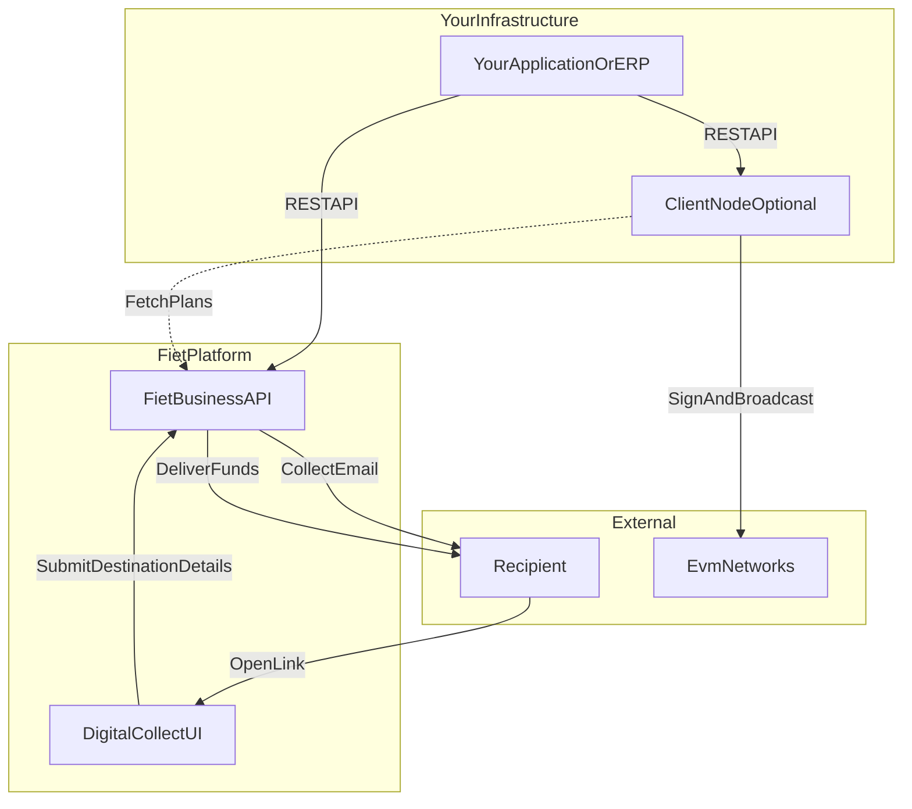
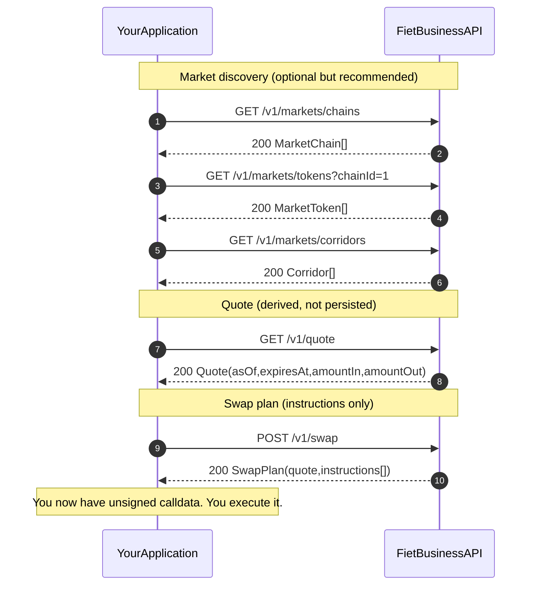
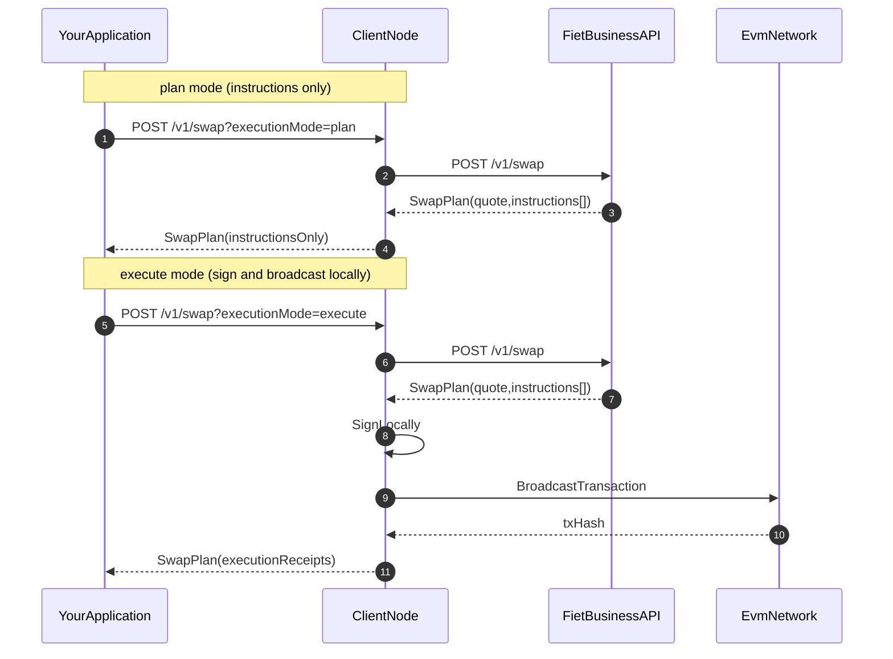
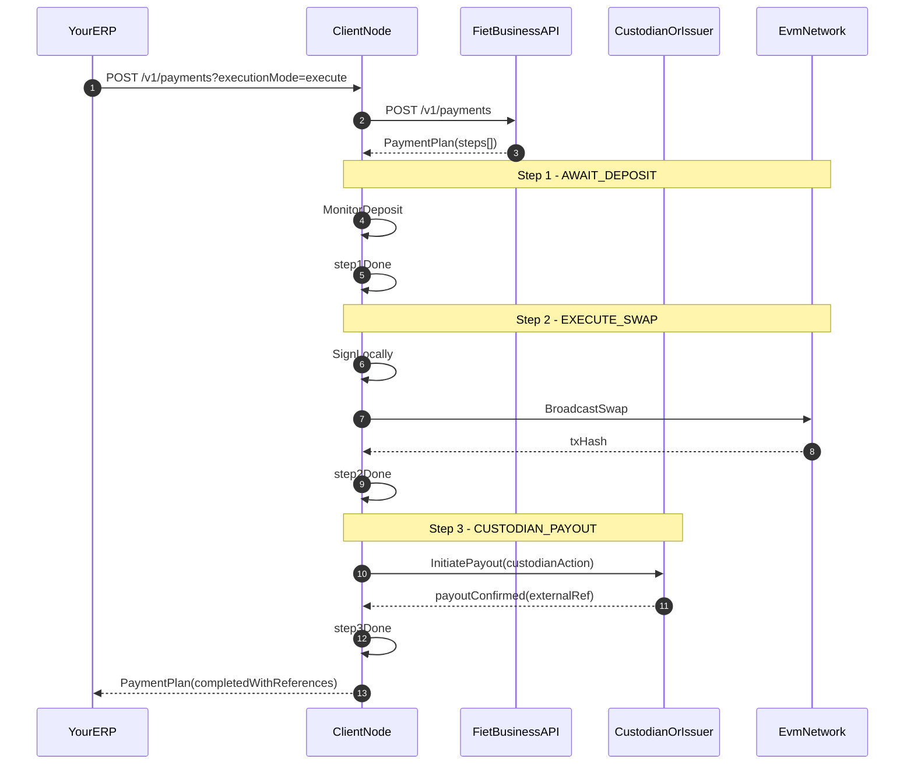
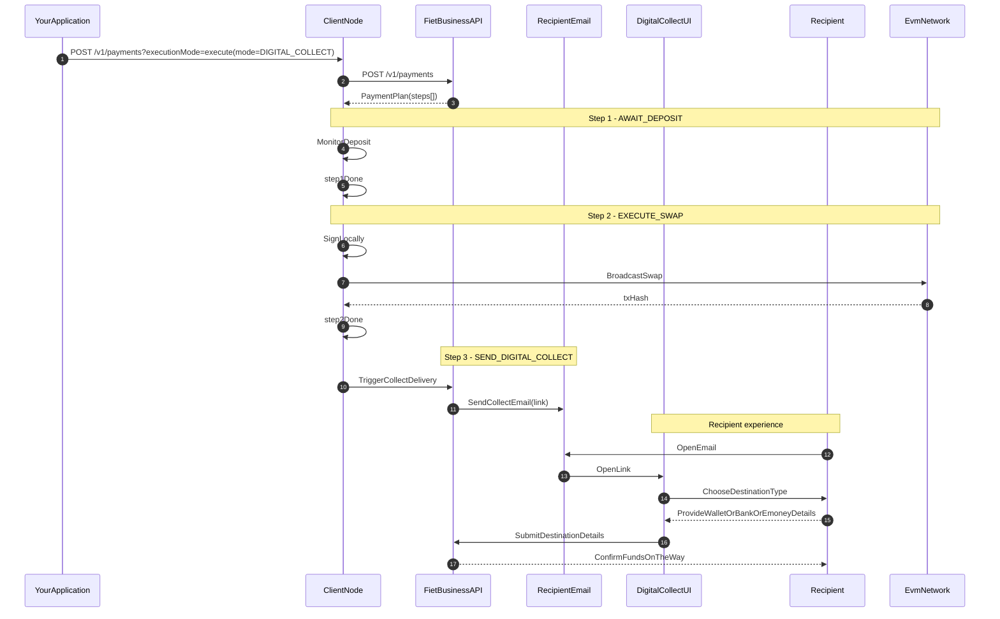

## System overview (public view)

The Business API is a single product surface. It provides quotes, instructions, and plans. **Execution** (signing and broadcasting) happens in your infrastructure.

Digital Collect includes a **recipient-facing web experience**: recipients open an email link, choose where they want to receive funds, and provide the required details (wallet, bank, or eMoney).

## Quotes and swaps (plan-only)

## Swaps with the Client Node (coming soon)

The Client Node is an optional, self-hosted component that can execute swap instructions locally.

## Payments (standard)

Payments return a **multi-step plan**. In standard mode, the plan typically includes: await deposit, execute swap, and coordinate payout.

## Payments (Digital Collect)

In Digital Collect mode, recipients complete a short web flow to choose how they want to receive funds.

## Who executes?

- **Direct integration:** you call the Business API and receive instructions and plans; you sign and broadcast using your own infrastructure.
- **Client Node (coming soon):** you call your self-hosted Client Node; it fetches plans from the Business API and executes locally, returning receipts.
